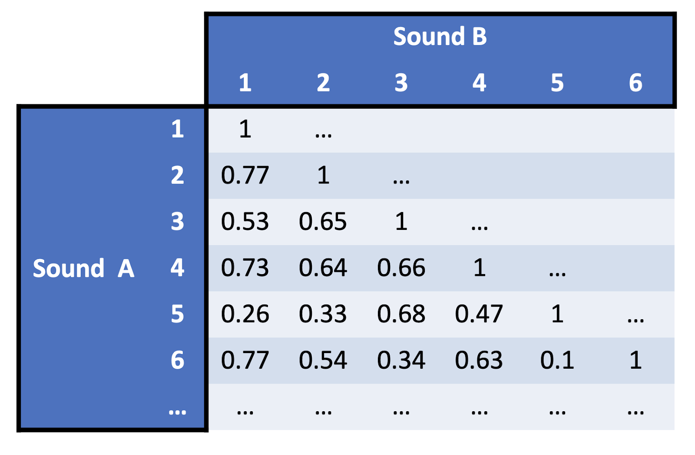
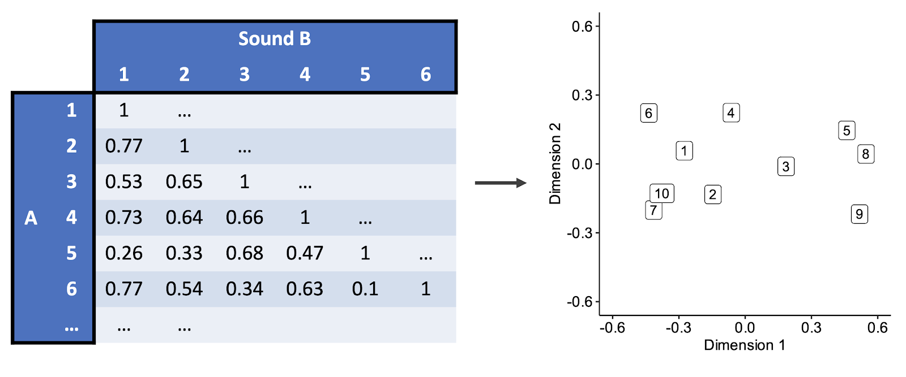

# Timbre

```{r, echo = FALSE, include = FALSE}
knitr::opts_chunk$set(
  echo = FALSE, results = "asis"
)
source("setup.R")
```

Informally, we can define timbre as the 'tone colour' or 'tone quality' of a sound. It's what gives a particular musical instrument its individuality. More formally, we can follow the Acoustical Society of America and define timbre as

> "that attribute of auditory sensation which enables a listener to judge that two nonidentical sounds, similarly presented and having the same loudness and pitch, are dissimilar."

A good way of getting a feel for timbre is to listen to the sounds of different musical instruments playing the same pitch, as in the following video. The different sounds are visualised with a spectrogram, which as you'll remember from before describes how the spectral content of a sound develops over time.

```{r}
embed_youtube_video(
  "VRAXK4QKJ1Q",
  title = "Spectrograms for different musical instruments.", credit = "[What Music Really İs
](https://www.youtube.com/channel/UCgqviysh9n4dbccXlOyWIfQ)", start_at = 24
)

```

Timbre perception plays an important role in day-to-day auditory perception. Timbre is by definition independent of loudness, so it doesn't depend much on the distance to the sound source. It's also independent of pitch, meaning that we can recognise the timbre of someone's voice across a wide range of pitches. As a consequence, timbre provides an important cue for identifying different objects from their sounds.

Timbre also depends a lot on an object's physical properties. If we hear someone hit an object with a stick, we can use the sound to guess whether the object is hard or soft, whether it's solid or hollow, and so on.

Timbre also plays a crucial role in speech-based communication. When I'm speaking to you, I can raise or lower the pitch of my voice, and I can speak louder or quieter. But the words that I say to you -- the vowels and the consonants -- are not defined by the pitch or the loudness, but are instead defined by a fast stream of changing timbres.

Timbre ends up being a very useful cue for making sense of complex auditory environments, when there are many different sound sources at the same time, for example at a cocktail party or at an orchestral concert. The brain uses timbre as a cue to organise sound into discrete auditory streams, where each stream might correspond to a particular speaker in a conversation, or to a different musical part in a piece of polyphonic music.

## Psychological methods for studying timbre

### Free-text methods

One way to study timbre is simply to play participants sounds, and ask them to write free text about what they heard. For example, a participant might write:

> This instrument sounds kind of woody. It has a soft breathlike quality at the beginning, but the instrument sustains in a manner that is quite dissimilar to the human voice; it sounds almost like a pipe organ.

We can get very rich and expressive data from this kind of approach. However, this kind of free-form data is complex to analyse quantitatively because of its unstructured format. Two participants can easily write descriptions that on the surface look rather different, even though their subjective experience was relatively similar.

One way of making the data slightly more tractable is to ask people not to write in prose, but instead to write individual words. The same participant might then write something like the following:

> woody; breath; organ

We still might receive many different words this way, many of which might be (near-)synonyms of each other. However, if we collect enough responses, we should see some words repeating more regularly than others. We could visualise this word distribution with a *word cloud*, where more common words appear in larger text. To dig into these responses more rigorously, one could adopt a *qualitative* approach, where the researcher thinks carefully about the different themes present in the text and summarises them accordingly (see Section \@ref(quantitativequalitative). More recently, *quantitative* approaches have become more feasible through advances in computational techniques for processing language (a field known as *natural language processing*), providing principled methods for extracting the semantic content of written text in a way that acknowledges (partial) synonyms.

### Semantic rating scales

An alternative way to study timbre perception is with *semantic rating scales*. Here we get the participant to evaluate a single perceptual dimension of the sound at a time, for example its 'brightness'. The participant rates this dimension on a numeric scale, for example from 'very dark' to 'very bright'. This means that we can then average results over multiple participants to get a more reliable outcome.

This approach has a clear advantage over the free-text approaches, in that the data are very straightforward to analyse quantitatively. This comes at the expense of having to restrict the available response options *a priori* to one or more terms preselected by the researcher. This is feasible for domains that have already been studied in some detail, but it is not very practical for domains about which we currently know little.

### Similarity judgments

A disadvantage of both free-text and semantic rating approaches is that all the results are filtered through language. This is a problem if we believe there might be important aspects of timbre perception that participants struggle to put into words.

A clever way to sidestep this problem is to use similarity judgements instead. In the classic similarity judgement paradigm, we play participants pairs of sounds, and we ask them to rate the similarity of each pair. The appealing feature of this approach is that similarity judgements do not need to be mediated by any verbal vocabulary; participants are free to compare the sounds based on whatever perceptual features they deem relevant, even if they don't have good words for them.

One we've presented lots of stimulus pairs to participants, we can construct a *similarity matrix*, which looks something like this:

{width="500"}

Each number in a similarity matrix tells us the average perceptual similarity of a pair of stimuli. For example, the cell in the fourth row and the first column has a value of 0.73, which tells us that the normalised similarity between the first and fourth stimulus is 0.73. Similarly, the 0.1 in the sixth row and the fifth column tells us that the normalised similarity between the sixth and the fifth stimulus is 0.1.

These similarity matrices quickly become very big, making them no easier to interpret directly than the free-text paradigm we considered earlier. We need some kind of statistical technique to distil this data down and create some meaningful quantitative insights. We call this process *dimensionality reduction*.

Here we're going to focus on a particularly method called *multidimensional scaling* ('MDS'). This is a popular method for dimensionality reduction in timbre perception studies. MDS takes the similarity matrices as its input, and uses them to compute a low-dimensional space, constructed so as to preserve the similarities between stimuli as well as possible. In this example the space has just two dimensions, but we can just as well fit spaces with higher numbers of dimensions, they're just harder to visualise. Each stimulus is automatically given a location in the MDS space: the idea is that stimuli with high similarity are located close to each other, and stimuli with low similarity are located far apart.\

{width="100%"}

For example, look at the first column of the similarity matrix. This tells us the raw pairwise similarities for stimulus 1. We see high similarity with stimuli 2, 4, and 6; correspondingly we see that stimuli 2, 4, and 6 are neighbours in the MDS space. In contrast, the similarity with stimulus 5 is low, and so 1 and 5 are distant in the MDS space.

So, imagine that we now have an MDS solution, with all our stimuli being placed in the multidimensional space. We now hypothesise that the dimensions of this space reflect fundamental perceptual features of the stimuli that are highly salient to the participant. MDS doesn't tell us anything about these dimensions except for the locations of each stimulus on that dimension. However, there are various ways for us to find out useful information about these dimensions. For example, we can correlate each dimension with acoustic analyses of the stimuli. We can also have participants generate word associations for each dimension.

MDS has been applied many times to timbre over the last few decades, producing lots of evidence for the fundamental dimensions of timbre perception [@McAdams2009]. Here we're not going to talk so much about individual timbre MDS studies; instead we'll talk more about the knowledge that these and related studies have generated.

When we interpret the results from these timbre studies, we end up returning to a recurrent theme: the distinction between *temporal* and *spectral* properties of sound. Temporal properties describe how the sound changes over time, whereas spectral properties describe how the sound's energy is distributed through the harmonic spectrum. We'll discuss both aspects in turn.

## Decomposing timbre

### Temporal aspects

As you'll remember from earlier in the course, we can represent sounds as waveforms, describing periodic fluctuations in sound pressure over time. For a pitched musical sound, these fluctuations happen very fast: for example, a sine wave corresponding to middle C will repeat itself approximately 262 times every second. We can call this 'low-level temporal structure'.

```{r}
embed_image(
  "images/middle-c-waveform.png", 
  width = "500px",
  title = "Sine wave corresponding to middle C (~ 262 Hz)."
)
```

In contrast, when we talk about temporal aspects of *timbre* perception, we're instead interested at temporal dynamics at longer time scales. We're interested not the specific ups and downs of the waveform, but we're instead interested in the 'envelope' within which the waveform oscillates. We can see this envelope if we 'zoom out' the visualisation, as follows (note that the wiggles in waveform are now squashed so close together that they just produce a solid block):

```{r}
embed_image(
  "images/temporal-envelope-generic.png", 
  width = "500px",
  title = "Example temporal envelope."
)
```

If we look at different instrumental sounds at this level of representation, we see quite different envelopes. For example, the harpsichord grows fast, then immediately decays:

```{r}
embed_image_with_audio(
  "images/temporal-envelope-harpsichord.png", 
  audio = "audio/temporal-envelope-harpsichord.wav",
  width = "500px",
  title = "Temporal envelope computed from a harpsichord."
)
```

Other sounds like the flute or the violin grow slower, and then can sustain for a long time:

```{r}
embed_image_with_audio(
  "images/temporal-envelope-flute.png", 
  audio = "audio/temporal-envelope-flute.wav",
  width = "500px",
  title = "Temporal envelope computed from a flute."
)
```

```{r}
embed_image_with_audio(
  "images/temporal-envelope-violin.png", 
  audio = "audio/temporal-envelope-violin.wav",
  width = "500px",
  title = "Temporal envelope computed from a violin."
)
```

The *ADSR model* is an attempt to capture the key components in which these different envelopes vary. It's a simplification of what we might see in the real world, but the important thing is that it's a simplification that's meant to retain the aspects of the envelope that are particularly salient in timbre perception.

```{r}
embed_image(
  "images/adsr-example-envelope.png", 
  width = "500px",
  title = "Generic ADSR envelope."
)
```

The standard ADSR model splits the envelope into four portions:

1.  The *attack* portion is where the envelope rises from zero amplitude to the maximum amplitude. The attack parameter set the *duration* of this portion.
2.  The *decay* portion is where the envelope decays from its maximum amplitude to a lower amplitude, over a time period corresponding to the decay parameter.
3.  The *sustain* portion has the amplitude remain constant, at a level determined by the *sustain* parameter.
4.  The *release* portion has the amplitude decay to zero over a time period specified by the *release* parameter.

```{r}
embed_image(
  "images/adsr-model-definition.png", 
  width = "500px",
  title = "Definition of the ADSR model."
)
```

Let's explore how each of these components contribute to making a distinctive timbre. We'll begin with a vanilla harmonic complex tone, one with a constant amplitude and frequency:

```{r}
embed_image_with_audio(
  "images/adsr-incremental-1.png", 
  "audio/adsr-incremental-1.wav",
  width = "500px",
  title = "A vanilla harmonic complex tone."
)
```

Let's now try adding an *attack* portion to the envelope. First of all, let's try a rather longer attack portion, lasting for half a second. The result already feels more naturalistic than the original tone.

```{r}
embed_image_with_audio(
  "images/adsr-incremental-2.png", 
  "audio/adsr-incremental-2.wav",
  width = "500px",
  title = "Setting the attack parameter to 0.5 s."
)
```

Now let's make the attack portion very short, and let's add a short decay portion, whereby the amplitude decays to 15% of the original. This combination of short attack and decay portions makes the tone sound somewhat like a plucked string instrument. However, the resemblance to a plucked string is marred by the constant amplitude in the latter part of the tone.

```{r}
embed_image_with_audio(
  "images/adsr-incremental-3.png", 
  "audio/adsr-incremental-3.wav",
  width = "500px",
  title = "Setting the attack parameter to 0.01 s, the decay parameter to 0.01 s, and the sustain parameter to 0.15."
)
```

In the final version, we therefore add a one-second release portion. This improves the sound a lot, and the resulting tone now sounds pretty close to an electric guitar.

```{r}
embed_image_with_audio(
  "images/adsr-incremental-4.png", 
  "audio/adsr-incremental-4.wav",
  width = "500px",
  title = "Setting the release parameter to 1.0 s."
)
```

The below app allows you to manipulate the parameters of the ADSR model interactively, and explore the resulting effect on the sound.

```{r}
cat(readLines("packages/simple-js-synth-2/adsr-demo.html"), sep = "\n")
```

It's important to recognise that the ADSR model is a big simplification compared to real instrument envelopes. This simplicity has useful benefits, though: it makes the model easy to interpret and easy to control. If we do want to capture more complex dynamics, there are various natural extensions we can make, for example adding non-linear segments or adding periodic amplitude fluctuations.

### Spectral aspects

As you'll remember from before, when a pitched musical instrument plays a given note, the resulting sound contains many different frequency components, represented visually as vertical lines. Generally speaking, these frequency components will all be integer multiples of a common fundamental frequency.

```{r}
embed_image_with_audio(
  "images/harmonic-spectrum.png", 
  "audio/harmonic-spectrum.wav",
  width = "500px",
  title = "Idealised harmonic spectrum."
)
```

Spectral aspects of timbre concern the amplitudes of these different frequency components. We're now going to look at a few different ways of describing these spectral aspects.

#### Spectral centroid

The spectral centroid describes how much of the spectral energy is concentrated in higher rather than lower harmonics. A high centroid tends to make the sound appear bright and piercing.

```{r}
embed_image_with_audio(
  "images/spectral-centroid-high.svg", 
  "audio/spectral-centroid-high.wav",
  width = "400px",
  title = "Tone with a high spectral centroid."
)
```

Conversely, a low centroid makes the sound appear dull.

```{r}
embed_image_with_audio(
  "images/spectral-centroid-low.svg", 
  "audio/spectral-centroid-low.wav",
  width = "400px",
  title = "Tone with a low spectral centroid."
)
```

#### Spectral irregularity

Spectral irregularity corresponds to discrepancies in amplitudes between adjacent harmonics. In the following example, adjacent harmonics have relatively similar amplitudes:

```{r}
embed_image_with_audio(
  "images/spectral-irregularity-regular.svg", 
  "audio/spectral-irregularity-regular.wav",
  width = "400px",
  title = "Tone with high spectral regularity."
)
```

In this example, the adjacent harmonics have relatively irregular amplitudes. The clarinet and the vibraphone are both examples of instruments with high spectral irregularity.

```{r}
embed_image_with_audio(
  "images/spectral-irregularity-irregular.svg", 
  "audio/spectral-irregularity-irregular.wav",
  width = "400px",
  title = "Tone with high spectral irregularity."
)
```

#### Nasality

A sound tends to be perceived as nasal when it has a lot of energy in the region spanning from 2000 to 5000 Hz. The following is an example of a tone without much energy in this region:

```{r}
embed_image_with_audio(
  "images/nasality-none.svg", 
  "audio/nasality-none.wav",
  width = "400px",
  title = "Standard harmonic complex tone."
)
```

Now follows a version of the tone where energy has been added in the 2000-5000 Hz region, producing a nasal sound:

```{r}
embed_image_with_audio(
  "images/nasality-high.svg", 
  "audio/nasality-high.wav",
  width = "400px",
  title = "Harmonic complex tone with energy added in the 2000-5000 Hz region."
)
```

#### Formants

Formants are a particularly interesting aspect of timbre that determine vowel sounds in speech. A formant corresponds to a peak in the acoustic spectrum located somewhere above the fundamental frequency. The first formants are particularly important for determining vowel identity.

The following example has formants at 850 Hz and 1650 Hz, corresponding to an 'a' vowel.

```{r}
embed_image_with_audio(
  "images/formant-a.png", 
  "audio/formant-a.wav",
  width = "400px",
  title = "A tone with formants at 850 Hz and 1650 Hz, corresponding to an 'a' vowel."
)
```

The following example has formants at 350 Hz and 650 Hz, corresponding to an 'o' vowel.

```{r}
embed_image_with_audio(
  "images/formant-o.png", 
  "audio/formant-o.wav",
  width = "400px",
  title = "A tone with formants at 350 Hz and 650 Hz, corresponding to an 'o' vowel."
)
```

In human vocalisations, the formant frequencies are determined by the resonances of the vocal tract, which the speaker manipulates in large part through changing the shape and position of the tongue:

```{r}
# embed_image(
#   "images/vocal-tract.svg",
#   width = "300px",
#   title = "Schematic illustration of the vocal tract.",
#   credit = "[Tavin](https://commons.wikimedia.org/wiki/File:VocalTract.svg), [CC BY 3.0](https://creativecommons.org/licenses/by/3.0)."
# )
embed_youtube_video(
  "jaIquq_4560",
  title = "Four professional musical theatre performers singing vowels in an MRI scanner.",
  credit = "[ProfEdwardsSU](https://www.youtube.com/channel/UCHuH3XfVqDbK_O-IzLQIeqA), via [YouTube](https://www.youtube.com/watch?v=jaIquq_4560)."
)
```

Many different vowel sounds can be produced through such manipulations:

```{r}
embed_image(
  "images/formant-frequencies.png",
  width = "400px",
  title = "F1 and F2 frequencies for various vowel sounds.",
  credit = "[Любослов Езыкин](https://commons.wikimedia.org/wiki/File:Average_vowel_formants_F1_F2.png), [CC BY-SA 4.0](https://creativecommons.org/licenses/by-sa/4.0)."
)
```

The 'vocoder' is a technology that enables musicians to incorporate formants (and other speech sounds) into their musical performances in real time. As the performer vocalises into the microphone, a computer extracts the spectral characteristics of their vocalisation and uses it as the timbre for a more traditional musical instrument, for example a keyboard or a guitar. Here's a clip of a vocoder being used in a performance by the band Snarky Puppy:

```{r}
embed_youtube_video(
  "cHckHVcg7vM",
  title = "'Sleeper' by Snarky Puppy.",
  credit = "Estival Jazz Lugano, via [YouTube](https://www.youtube.com/watch?v=cHckHVcg7vM).",
  start_at = 2 * 60 + 53
)
```

The following applet enables you to explore the spectral content of your own voice. Click on the microphone button (far left) to activate the real-time spectrogram, and try making different kinds of sounds with your voice. Can you differentiate between pitched and non-pitched sounds? Can you identify signature markers of different vowel sounds?

```{=html}
<style>
  #spectrogram-wrapper     {
      height: 500px;
      overflow: hidden;
  }

  #interactive-spectrogram {
      width: 160% !important;
      height: 800px !important;
      -webkit-transform: scale(0.6);
      transform: scale(0.6);
      -webkit-transform-origin: 0 0;
      transform-origin: 0 0;
  }
</style>
```
::: figure
::: {#spectrogram-wrapper}
<iframe id="interactive-spectrogram" src="spectrogram/index.html">

</iframe>
:::

<p class="caption">

<strong>Interactive spectrogram.</strong> Credit: <a href="https://musiclab.chromeexperiments.com">Chrome Music Lab</a>

</p>
:::

