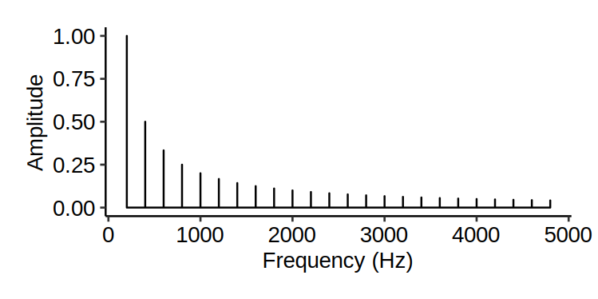
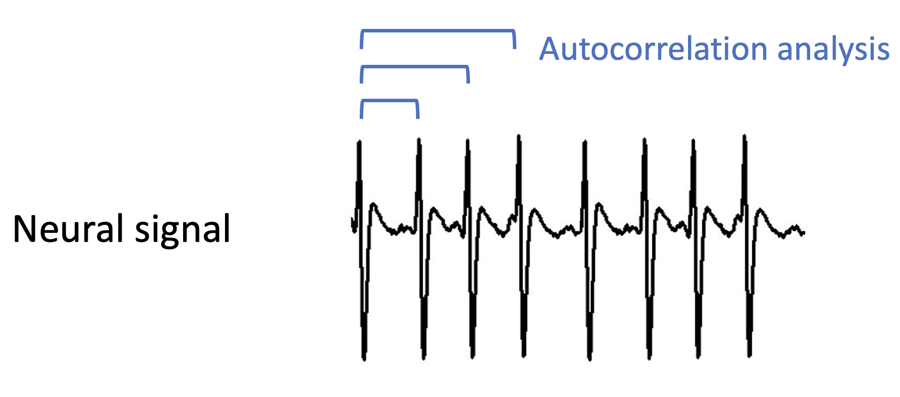

# Pitch

In Section \@ref(foundations-of-acoustics) we saw various forms of idealised waves: the sine wave, the sawtooth wave, and the square wave. These waves all differ in shape, but they share a key property: they are all *periodic*. By periodic, we mean that the wave repeats itself at a regular time interval. This periodicity turns out to be integral to pitch perception.

{width='400px'}

(ref:e8100b33-0d60-4eb4-bee0-eff149fa0775)  <audio controls controlsList='nodownload' style='display: block; margin-top: 10px'><source src='audio/tone-frequency=240.wav' type='audio/mpeg'></audio>

We also covered the notion of 'frequency'. Frequency tells us the repetition rate of a periodic waveform, and is expressed in units of Hz. A frequency of 5 Hz means that the waveform repeats at a rate of 5 times per second.

{width='400px'}

While frequency is a concrete, observable property in the outside world, pitch is something relatively intangible, present only in the mind. We define 'pitch' as the perceptual correlate of frequency; essentially, we are saying that "pitch is that perceptual quality of sound that derives from the underlying sound wave's frequency". 

As discussed in \@ref(foundations-of-acoustics), we can represent a given sound either in a *temporal* representation or in a *spectral* representation. In the temporal representation, we study the waveform, which tells us how pressure changes over time. In the spectral representation, we instead decompose the waveform into its constituent sine waves, and we study the frequencies and amplitudes of these sine waves. The process of converting from a temporal to a spectral representation is achieved using the mathematical technique of Fourier transformation.\

{width='100%'}

The two main theories for human pitch perception correspond to these two different ways of representing sounds. We call these theories the *spectral* and *temporal* theories of pitch perception respectively.

## Spectral theory

According to the spectral theory, pitch perception depends fundamentally on a spectral analysis process that occurs within the *inner ear*, the deepest part of the ear. In mammals, the inner ear is encased in a bony structure called the *bony labyrinth*.

, [CC BY 3.0](https://creativecommons.org/licenses/by/3.0).](images/inner-ear-location.png){width='100%'}

The inner ear contains various structures involved in both sound perception and in orientation perception. The spectral analysis process occurs specifically in the *cochlea*, this coiled structure at the end of the inner ear.

, public domain.](images/inner-ear-and-cochlea.png){width='100%'}

It is easier to understand the cochlea if we imagine uncoiling it, as in the following diagram. The most important part of this diagram is the *basilar membrane*, a long structure that spans the length of the cochlea. At the base, the basilar membrane is thick and stiff, but at its apex, it is thin and mobile. As a result, the basilar membrane has different resonant properties along its length.

, [CC BY 2.5](https://creativecommons.org/licenses/by/2.5).](images/basilar-membrane.png){width='100%'}

Specifically, the base of the basilar membrane resonates at high frequencies, but as we move from the base to the apex, the resonant frequencies become lower and lower. As a result, when sound enters the cochlea, its different spectral components are translated into resonances at different locations along the basilar membrane. This spatial localisation of frequency components is called *tonotopy*. These different locations have their own connections to nerve cells, which communicate the resonances towards the brain, with these resonances already separated by spectral frequency.

**Helmholtz's *sympathetic resonance* theory**. Helmholtz knew about the capacity of the ear to separate sounds by frequencies. He suggested that the ear contains many separate resonant elements, each tuned to a distinct characteristic frequency, similar to the strings in a piano. Incoming sound would then cause particular elements to resonate according to the sound's spectral frequencies (Panel A in the figure below).

![**Schematic illustration of two theories of aural resonance.** **A:** Helmholtz's *sympathetic resonance* theory [@Helmholtz1875-fm]. **B:** von Békésy's travelling wave theory [@Von_Bekesy1960-oh]. Credit: @Bell2004-wo, [CC BY 4.0](https://creativecommons.org/licenses/by/4.0/).](images/resonance-and-travelling-waves.png){width='100%'}

Nowadays most people think that Helmholtz was partly right. We do think that the ear's frequency dispersion capacity comes from the fact that different parts of the basilar membrane have different resonant frequencies. However, we no longer believe that the basilar membrane contains discrete resonators; rather, the basilar membrane's physical properties gradually change as we progress from its base (thick, stiff) to its apex (thin, flexible), and this causes different locations to have different resonant frequencies.

**Travelling waves.** The biophysicist von Békésy conducted a famous series of experiments from the 1940s to the 1960s where he dissected the inner ears of cadavers and used strobe photography to measure their vibrations in response to sounds. He verified that the basilar membrane indeed disperses different frequencies to different physical locations, and showed moreover that the membrane's resonances correspond to a *travelling wave*, specifically a wave that travels down the length of the basilar membrane, analogous to what happens when you hold a rope at one end and flick it (Panel B in the figure above; see also [this link](https://isle.hanover.edu/Ch10AuditorySystem/Ch10TravellingWave.html) for an interactive demo). This work ultimately won von Békésy the 1961 Nobel Prize in Physiology or Medicine. There is nonetheless still uncertainty about the precise physical mechanisms at play here, and debates about the extent to which Helmholtz's and von Békésy's theories characterise frequency dispersion in the cochlea; see @Bell2004-wo and @Babbs2011-eg for some recent discussions.

**Auditory filters**. A given location of the basilar membrane will, in practice, respond to a range of spectral frequencies centred on a particular *characteristic frequency*; put another way, it behaves like an *auditory filter*, filtering the frequency spectrum to include only a small range of frequencies. This frequency range is termed the *critical band*, and its width is termed the *critical bandwidth*, or sometimes the *equivalent rectangular bandwidth* (ERB). Critical bandwidth is closely linked to the perceptual sensitivity of the basilar membrane; when two tones fall within the same critical band, they both excite the same auditory filter, causing interference effects including masking (where one tone makes another tone sound quieter) and beating (i.e. fluctuations in sound amplitude). Critical bandwidth varies according to several factors; for example, louder sounds elicit a larger critical bandwidth, presumably because the increased energy spreads over a wide region of the basilar membrane. If we express critical bandwidths in musical semitones, we find average values of 2-4 semitones for ordinary musical registers, and we find that the number of semitones in the critical band *increases* for lower pitches, meaning that a given musical interval sounds 'muddy' and unclear if we play it low on the piano (or another instrument).

](images/band-pass-filter.svg){width='90%'}

**Inner hair cells.** We have established that different parts of the basilar membrane oscillate in response to different spectral components. How does the ear measure those oscillations? If we look closely under a high-powered microscope, we find bundles of hairs sticking out of the basilar membrane. These tiny hairs are called *stereocilia*. They come in bundles (termed *hair bundles*), and are attached to *hair cells*. They look something like this:

](images/stereocilia-of-frog-inner-ear.jpg){width='100%'}

](images/hair-cells-wellcome-collection.jpg){width='100%'}

Humans have two main types of hair cells: *inner hair cells* and *outer hair cells*. The inner hair cells are responsible for sensing oscillations in the basilar membrane.

The stereocilia of the inner hair cells project into the fluid-filled centre of the cochlea, termed the *cochlear duct*. When the inner hair cell vibrates, the stereocilia try to move along with it, but they drag against the cochlear fluid (*endolymph*).[^030-pitch-1] This causes the stereocilia to *shear*, i.e. to move away from their resting perpendicular position.

[^030-pitch-1]: Recent research suggests that the stereocilia may also be connected by filamentous structures to the overlaying *tectorial membrane*, which would also exert similar resistance to movement [@Hakizimana2021-wt].

The tips of the stereocilia are connected by tiny filaments called *tip links*. When the stereocilia shear, this applies tension to the tip links, and causes *ion channels* to open, allowing positively charged *ions* (especially potassium, $K^+$) to flow into the cell. This triggers the release of *neurotransmitters*, which in term cause the *auditory nerve* to fire.

](images/hair-cell-transduction.svg){width='60%'}

**The auditory nerve.** The auditory nerve is responsible for communication between the ear and the brain. It comprises a bundle of approximately 30,000 nerve fibres, most of which innervate inner hair cells, and the rest of which innervate outer hair cells. Different nerve fibres connect to different inner hair cells, each with their own characteristic frequencies; the auditory nerve therefore inherits the tonotopy of the basilar membrane, with different nerve fibres responding to different characteristic frequencies.

**Outer hair cells.** The travelling wave mechanism identified by von Békésy appeared, on the face of it, to have two important limitations. The first is that a given spectral component would excite such a large portion of the basilar membrane that position information would only provide a very imprecise cue for spectral frequency. The second is that loud sounds would produce such immensely larger vibrations than quiet sounds that the latter would be very hard to detect. Recent decades of research indicate that the outer hair cells (found only in mammals) play a special role in counteracting these effects: they sharpen the physical response of the basilar membrane, meaning that spectral components excite a much smaller area, and they amplify the response to quiet sounds. The physical mechanisms of this sharpening and amplification are still being studied, but it is thought that they depend on the outer hair cells' *electromobility*, namely their ability to change length in response to electrical stimulation. See @Dallos2008-lk for a recent discussion.

**Deriving pitch from auditory nerve firings.** As discussed previously, a complex tone has many spectral components. According to the above process, these spectral components excite different regions of the basilar membrane, stimulating different inner hair cells, and causing different nerve fibres in the auditory nerve to fire. The brain can thereby access its own spectral representation of the incoming sound: the spectral components simply correspond to the different excited nerve fibres. But how would the brain merge these all together to form a coherent percept of pitch? According to the *spectral* theory of pitch perception, the brain uses a *template-matching process*, where the template corresponds to a set of equally spaced harmonics, each corresponding to integer multiples of a common fundamental frequency, with amplitude decreasing as harmonic number increases. This template could either be innate or learned through experience.

{width='450px'}

The brain would continually search the spectrum for patterns that matched this template; whenever it identifies such patterns, it 'merges' their harmonics into a single auditory percept, corresponding to the complex tone. This percept would have a pitch corresponding to the lowest harmonic in this template, corresponding to the fundamental frequency.

This spectral theory of pitch perception is sometimes referred to as 'place theory' or 'tonotopic theory', to emphasise the way in which different spectral components are localised to different places in the ear.

## Temporal theory

Like the spectral theory, the temporal theory of pitch perception still relies on the mechanisms of the inner ear for translating air vibrations into neural impulses. However, it posits that pitch perception does not depend so much on transmitting the locations where the basilar membrane resonates, but rather depends on the temporal structure of the nerve impulses that are elicited by this resonance. In particular, the firing patterns of the nerve cells are known to entrain to the periodic motion of the basilar membrane, in what is called *phase locking*.

, [CC BY-SA 4.0](https://creativecommons.org/licenses/by-sa/4.0).](images/phase-locking-intro.png){width='450px'}

Though an individual nerve cell may not be able to fire fast enough to entrain to every wave cycle, multiple nerve cells stimulated together can simulate this effect, with different cells firing on different cycles. This idea that multiple nerve cells can work together to entrain to high frequencies is called *volley theory*. Through this mechanism, the brain can therefore access the main periodicities of the sound wave, represented as temporal firing patterns in the auditory nerve.

, [CC BY-SA 3.0](https://creativecommons.org/licenses/by-sa/3.0).](images/volley-theory.png){width='100%'}

Suppose that this temporal information does reach the brain -- how does the brain then use this for pitch perception? The proposal is that the brain implements a version of *autocorrelation analysis*, which looks for time lags at which the signal correlates highly with itself. Time lags achieving high correlations are good candidates for the wave's fundamental frequency.

{width='500px'}

There is a deep mathematical similarity between the autocorrelation analysis proposed here for the temporal theory and the Fourier analysis that was previously proposed for the spectral theory. We won't go into the mathematical details here. However, one thing to point out is that the autocorrelation method doesn't in general require the additional template-matching step that the Fourier method required.

Researchers have debated about spectral versus temporal mechanisms of pitch perception for almost a century, but remarkably we still don't really know the extent to which either mechanism contributes to pitch perception. Even with modern neuroscientific methods, it is very difficult to unpick the brain's implementation of pitch perception at a neural level, and so our understanding of this area relies in large part on combining results from many different behavioural psychoacoustics studies probing pitch perception in many different conditions. Currently it seems moderately plausible that both mechanisms contribute to pitch perception; in particular, it seems reasonable that the brain uses both mechanisms for frequencies up to about 2-4 kHz, at which point phase locking is thought to break down due to the neurochemical limitations of the interface between the basilar membrane and the auditory nerve [@Palmer1986-sd]. At higher frequencies the place-based spectral mechanism would then take over.

Interestingly, 2-4 kHz is about the limit for pitch production in conventional musical instruments; for example, the highest note produced by the piccolo is about 4 kHz. One might therefore speculate that *musical* pitch relies particularly on temporal mechanisms.

, [CC0](https://creativecommons.org/publicdomain/zero/1.0/).](images/piccolo.jpg){width='100%'}

## Pitch intervals

Western listeners tend not to hear pitch in *absolute* terms; even highly trained musicians will struggle to name a given note played without additional contextual information. Instead, most Western listeners tend to hear pitch in *relative* terms, specifically in terms of the recognition of particular *frequency ratios*. For example, if a listener is played a pair of tones corresponding to the frequencies 555 Hz and 833 Hz respectively, they are unlikely to realise that the two tones correspond to a C# and a G#, but they might well recognise that the tones are separated by a perfect fifth.

Psychologically speaking, we describe pitch interval as the *perceptual correlates* of frequency ratio. For example, the octave corresponds to a 2:1 frequency ratio; if we take concert A (A4, 440 Hz), and double the frequency (880 Hz), this gives us the A one octave above (A5).

Music theorists have long been aware that, at least for Western listeners, certain pitch intervals seem to sound more pleasant (or harmonious) than others. This differentiation in pleasantness seems particularly strong when the two pitches are played simultaneously to produce *chords*. Intervals and chords that sound particularly pleasant are called *consonant*, and those that sound particularly unpleasant are called *dissonant*.

The consonance of an interval is deeply linked to its constituent frequency ratio. In particular, music theorists long ago established the following interesting observation: consonant intervals tend to have frequency ratios that can be approximated by a ratio of two small integers, for example 2:1, 3:2, 4:3, and so on. Such ratios are called *simple integer ratios.* We will discuss this phenomenon in more detail in Section \@ref(consonance).

Many intervals in Western music theory can be approximated by simple integer ratios such as these. Intervals with particularly simple integer ratios tend to be perceived as more consonant. The following table lists some examples with integer-ratio approximations as proposed by the Greek mathematician Ptolemy:

| Interval       | Frequency ratio | Classification |
|----------------|-----------------|----------------|
| Unison         | 1:1             | Consonant      |
| Major second   | 9:8             | Dissonant      |
| Major third    | 5:4             | Consonant      |
| Perfect fourth | 4:3             | Consonant      |
| Perfect fifth  | 3:2             | Consonant      |
| Major sixth    | 5:3             | Consonant      |
| Major seventh  | 15:8            | Dissonant      |
| Octave         | 2:1             | Consonant      |

: Integer-ratio approximations for musical intervals, from Ptolemy's intense diatonic scale.

This phenomenon of relative pitch has important implications for how we understand the concept of melody. On the one hand, any particular performance of a melody will be defined by a particular sequence of absolute pitches: for example, I might play the first phrase of 'Old MacDonald' starting on a concert A, giving me the following frequencies:

>  440 Hz, 440 Hz, 440 Hz, 330 Hz, 367 Hz, 367 Hz, 330 Hz

<audio controls controlsList='nodownload' style='display: block; margin-top: 10px'><source src='audio/old-macdonald-440.wav' type='audio/mpeg'></audio>

However, I could equally well play the same melody starting on a different frequency, say 330 Hz:

>  330 Hz, 330 Hz, 330 Hz, 247.5 Hz, 275.25 Hz, 275.25 Hz, 247.5 Hz 
<audio controls controlsList='nodownload' style='display: block; margin-top: 10px'><source src='audio/old-macdonald-330.wav' type='audio/mpeg'></audio>

Here we have changed all the frequencies of the melody by the same fixed ratio: 330/440. This changes the starting note but keeps all the intervals the same. We call this manipulation *transposition*.

For most Western listeners, melodies preserve their identities under transposition. So, it's clear that the underlying cognitive representations of these melodies are not absolute frequencies. What else might they be?

One option is that listeners represent the melodies as intervals between successive notes. In that case, we could represent the melody as follows:

> Unison; Unison; Descending perfect fourth; Ascending major second; Unison; Descending major second

Alternatively, listeners might represent the intervals as intervals from the tonic, which here would be the first note of the melody, giving us something like this:

> Unison; Unison; Perfect fourth below; Minor third below; Minor third below; Perfect fourth below

It is not entirely clear yet what exact cognitive representation listeners use; the real answer seems to be complex and task-dependent [see e.g. @dowling1978]. Nonetheless, it seems fair to say that some kind of intervallic representation must be involved, at least for Western listeners.

## Pitch notation

The pitch notation systems used in Western music reflect this primal role of pitch intervals in music perception. We split the continuous space of all possible musical pitches into a grid, where the basic unit in this grid is a fixed pitch interval, the *semitone*. The defining feature of the semitone is that it corresponds to a 12-fold division of the octave.

The piano keyboard provides a physical instantiation of this grid. Each successive key on the piano keyboard corresponds to one semitone above the previous key; moving from left to right takes us from low pitches to high pitches. Western music notation provides another instantiation of this grid, where instead low pitches are situated at the bottom of the stave and high pitches are situated at the top of the stave.

](images/piano-keyboard-with-notes.svg){width="100%"}

It is useful to have standardised names for each of these notes. It is worth mentioning two main naming systems: *scientific pitch* *notation* and *MIDI pitch notation.* Scientific pitch notation assigns each pitch a letter, an optional accidental, and a number that designates the octave, following the scheme below:

](images/piano-octave-numbers.svg)

MIDI pitch notation assigns each note on the piano keyboard a single number, where successive integers correspond to successive semitones. For example, middle C would conventionally be 60, and concert A would be 69 (note that unfortunately there are some places have different conventions here, with middle C for example being given the number 48).

Historically speaking, different semitones would typically have slightly different sizes. The precise sizes of semitones would depend on the current tuning system. Nowadays, most of Western music uses twelve-tone equal temperament, where each semitone has exactly the same size. Unless otherwise specified, MIDI pitch notation is assumed to operate under this equal-temperament scheme too. This means we can have a simple mathematical formula that converts from MIDI pitch to frequency:

$$
\textrm{frequency} = 440 \times 2 ^ {(\textrm{MIDI} - 69) / 12}
$$

This formula works as follows: we are counting the number of semitones between our MIDI pitch and concert A, we're dividing this by 12 to get the number of octaves, we're expressing this as a power of 2 to get the frequency ratio, and we're multiplying it by 440 (the frequency of concert A) to get the absolute frequency.

We can equivalently derive an inverse formula for computing the MIDI pitch for a given frequency:

$$
\textrm{MIDI pitch} = 
69 + 12 \log_2 \left( \frac{\textrm{frequency}}{440} \right)
$$

The following table illustrates these different notation systems for two octaves either side of middle C:

| MIDI note | Scientific pitch notation | Frequency (Hz) | Also known as |
|:---------:|:-------------------------:|:--------------:|:-------------:|
|    48     |            C3             |     130.81     |               |
|    49     |            C#3            |     138.59     |               |
|    50     |            D3             |     146.83     |               |
|    51     |            D#3            |     155.56     |               |
|    52     |            E3             |     164.81     |               |
|    53     |            F3             |     174.61     |               |
|    54     |            F#3            |     185.00     |               |
|    55     |            G3             |     196.00     |               |
|    56     |            G#3            |     207.65     |               |
|    57     |            A3             |     220.00     |               |
|    58     |            A#3            |     233.08     |               |
|    59     |            B3             |     246.94     |               |
|    60     |            C4             |     261.63     |   Middle C    |
|    61     |            C#4            |     277.18     |               |
|    62     |            D4             |     293.66     |               |
|    63     |            D#4            |     311.13     |               |
|    64     |            E4             |     329.63     |               |
|    65     |            F4             |     349.23     |               |
|    66     |            F#4            |     369.99     |               |
|    67     |            G4             |     392.00     |               |
|    68     |            G#4            |     415.30     |               |
|    69     |            A4             |     440.00     |   Concert A   |
|    70     |            A#4            |     466.16     |               |
|    71     |            B4             |     493.88     |               |
|    72     |            C5             |     523.25     |               |

One useful thing about MIDI notation is that we can compute an intervallic representation of a melody simply by subtracting successive note numbers, which gives us the number of semitones between each note number. Another useful thing is that we can transpose a melody by simply adding or subtracting a fixed number to all notes.

## Pitch-class notation

Western music, and indeed many musical styles across the world, has an important notion of *octave equivalence.* Octave equivalence means that pitches separated by octaves (i.e. 2:1 frequency relationships) share some kind of underlying identity, which can be termed *chroma* [@Bachem1950-eb]. In Western music theory we use the term *pitch class* to denote collections of pitches separated by octaves. We can label pitch classes with their corresponding letter names (e.g. C, C#, D, D#, ...), or alternatively we can label them with numbers, where by convention C is written as 0, C# is written as 1. A full table can be found below:

| Letter name | Number |
|-------------|--------|
| C           | 0      |
| C#          | 1      |
| D           | 2      |
| D#          | 3      |
| E           | 4      |
| F           | 5      |
| F#          | 6      |
| G           | 7      |
| G#          | 8      |
| A           | 9      |
| A#          | 10     |
| B           | 11     |

: Western pitch classes and their corresponding integer labels.

Mathematically, we can compute pitch class numbers from MIDI pitches by calculating the remainder when we divide the MIDI pitch by 12. For example, suppose we want to calculate the pitch class of MIDI pitch 62. We divide by 12; $12 \times 5 = 60$, so we have 2 left over, meaning that our pitch class is 2. We express this using mathematical notation as follows:

$$
\textrm{pitch class} = \textrm{MIDI pitch} \mod 12
$$
