# Expectation


## Introduction

Survival depends on the ability to predict the future. Good prediction allows organisms to make sure that they're in the right place at the right time, perhaps to avoid a predator, catch some prey, or avoid an incoming collision. As a result, humans and many other animals have developed sophisticated cognitive abilities for generating effective predictions.

Music listening seems to activate some of these prediction abilities. The idea is that, during a piece of music, the listener is constantly trying to predict what will happen next. These predictions take into account both the listener's prior experience with the musical style, as well as the specific events that have happened so far in the musical piece.

When reading literature about musical predictions, you'll often see them referred to as musical 'expectations'. There's not much practical difference between these terms, but 'expectation' has ended up being the most common term in the musical literature, so it's generally useful to stick with that. To the extent that there is a difference, it concerns whether you are focusing on the listener or the music. 'Predict' is a term that requires you to be talking about the listener: "the listener predicts that the next chord will be a tonic triad". 'Expect' can be applied to either the listener or to the music: "the listener expects a tonic triad", or "the dominant chord creates an expectation for the tonic triad".

Suppose we are partway through a melody and we are trying to predict what note is going to come next. Broadly speaking, two kinds of outcomes are possible: (a) our prediction is fulfilled, and we see the note that we were expecting to see; (b) our prediction is violated, and we see a different note to what we were expecting.

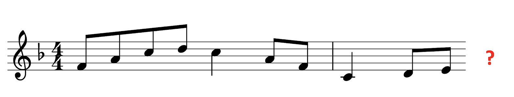{width='100%'}

<br>

In the natural environment, accurate prediction can be a matter of life and death. An incorrect prediction could mean being caught and killed by a predator, or missing a rare opportunity to find food. It seems reasonable then that incorrect predictions should be accompanied with some kind of emotional 'shock', or at least a 'frisson', to alert the organism that something has gone and potentially to discourage it from making similar mistakes in the future.

We seem to see these kinds of effects in music listening too. If I play a musical context that clearly implies a certain continuation, and then violate that implication, this gives the listener a certain kind of shock that can snap them out of a comfortable state.

When used appropriately, these prediction violations don't have to be experienced negatively; they can instead make the piece more interesting, and introduce rewarding trajectories of tension and relaxation. Prokofiev is a composer who makes very explicit use of these prediction violations, which musicologists often describe tongue-in-cheek as 'wrong notes'. In Peter's theme from Peter and the Wolf, the first two bars are harmonically very predictable, simply outlining the tonic triad. The theme then jumps without warning to the flat submediant, giving the listener a strong prediction violation.


<br>


(ref:94a61186-92a4-4aa1-b8c4-62bd2d8685a6) <iframe width="560" height="315" src="https://www.youtube.com/embed/1BRp_zeLYr4?start=10" style="display: block; margin-bottom: 25px" title="Prokofiev 'Peter and the Wolf', opening." frameborder="0" allow="accelerometer; autoplay; clipboard-write; encrypted-media; gyroscope; picture-in-picture" allowfullscreen></iframe>

Prokofiev ends up repeating the same unusual harmonic progression many times -- four times over the course of the movement. The more we hear it, the less surprising it sounds: our short-term experience starts to override our long-term stylistic knowledge. It never manages to override it completely, though. Intuitively, it feels like part of our brain keeps on trying to generate predictions based on long-term stylistic knowledge rather than short-term experience, and keeps being surprised as a result. This is probably for the best -- if knowing a piece meant that you stopped hearing it with respect to your stylistic knowledge, then it might become rather difficult to get much out of repeated listenings.

We typically use the words 'schematic' and 'veridical' to differentiate these two kinds of expectations. Schematic predictions are predictions that derive from long-term experience with a given musical style. Veridical predictions are predictions that derive from specific experience with particular musical elements. This could mean hearing the exact same piece before, but it could also mean recognising a theme that we already heard from earlier in the piece.

It's possible to rationalise these different expectations from the perspective of music theory. We can talk about how certain chord progressions are prototypical, or 'expected', in the context of Western music, and we can point to how certain musical passages violate these expectations. It's important to remember though that one doesn't need formal training in music theory to experience these expectation violations: music theory just helps put words to them.

We can think about listeners generating expectations for various kinds of musical features. The music psychology literature has focused on several in particular:

**Temporal expectation.** Almost every musical style has some kind of temporal organisation. A given music performance will typically contain many individual musical notes, and the timing of these notes is organised in some kind of structured way. We know from earlier in the course that listeners can develop expectations for when these notes will occur, based on their ability to detect periodic structure in the sound, and their ability to recognise prototypical rhythmic structures from their musical style. They can also develop expectations for when the beat is going to arrive, which is very helpful for coordinating physical movements such as tapping and dancing.

**Melodic expectation.** Melody also occurs in almost every musical style across the world. There's a long tradition of music theory and music psychology work that tries to explain how a particular melodic context generates expectations for what note is going to come next.

**Harmonic expectation.** In the context of Western music, listeners also develop strong expectations for harmonic progressions. Suppose I have a context sequence of chords looking like this:

{width='100%'}

<br>

Western music listeners will have an automatic idea of what chords should be expected next. For example, if I continue the progression with a D flat major chord, it sounds very unexpected, but if I continue it with a C major chord, it sounds very expected.

## Expectation and probability

Probability is the mathematician's way of dealing with uncertainty. Even if we can't be sure about what is going to happen in the future, we can put certain numbers on the probabilities of different outcomes, and this can help us to make the best decision about what to do next.

A particularly important concept is that of 'conditional probability'. Conditional probabilities tell us about the probability that an event will occur given a set of contextual conditions. If we call the event we're waiting for 'X' and the contextual conditions 'Y', then we write the conditional probability of "X given Y' using the following notation:

$$
P(X \vert Y)
$$

Here the "P" refers to probability", and the vertical bar means 'given', or 'conditioned on'.

An example of a conditional probability would be if I asked you, "What is the probability that it rains today, given that it rained yesterday and the day before?" You might tell me that the probability is 75%, meaning that on average, 75% of days that follow two rainy days are also rainy themselves. In the context of card games, another example might be if I asked "What is the probability that a blackjack player goes 'bust' if they ask for another card from the dealer, given that they've already been dealt a Jack of Spades and a 5 of Diamonds?" In the context of music, I could similarly ask "What is the probability that I see a C major chord, given that I've just seen a D minor chord followed by a G major chord?"

So, we've seen some examples of conditional probabilities. How do we actually define these probabilities? There are different ways to define probability out there, but perhaps the most fundamental is the 'frequentist' approach. The frequentist approach takes a so-called 'long-run' approach to defining probabilities. The probability of X given Y is defined as the result of the following procedure: run infinitely many experiments where Y is known to be the case, and calculate the proportion of times that X occurs in practice. This will give us a number between 0 and 1, which we term the 'probability of X given Y'.

Of course, in practice we can't run infinitely many experiments. However, if we run a sufficiently large number of experiments, we know that our results should approximate the true probabilities fairly closely.

Corpus analyses often end up being exercises in estimating probabilities. For example, we might be interested in the question "Did Baroque composers use plagal cadences more commonly than Classical composers?" We can approach this question by sampling a large number of cadences from Baroque and Classical composers, and calculating the proportion of these cadences that are plagal. Using our notation from before, we can then calculate "What's the probability that a cadence will be plagal, if I know already that it's written by a Baroque composer?", and likewise for Classical composers.

$$
\begin{align}
P (\textrm{cadence is plagal } \vert \textrm{ Baroque composer}) &= \ ? \\
P (\textrm{cadence is plagal } \vert \textrm{ Classical composer}) &= \ ?
\end{align}
$$

When we're talking about musical expectations, we are typically interested in a particular kind of conditional probability, calculated at a particular point in the musical piece. We suppose the listener is hearing the piece in real time, and is trying (for example) to predict what the next note in the melody is going to be. Let's call the pitch of the next note X, and let's use Y to denote the portion of the piece that the listener has heard already. The listener is then trying to estimate the conditional probability of X given Y, for different possible pitches X. In this particular example, the listener might think that an F is particularly likely, with a probability of .28. They might also think G and D are reasonably plausible, taking probabilities of .22 each. The remaining possibilities each receive lower probabilities. We call this collection of different probabilities a 'conditional probability distribution'.

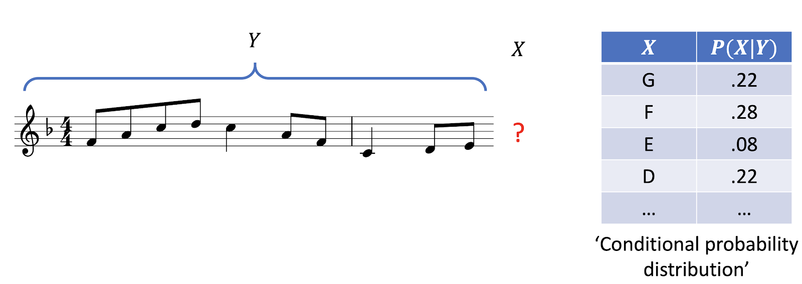{width='100%'}

<br>

At this point it's important to distinguish two kinds of probabilities: *objective* probabilities and *subjective* probabilities. Objective probabilities correspond to the true probabilities of musical events as manifested in music corpora; we can estimate them using corpus analyses. Subjective probabilities corresponded to the imagined probabilities for musical events in the mind of the listener. These subjective probabilities will be determined by the listener's musical experience, and any internal biases that they hold.

A *rational* or *ideal* observer will try and maximise the accuracy of their subjective probabilities, given access to their available information. So, we can imagine that, as a listener grows more and more familiar with a musical style, their subjective probabilities are likely to approach closer and closer to that style's objective probabilities.

There's a problem here, though. A given listener will only have listened to a certain amount of music in their lives, and so they don't have access to an infinite amount of information. But music is like chess -- it only takes a few steps for you to end up with a context Y that has never occurred in your past experience. Even with the simple melody above, I doubt that any readers have heard this precise melody outside of this class. So, how can we compute the conditional probability of X given Y, if we've never seen Y before?

The way we solve this problem is with the following observation: "Good prediction is about knowing what to ignore". The full melodic context is too much information to cope with: we need to discard some of this information to make the problem tractable.

A very radical approach would be to forget about all details of the preceding melody, and just remember what key we're in. If we know that the key is F major, we can guess even with limited musical experience that the next note is quite likely to be an F, or perhaps an A or a C, or any other member of the F major scale. In contrast, we can be fairly confident that we won't see an F sharp, or a C sharp, and so on. We know this because we can look at many pieces in the key of F major, and count how often different pitches occur.

Arguably we've thrown away too much information if we just look at the key. So, we might additionally choose to remember the last note of the melodic context. This is quite useful here: the last note is an E, which is the leading note in F major. We don't need to look at all that many melodies to realise that the leading note typically resolves upwards by a semitone to land on the tonic.

We can extend this information further by including the penultimate note in the context, which in this case is a D. This is also quite informative: the rising movement from the D to the E introduces some inertia (i.e. momentum) which provides further reason to suspect that the next note will be an F.

Of course, we can repeat this process further and further, taking into account more and more context. In this example we're now looking at the last three notes of the melodic context. If we look much further than three notes in the past, we'll struggle to find enough precedents in our music corpora.

One thing that becomes particularly apparent when modelling listeners is the importance of recent information. If we have to choose two notes to remember when trying to predict the next note, the last two notes are the best ones to choose. We can see this mathematically if we analyse the statistical structure of music corpora. We can also interpret in terms of the listeners' cognitive constraints: listeners don't have enough memory space to remember the whole history of the musical piece, and in practice most listeners can only recall the last few seconds with much reliability.

I want to conclude by talking about a few practical applications of probabilistic music modelling. By probabilistic music modelling, I mean developing a computer program that learns to express a musical style effectively in terms of conditional probability distributions.

One of the most compelling practical applications of probabilistic music modelling is in *automatic music generation*. Here we get the computer to create a piece by sampling one note at a time according to the conditional probability distributions that it's learned from processing music corpora. This work has a history dating back to the 1950s, but a lot of progress has been made in the last few years, including some significant contributions from Google's Magenta group. In this audio example, we hear Google's "Music Transformer" model extemporise a continuation for the opening of Debussy's composition "Clair de Lune". Note that here the model is generating a full performance, not just a musical score.

<audio controls controlsList='nodownload' style='display: block; margin-top: 10px'><source src='https://s3-eu-west-1.amazonaws.com/media.pmcharrison.com/music/magenta/clair_de_lune_continuation.mp3' type='audio/mpeg'></audio>

These generative models can be applied in quite varied ways. Here the same model is used to generate a harmonisation for "Row, row, row your boat".

<audio controls controlsList='nodownload' style='display: block; margin-top: 10px'><source src='https://s3-eu-west-1.amazonaws.com/media.pmcharrison.com/music/magenta/row_row_accompaniment.mp3' type='audio/mpeg'></audio>

Another application of these models is in *automatic music classification*. Suppose we discover a manuscript for an unknown composition in some library archives, and we want to work out whether the composition was written by J. S. Bach or by one of his contemporaries. Probabilistic models give us a principled way to investigate these kinds of authorship questions. We construct probabilistic models for the different candidate composers, trained on music written by these composers, and then we quantify how well these models manage to predict the new piece of interest. High predictive accuracy means that the piece is particularly consistent with the style of that particular composer. So, we can use these probabilistic models to make educated guesses about authorship.

*Automatic music transcription* is another important application of these probabilistic models. The goal in automatic music transcription is to develop software that accurately transcribes some kind of score from an audio recording. This is a difficult task, especially when many parts are playing at the same time. Probabilistic models are helpful for increasing the accuracy of transcription models, because they provide an error-correction function: if the transcription algorithm produces an output that seems very stylistically unlikely, then the probabilistic model can encourage the transcription algorithm to find a more plausible solution.

## Measuring musical expectations

In this section we will cover various ways of measuring musical expectations: rating paradigms, singing paradigms, priming paradigms, and electroencephalography paradigms.

### Rating

The first and best-established method for assessing musical expectations is the rating experiment. The method is simple: we just ask the participant to give a numeric rating for a particular musical event in a particular musical context. The precise instructions for this rating differ between studies, but most commonly we just ask the participant to evaluate the 'fit', or perhaps the 'expectedness', of the particular event.

The most famous version of this rating method is described in an important paper by @krumhansl1982. This paper focuses specifically on pitch in the context of Western tonality. They call their approach the 'probe-tone' paradigm: 'probe' because they are probing the listener's expectations, and 'tone' because they're probing expectations for tones.

In each trial of the probe-tone paradigm, the participant is first played a context stimulus. In this example, the context stimulus is a C major chord. A few moments later, the participant is played a probe tone. This tone is chosen from a selection of possibilities covering the chromatic scale. The participant is then asked, "How well does the probe tone fit with the context?", and has to respond on a 7-point rating scale. Here's an example trial with a C as the probe tone; most Western participants would say that the probe tone fits pretty well.

{width='50%'}

<br>


(ref:221630af-5b1e-4478-a9b7-040123275c3e)  <audio controls controlsList='nodownload' style='display: block; margin-top: 10px'><source src='expectation/probe-tone-major-chord.mp3' type='audio/mpeg'></audio>

\
In this example, C sharp is the probe tone. Most Westerners would say that this tone fits less well.

{width='50%'}

<br>


(ref:c90875c7-0f83-4224-bc44-37031d6e35e2)  <audio controls controlsList='nodownload' style='display: block; margin-top: 10px'><source src='expectation/probe-tone-major-chord-2.mp3' type='audio/mpeg'></audio>

@krumhansl1982 studied a variety of tonal contexts in their experiment, in addition to simple tonic triads. Some trials used a diatonic scale; other trials used short cadences, like the IV-V-I cadence or the ii-V-I cadence.

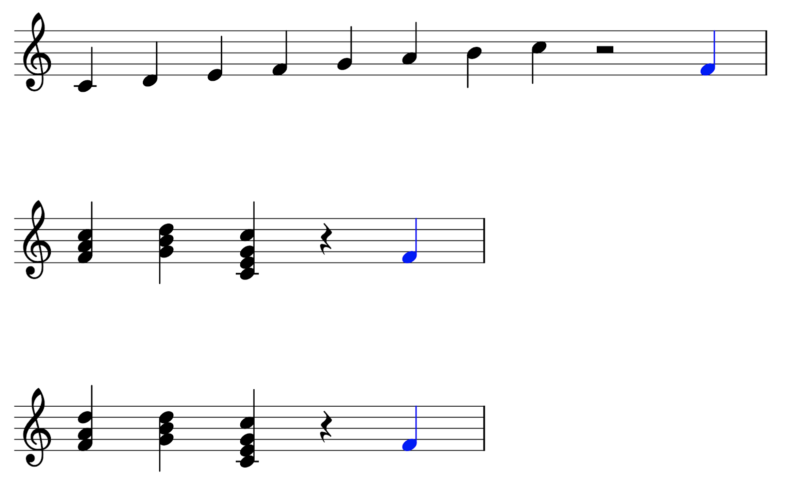{width='100%'}

<br>

After collecting data for many trials like this, the authors computed mean fit ratings for the different pitch classes in the chromatic scale. This graph plots the results for context sequences in C major. We can see that there's a lot of variation in the graph: some pitch classes receive much higher ratings than others. We see the highest ratings for the members of the tonic triad: C, E, and G. We see the lowest ratings for pitch classes outside the C major scale: C#, D#, F#, G#, and A#. It seems reasonable to interpret this figure as an approximation of the participant's conditional probability distribution over the different candidates for the probe tone: highly rated tones correspond to tones with high subjective probability.

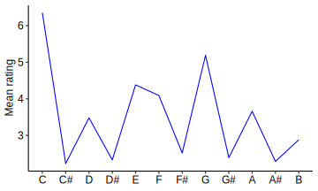{width='70%'}

<br>

The authors also performed an analogous set of experiments using minor context sequences. As you'd expect, a different profile emerges, reflecting the change of key. Now E has very low fit, but E flat has high fit. Likewise, A no longer has a high fit, but A flat does. These changes straightforwardly reflect the differences between the major and minor scales.

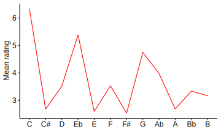{width='70%'}

<br>

It's clear that this rating paradigm has the advantage of delivering easy to interpret results. It's also fairly efficient -- we don't need that many participants to deliver useful data. However, it arguably does have an important disadvantage, which is that the participants' responses are filtered through conscious decision-making, when the participant decides what number to give on the rating scale. We don't have to make those kinds of decisions when we listen to music normally, and it could be that this process provides results that don't completely reflect normal music listening.

### Singing

Singing tasks are another way to probe melodic expectations [e.g. @Fogel2015; @Morgan2019]. Here we play the participant a context melody, and we ask them to sing a continuation to that melody. The idea is that participants are more likely to sing 'expected' continuations, that is, continuations with high subjective probability.

This task is very intuitive. It's also very efficient: there's no need to probe every tone in the scale, because the participant simply sings the most expected tone straight away. However, the task does have some obvious disadvantages. One is that the task is still potentially biased by conscious decision-making, similar to the rating task. A second is that it relies on the participant's singing ability: participants who are poor singers won't be able to perform the task properly. A third is that the results are influenced by production biases. For example, if a singer tends to sing flat, then this will make their expectations appear 'flat' compared to how they might look in a perceptual task. Lastly, the method relies on transcribing what note was sung by the participant, which can be a time-consuming process to do manually, and a tricky one to automate.

### Priming

Another important approach in the field is the 'priming' paradigm. This paradigm was inspired by previous work in the field of psycholinguistics.

Here's an example of how the priming approach can be used to assess harmonic expectation, taken from a study by @Tillmann2006. In each trial, we play a chord sequence to the participant, and tell them to make a perceptual judgment about a particular chord in the sequence, called the 'target'. In this case the chord of interest is the final chord in the sequence, and the participant is being asked to say whether this final chord is played by a piano or by a harp.

{width='100%'}

<br>


(ref:6f673b15-3197-4b32-96ec-723f1116bc52)  <audio controls controlsList='nodownload' style='display: block; margin-top: 10px'><source src='expectation/tillmann-2006-congruent-harp.mp3' type='audio/mpeg'></audio>

In different trials we manipulate the chords used in the stimulus. In the previous example, the target would have been categorised as 'related': it's the tonic chord, and hence highly expected given the context. In the next example, the target is the subdominant chord, and is hence categorised as 'less related' to the context.

{width='100%'}

<br>


(ref:ee8c0835-56e8-4850-994f-bad4d2480450)  <audio controls controlsList='nodownload' style='display: block; margin-top: 10px'><source src='expectation/tillmann-2006-less-related-harp.mp3' type='audio/mpeg'></audio>

The theory behind the priming task is as follows. When the target is more expected, this makes the chord easier to process, which then speeds up the participant's decision. Conversely, when the target is less expected, this slows down the processing, causing longer reaction times. So, we can measure how expected a chord is by studying the length of its reaction times. The main appeal of this priming paradigm is that it bypasses the conscious processing that we saw in the rating task and the singing task. We can call it an 'implicit' measure of expectation: the participant generally has no awareness of what is happening. However, this implicit nature is at the same time a disadvantage. It's difficult to be certain that the results of this paradigm really are telling us about expectation. Our main evidence that priming measures expectation is that expected events tend to deliver shorter reaction times than unexpected events, but when we start using priming as a way of measuring expectation, this logic becomes circular.

### Electroencephalography

EEG is a neuroimaging technique that has proved particularly useful for studying musical expectations. The reason is that EEG has a particularly high time resolution compared to many other neuroimaging techniques, which allows us to study the time course of the brain's responses to musical events at a very granular level.

Participants in EEG studies wear caps containing many different electrodes which are placed into contact with the scalp. The EEG device records small changes in voltage on the scalp. These voltage changes are linked to the firing of neurons on the edges of the brain.

An important thing to know about EEG data is that it tends to be very noisy. Of course, even when the participant isn't actively doing anything, their brain is constantly at work, and this produces constant fluctuations in the EEG signal. When we conduct EEG experiments, we want to find a way of minimising this kind of random noise, and amplify the part of the EEG signal that corresponds to a particular experimental intervention, for example playing a melody. This task can be seen as a problem of maximising the 'signal-to-noise ratio'.

The event-related potential (ERP) technique is a classic way to maximise this signal-to-noise ratio. Here we suppose that we're interested in measuring the characteristic EEG response to a particular stimulus, for example an unexpected note in a melody, or the resolution of a 4-3 suspension. We collect EEG data for many trials like this, and average the results. The averaging makes the random noise component disappear away towards zero, leaving us with an event-related potential like the one plotted here. On the x-axis, we have the time after the stimulus (in milliseconds); on the y-axis, we have the instantaneous potential, corresponding to the voltage measured at a particular scalp electrode. We find that ERPs typically contain various peaks or troughs, which we call *components*. If we're lucky, we can identify individual components with particular aspects of cognitive processing. Typically the earlier components will correspond to more primitive sensory processing, whereas the later components will correspond to higher-level cognitive processing.

, [CC BY-SA 3.0](http://creativecommons.org/licenses/by-sa/3.0/), via Wikimedia Commons](expectation/erp.svg){width='50%'}

<br>

Neuroscientists have identified various kinds of ERPs in response to musical stimuli. One example is the Early Right Anterior Negativity, or ERAN, originally identified by @Koelsch2000. For copyright reasons we don't have an image of an ERAN to show for you here, but we recommend looking at Figure 1C in @Koelsch2009-yd for a reference; you can see an ERAN in that plot as a peak in the red curve at about 250 ms. We typically see the ERAN as a response to syntactically unexpected chords in chord sequences: chords that violate the listener's cultural expectations for what chords should come next.

The ERAN is 'early' because it happens relatively early in the time course. The term 'right' refers to the way in which the ERAN is typically localised to the right hemisphere of the brain (though some studies haven't reproduced this effect). The term 'anterior' refers to the way in which the ERAN is typically localised forward in the brain. The term 'negativity' refers to the way in which the ERAN peaks with negative voltage (note how on ERP diagrams, high points correspond to negative numbers, not positive numbers; you can see this from the labelling of the y axis).

In theory, we can use ERPs like the ERAN to track musical expectation in melodies or chord sequences. In the case of chord sequences, seeing an ERAN would tell us that the chord was syntactically unexpected. An absence of an ERAN would tell us that the chord was relatively expected.

The great advantage of this approach is its directness. Our psychological data is no longer filtered through distracting behavioural paradigms, such as rating or discrimination tasks. We are leaving our participants to experience music in a relatively undisturbed way, close to how they might ordinarily listen to music. This must surely increase the validity of the results. What's more, the task can give us some insight into the neural dynamics of expectation. We can directly observe how long it takes the brain to process different kinds of violations, without having to wait for the participant to initiate any physical movements. The data can also give us some insights into which regions of the brain are involved in generating and monitoring expectations.

There are some important disadvantages to this approach, though. The first is the noisy nature of the measurement process. On an individual trial, random fluctuations in brain activity make it difficult to discern anything useful in the EEG signal. To get interpretable results, the experimenter must conduct many trials and average over them. To get enough trials, experimenters often end up repeating the same stimulus multiple times, but this can be problematic because repetition will change the participants' expectations.

A second problem concerns what we might call *measurement validity*. How can we be sure that an ERP such as the ERAN is really measuring expectation? Sure, several experiments have found ERANs occurring in the context of syntactically unexpected chords, but it is difficult (or perhaps even impossible) to be sure that the ERAN is truly a 'pure' marker of expectation violation. This measurement validity question crops up again and again in different aspects of cognitive neuroscience.

### Summary

We covered four different empirical approaches for assessing musical expectations: rating tasks, singing tasks, priming tasks, and electroencephalography (or EEG). The first two of these are *explicit* tasks, in that we tell the participant explicitly to judge expectedness, or to produce expected continuations to melodies. The second two are *implicit* tasks, in that the participant receives no explicit instructions to evaluate expectedness. We saw how implicit tasks bring appealing benefits in terms of avoiding conscious evaluation processes that may not be relevant to naturalistic music listening. At the same time, these implicit tasks raise important issues of measurement validity. In practice, it's difficult to get far with any single paradigm: a proper account of musical expectation ought to reconcile and explain measurements from several of these different paradigms.

## Modelling melodic expectation

From a psychological perspective, models help us to formalise complex theories in a way that helps us to test them in scientific experiments. From a practical perspective, good models of music perception can also have interesting applications, for example in automatic music composition.

In this section we're going to talk about three main classes of melodic expectation models: music-theoretic models, psychoacoustic models, and statistical-learning models.

### Music-theoretic models

These models were created by expert music theorists who set about the goal of expressing their personal understanding of music and music perception in a formal way.

The classic model in this tradition is Narmour's Implication-Realisation model, which Narmour introduced in a couple of books published in the early 1990s [@Narmour1990-gv; @Narmour1992-ka]. The work is heavily influenced by earlier work by the philosopher Leonard Meyer. The main goal of Narmour's model is to explain how the arrangement of the notes in a melody combine to generate certain expectations in the listener, which Narmour calls *implications*.

Narmour's model proposes that melodic expectation can be understood in terms of two independent perceptual systems: a *bottom-up* system and a *top-down* system. The bottom-up system corresponds to innate and fundamental processes of auditory perception, which are by definition shared across all listeners irrespective of their culture. The top-down system then reflects knowledge that the listener learns through exposure to music in a particular style, with this exposure depending on the listener's cultural background.

Here's how Narmour puts it: "The top-down system is flexible, variable and empirically driven... In contrast, the bottom-up mode constitutes an automatic, unconscious, preprogrammed, 'brute' system".

Narmour's writings have a reputation for being rather lengthy and dense. The psychological community has ended up relying heavily on several subsequent papers that summarise Narmour's work in some way. @Cross1995-ar and @Thompson1996-pk both wrote useful reviews of Narmour's books that summarise the work from a critical perspective. Krumhansl produced an influential collection of papers [e.g. @Krumhansl1995-yz] showing how Narmour's model could be applied in psychological experiments.

Most empirical studies, including Krumhansl's, have focused primarily on the bottom-up component of Narmour's model. This is presumably because this is the most clearly specified part of the model, and the part that should generalise best to different musical styles and musical listeners.

This bottom-up system is typically summarised in terms of five basic principles: *proximity*, *registral direction*, *intervallic difference*, *registral return*, and *closure*.

The **proximity** principle is the simplest of them all. This states that listeners will generally expect small intervals. We encountered a similar principle earlier in the context of voice leading.

{width='100%'}

<br>

The remaining principles are specific to particular melodic contexts. In particular, we consider a melodic context of two notes, forming what we call an *implicative interval*. This interval generates implications, or expectations, for what interval is going to come next. The interval that actually comes along is called the *realised interval*. This interval can either fulfil or deny the listeners expectations.

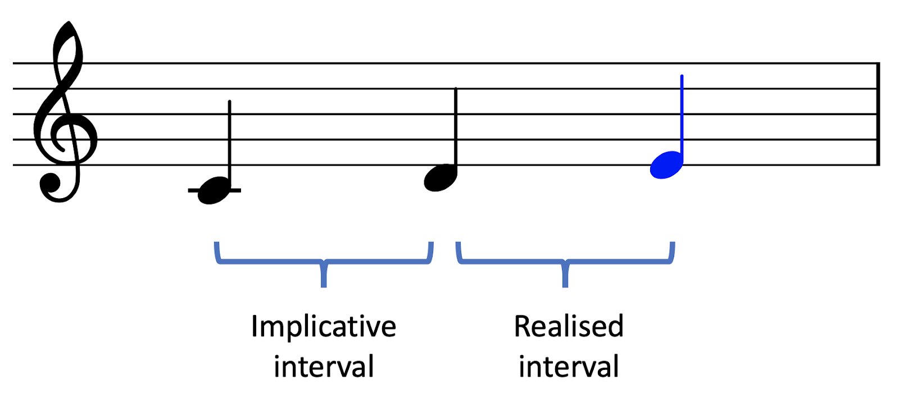{width='70%'}

<br>

The **registral direction** principle states that small intervals generate an implication that the next interval will continue in the same direction. Conversely, the principle also states that large intervals generate an implication that the next interval will reverse direction. A 'small interval' is defined here and elsewhere as anything smaller than a tritone (6 semitones), whereas a large interval is defined as anything larger than a tritone.

The **intervallic difference** principle also makes a distinction between small and large implicative intervals. It states that a small implicative interval will create an expectation for another similarly sized interval, whereas a large implicative interval will create an expectation for a contrasting smaller interval.

The **registral return** principle differs from the others in that it describes the relation between the *first* note of the implicative interval and the *second* note of the realised interval. It states that, all else aside, listeners will expect the latter note to be no further than a major second away from the former note. Note that this principle can end up working contrary to the intervallic difference principle, which states that large intervals should be followed by small intervals.

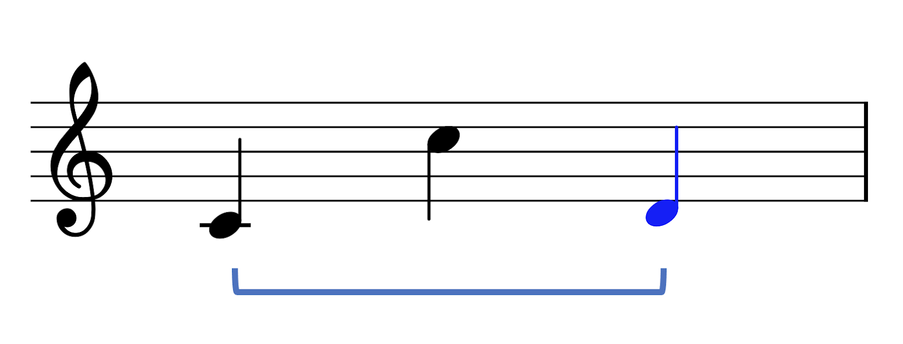{width='70%'}

<br>

The **closure** principle is different in its own way: it's meant to determine the completion of melodic phrases. Narmour states that the impression of closure can be created by various different features. One feature is when the melody exhibits a change of direction. Another feature is when a large interval is followed by a small interval. Narmour also describes various other closure features, to do with rhythm and tonality, which we will not consider here.

Narmour's model was mainly motivated by music analysis and introspection. It prompted a series of empirical studies investigating whether the principles actually held true for the average listener.

A series of these studies have investigated how well Narmour's principles held in **Western** listeners [e.g. @Krumhansl1995-yz; @Schellenberg1996-hz; @Pearce2006-hk]. Generally speaking, the conclusions are rather positive: most of the time, most of the rules end up being supported. In any individual study, the researchers might not necessarily find evidence for all of Narmour's rules, but when we look over multiple studies, we see that most of the rules end up being pretty well supported.

An important part of Narmour's theory is the claim that these bottom-up principles are innate. If so, we should see these principles manifesting across **different musical cultures**. There are not that many studies in the literature testing this question, unfortunately: I'm only aware of three. These three studies investigate three non-Western participant groups: Chinese participants [@Schellenberg1996-hz], participants from the Sami people, who are an indigenous people from the Scandinavian peninsula [@Krumhansl2000-nj; @Eerola2009-ug], and finally South African traditional healers [@Eerola2009-ug]. The general message from these studies is that these populations do differ in terms of their melodic expectations, but these expectations nonetheless share a common basis in Narmour's bottom-up principles. In other words, Narmour's bottom-up model does seem to generalise fairly well cross-culturally. However, we'd need to test many more populations before making a firm conclusion about this. For more discussion about melodic structures cross-culturally, see the 'Music across the world' chapter.

There are a few other music-theoretic expectation models in the literature. @Margulis2005-sd describes a model of melodic expectation that includes various relatively high-level principles that link expectation to tension. This model has been surprisingly underexplored in subsequent work. The 'Tonal Pitch Space' model of @Lerdahl1988-hi is not specifically about melodies or about expectation, but it describes Western tonality in a cognitively informed way that can be used to predict the relative stability of different notes in a melody, and their tendencies to resolve in particular directions.

These music-theoretic modelling approaches have two main disadvantages. The first is that their rules are speculative: they are generally grounded in the theorist's intuition, and are not necessarily supported by objective psychological data. The second disadvantage is a consequence of the first: since the models are grounded in the theorists' intuitions, and since the theorists are typically grounded in Western music theory, then the models are likely to be Western-centric in nature.

Given this context, it's particularly impressive how well Narmour's implication-realisation model seems to generalise, both across different Western listeners, but even across musical cultures. It's a testament to how far one can get with speculative methods.

### Psychoacoustic models

Psychoacoustic models come from a very different perspective. They try to explain melodic expectation in terms of basic properties of sound, and the way that sound is processed by the ear and the brain.

Various kinds of psychoacoustic models have been used to try and understand melody perception. Here we're going to focus on one such model, from @Milne2011-iv. Milne has used this model to explain various aspects of tonal perception that others have often assumed to be cultural in origin.

The fundamental idea behind Milne's model is that listeners expect successive sounds to have high spectral similarity. We can imagine that this is motivated by real-world auditory perception, where sound spectra will typically stay relatively consistent over time. This isn't a new idea: @Parncutt1989-sm and @Leman2000-ky have also presented similar theories. Here we're going to focus on Milne's model because it takes a particularly simple form, yet works rather well in practice.

The main function of the model itself is to compute the spectral similarity of a pair of sounds. If we know this spectral similarity, then we can try and predict the expectedness of a given chord progression. The computation process involves two steps. First, the model computes a perceptual spectrum for each sound, intended to represent how the sound appears to the listener. Second, the model computes the similarity between the two perceptual spectra, to arrive at the overall perceived spectral similarity.

The first step, simulating perceptual spectra, involves making certain assumptions. Some of these assumptions are acoustic and some are psychological. The main acoustic assumption is that every note is a harmonic complex tone. It's easy to modify this assumption though when studying different kinds of timbres, for example inharmonic timbres. One psychological assumption is 'octave equivalence': this means that pitches are perceived as equivalent if they are separated by a whole number of octaves. This assumption of octave equivalence seems to hold across many different musical cultures [though certain cultures, such as the Tsimane', seem not to hold to this; @Jacoby2019-ew]. The second psychological assumption is that pitch perception has finite acuity: in other words, listeners can't perceive pitch with unlimited accuracy, but instead perceive pitches with some kind of window of uncertainty.

Simulating the perceptual spectrum involves several steps:

1.  Expand the notes into **harmonic spectra**.

2.  Apply the **octave invariance** principle. This is done by converting all the pitches in the spectrum into *pitch classes*. Pitch classes are based on the idea of 'octave equivalence' -- if two notes are separated by a whole number of octaves, they are given the same pitch class. When we compute the pitch-class spectrum, all the different Cs end up being collapsed to the same spectral component, all the different Gs end up collapsed to the same spectral component, and so on. The resulting spectral components have amplitudes corresponding to the sums of their contributing components.

3.  **Smooth** the spectrum to account for the limited acuity of pitch perception. As a result, instead of very precise peaks at pitch classes of '0' or '7', we get smoother bumps.

The following diagram illustrates the results for an input note of C:

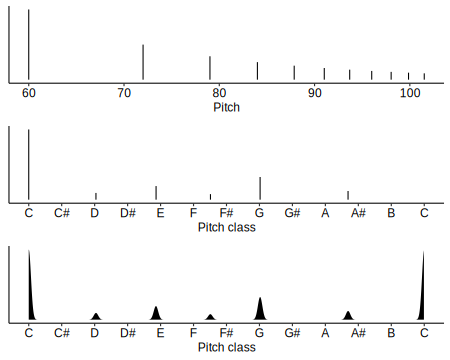{width='100%'}

<br>

The following diagram illustrates the results for an input C major triad:

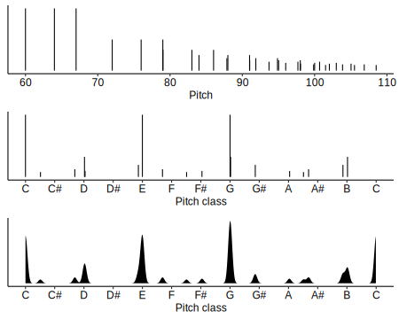{width='100%'}

<br>

So, we now know how the model computes perceptual spectra for different sounds. In order to predict expectation, we now need to compute the similarity between different perceptual spectra.

Let's apply the model in the context of Krumhansl & Kessler's famous probe-tone experiments [@krumhansl1982], which we discussed earlier. Here the participant is played a particular tonal context, for example C major triad, and then asked to rate the expectedness of different 'probe tones' that come after. In this example, we're going to consider a probe tone of 'C'.

To apply Milne's model to these contexts, we first compute perceptual representations for the tonal context and the probe tone, and then we compute the similarity of these perceptual representations. Here the perceptual representation for the C major triad is plotted in grey, and the representation for the C probe tone is plotted in red. We see that these two spectra are rather well aligned: both of these spectra have large peaks at C, E, and G. For the triad, these peaks come mainly from the fundamental frequencies of each chord tone. For the probe tone, these peaks come from particular harmonics within the complex tone.

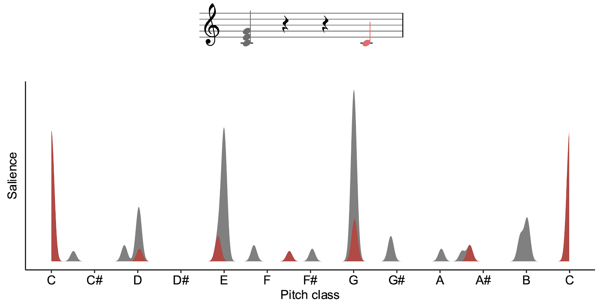{width='100%'}

<br>

If we quantify the similarity between these spectra mathematically, we get rather a high value, .70. So, the model correctly predicts that a C should be relatively expected in the context of a C major triad -- no surprises there!

Let's now see what happens if we try a probe tone of C#. If we look at the graph, we see now that the spectrum for the C# (in red) no longer aligns well at all with the spectrum for the C (in grey). Correspondingly, when we compute the similarity between the spectra, we get a rather low value of .01. So, the model predicts that C# is going to be relatively unexpected in the context of C major.

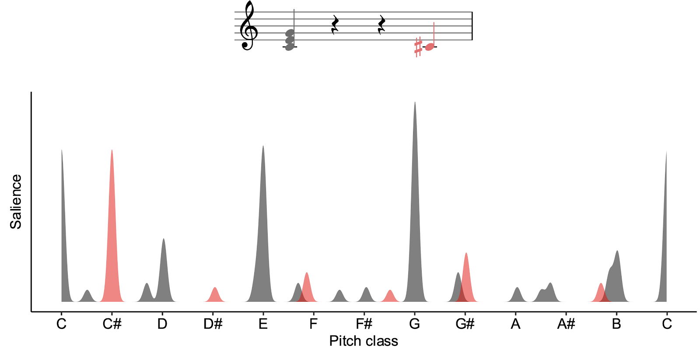{width='100%'}

<br>

We can repeat this process for all the different pitch classes in the octave, and we get the results plotted in red. We can compare these curves against the participant ratings collected in Krumhansl & Kessler's [-@krumhansl1982] probe-tone study, plotted here in blue. If we do this, we see an impressively close correlation.

![**Comparison of the Krumhansl-Kessler [-@krumhansl1982] probe-tone data with the predictions of Milne's spectral similarity model [@Milne2011-iv].**](expectation/milne--krumhansler-kessler.png){width='100%'}

<br>

I mentioned before that @Milne2011-iv weren't the first to come up with this spectral similarity idea. We can find rather similar ideas implemented as computational models in work by @Parncutt1989-sm and @Leman2000-ky. These former models are more sophisticated in various ways, taking into account more complex psychological phenomena such as masking and pitch-perception mechanisms. Interestingly, though, this added complexity doesn't seem to result in any greater predictive power -- in fact, the present evidence suggests that the models actually perform worse than Milne et al.'s simple model [@Milne2015-os]. So, we won't consider them further here.

A very appealing aspect of these psychoacoustic models is that they can suggest deep explanations for the ultimate origins of stylistic rules. For example, Milne et al.'s model is showing that the relative expectedness of different pitch classes within a given tonal context might well be explained by the harmonic spectra of these tones, rather than any particular cultural learning. On the other hand, these models are limited in terms of what they can hope to explain. Fundamentally, only so much can be explained by acoustics and basic biology -- to explain more nuanced and culturally dependent aspects of melodic expectation, we need models that are capable of learning.

Note: You can try out Milne's model on your own chords using
this [Colab Notebook](https://colab.research.google.com/drive/1gazS3VH2y4gr0MrgjXFQBHsR-4NBgm78).

### Statistical-learning models

Statistical-learning models simulate processes of *enculturation* over a listener's lifespan. Through exposure to lots of music from a particular musical style, the listener acquires an intuition for what kinds of melodic patterns are common and which are uncommon. This intuition then drives their reactions to new, unfamiliar melodies.

We're going to focus on a particular statistical-learning model from the literature called the Information Dynamics Of Music model, or IDyOM for short @Pearce2005-bm.

We talked already in a previous section about the idea of understanding expectation in terms of conditional probabilities. Here we suppose that the listener has just heard a particular melodic context, and is trying to predict what note is going to come next. The expectedness of a particular continuation is operationalised probabilistically as the conditional probability of observing that note given the previous context.

{width='100%'}

<br>

The idea behind statistical-learning expectation models is that they simulate how listeners might learn conditional probabilities through experience. To do this, the listener needs to keep track of particular melodic contexts, and chart how often they tend to continue in a certain way.

Let's imagine how this would work in practice. Suppose we're interested in predicting the next note in the melody from before. The last two notes of the context were a D and an E. Let's imagine that the listener has heard this context 180 times before, with various different continuations, illustrated on the left of the screen. In this context, the listener heard a G 40 times, an F 50 times, an E 15 times, a D 40 times, and a C 35 times. Following basic mathematical principles, the listener can use this information to estimate the probability of seeing an F as the number of times they saw an F in this particular context (50 times) divided by the number of times they saw this context in total (180 times). This gives a value of .28, or 28%. We can repeat this process over all the different possible continuations to get the full conditional probability distribution. This is basically how IDyOM works.

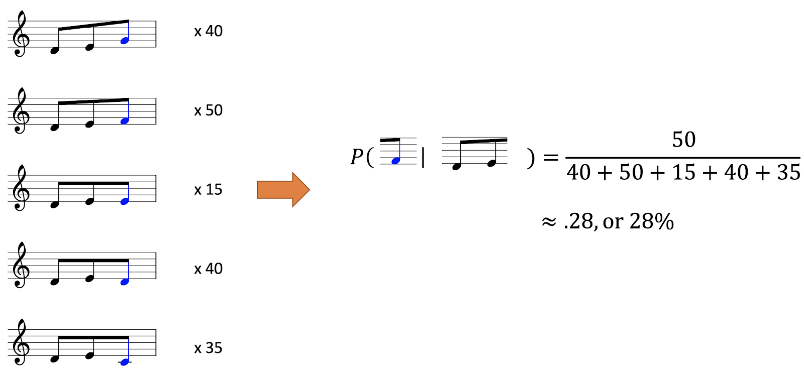{width='100%'}

<br>

IDyOM does have some special features though, which set it apart from simpler models in the literature. I'm going to outline briefly three of these special features today: viewpoints, variable-order Markov modelling, and long-term and short-term memory.

#### Viewpoints

The idea about viewpoints is that there's many different ways of looking at a particular melody:

-   We could consider the **pitches** themselves, perhaps expressed on a MIDI scale.

-   We could consider the **contour** pattern, which describes whether each note goes up or down compared to its predecessor. In the below diagram I've marked ascending intervals with '+' symbols and descending intervals with '-' symbols.

-   We could consider an **interval** representation, where each note is represented as a signed number of semitones from the previous note. For example, the first interval in this melody is an ascending major third, corresponding to four semitones, so we write a 4 under the second note of the melody. The second interval is an ascending minor third, so we write a 3 under the third melody note, and so on. Alternatively, we could use a scalar interval representation instead, which preserves the number but not the quality of the interval (e.g. not distinguishing between major or minor sixths). This is useful for capturing tonal transpositions of a motif, where the exact interval sizes are not necessarily preserved.

-   We could consider a **scale degree** representation, where each note is represented relative to the local tonic. Here the first few notes outline the major triad, so we write 1, 3, and 5 underneath them, as we would do in Roman numeral analyses.

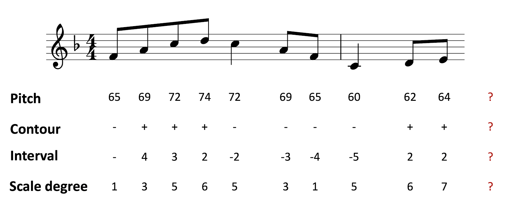{width='100%'}

<br>

Each of these different representation schemes is called a 'viewpoint'. The idea is that IDyOM learns statistical regularities in each of these different viewpoints through its simulated enculturation process. This is intended to simulate the way in which listeners also hear music in terms of these different viewpoints. Often these viewpoints help the model to learn quicker, and generalise better to new contexts: for example, the interval and the scale degree representations are both invariant under transposition (i.e. pitch shift), which mean that if the listener learns a particular pattern in a particular melody, they can generalise that knowledge to melodies in different keys.

#### Variable-order Markov modelling

This feature concerns the kinds of statistical regularities that the model is able to learn.

Let's begin by defining a 1st-order Markov model. A 1st-order Markov model makes its predictions by solely looking at the previous element in the sequence. If we're looking at the pitch viewpoint, this means looking only at the previous pitch; if we're looking at the interval viewpoint, that means looking only at the previous interval, and so on. This sounds like a big sacrifice, and in a sense it is -- you're discarding information that could be useful in predicting the next note. On the other hand, there's an important advantage, which is that discarding this information helps to make the learning process more tractable, because there's only a limited number of possible contexts to learn.

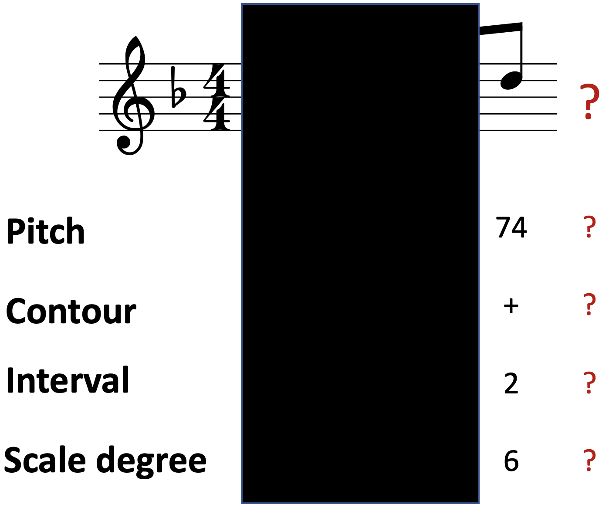{width='50%'}

<br>

A 2nd-order Markov model is like the 1st-order model, except it now takes into account the two previous elements in the sequence. This makes the model more specific to particular contexts, potentially increasing its predictive power.

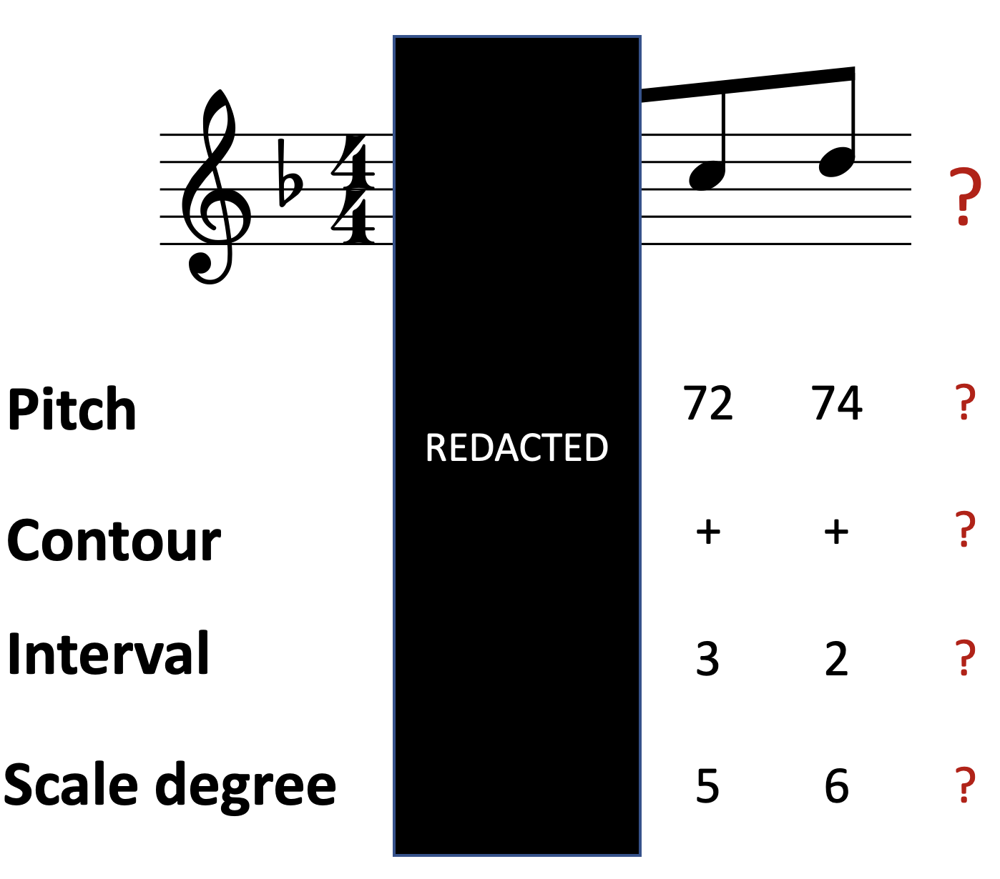{width='50%'}

<br>

As you might expect by now, a 3rd-order Markov model then takes into account the preceding three elements. This improves its potential predictive power still further, at the cost of having to learn many more different contexts.

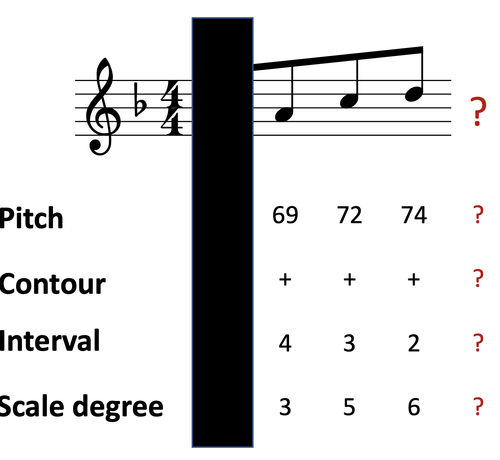{width='50%'}

<br>

So, each kind of Markov model comes with its own advantages and disadvantages. IDyOM is a variable-order Markov model, which means that it switches between different orders of Markov models depending on the situation. When it has lots of data available, it'll prefer higher-order Markov models, because they can take advantage of additional information present in the longer context. When not much data is available, it'll prefer lower-order Markov models, which don't require so much data. This seems to reflect how listeners are able to function well in both unfamiliar and familiar musical contexts.

#### Long-term and short-term memory

The final feature concerns IDyOM's *long-term* and *short-term* memory modules. The long-term module is pretrained on a large corpus of melodies, with the intention of simulating the enculturation that occurs over a listener's lifetime. The short-term memory module begins each melody with a blank slate, and solely learns statistics from this melody. This allows the model to learn particular patterns in the melody, for example motifs, that might be used to generate better predictions in the future. It seems that both these kinds of memory are useful for predicting listener responses.

#### Example practical application

Let's see how we might apply IDyOM in practice. Here's an excerpt from a Bach chorale melody, with model outputs from IDyOM compared to human listeners. In particular, this graph is plotting the 'surprise' experienced by IDyOM and by the human listeners at each point in the melody. We can see that surprise varies somewhat over the course of the melody. If we look at note position 14, for example, we see that both the model and the listeners have very low surprise -- in other words, they were both very confident that the G was going to occur. If we look at the melody itself, we can sympathise with this prediction: the G is the obvious end of a descending scale, and it produces an obvious cadence onto the tonic.


```
#> Warning: ImageMagick was built without librsvg which causes poor qualty of SVG rendering.
#> For better results use image_read_svg() which uses the rsvg package.
```

![**Modelling listener surprise through the course of a melody [data from @Pearce2018-pw].**](expectation/idyom-dynamic-predictions-combined.svg){width='100%'}

<br>

Looking at note position 23, we see that both the model and the listeners have very *high* surprise. We can see why this happens when we look at the melody: there\'s a big leap of an ascending minor seventh, which is rather unexpected in a melodic context.

After this point, though, the melody becomes rather predictable again, producing a descending scale back to the tonic.

IDyOM has been successfully applied to quite a few psychological contexts. It\'s been demonstrated to predict listener **expectation** fairly well in a variety of tasks, ranging from rating to priming to EEG. It\'s been shown to predict **emotional responses**, at least to a certain degree: high levels of surprise are associated with increased arousal and negative emotional valence (we\'ll talk more about arousal and valence next week). The model seems to predict the **memorability** of sequences: more predictable sequences are easier to remember. It\'s also been shown to predict **phrase boundary perception**, to some degree: high surprise acts as a cue for initiating a new phrase.

Note position 23 is an example of high surprise at a phrase boundary. The high surprise tells us that the transition between the low F sharp and the high E would be relatively unlikely as part of a normal melodic phrase -- this suggests that the transition potentially occurs over a phrase boundary.

The big advantage of IDyOM as a model of melodic expectation is that it can predict listener expectations rather accurately. So far it seems to outperform all the competitor models in the literature.

One disadvantage is that it can be difficult to interpret what the model has learned. IDyOM ends up learning a vast number of conditional probabilities, and it\'s difficult for the researcher to interpret those probabilities manually. A second disadvantage is that IDyOM doesn\'t differentiate between aspects of expectation that might be learned from a musical style and those that have non-musical origins. For example, IDyOM quickly learns that small intervals are more common than large intervals, and hence treats large intervals as relatively unexpected. It could be true that listeners learn this fact from music listening, but it\'s also possible that listeners learn this expectation from listening to speech, or even are born with an innate expectation for small intervals.

### Recap and future directions

We considered three kinds of melodic expectation models: music-theoretic models, psychoacoustic models, and statistical models. Our example music-theoretic model was Narmour\'s Implication-Realization model [@Narmour1990-gv; @Narmour1992-ka]; we focused particularly on five rules that make up the \'bottom-up\' component of this model. Our example psychoacoustic model came from @Milne2011-iv; this model predicts expectation in terms of the spectral similarity between different musical sounds. Lastly, our example statistical-learning model was IDyOM [@Pearce2005-bm], a fairly sophisticated model that incorporates various special features to help it better predict melodic expectation in listeners.

Current work has been generalising these ideas in various ways. One line of research follows Milne et al.\'s psychoacoustic work, exploring how psychoacoustic models of expectation can help us to understand how listeners can perceive tonality in microtonal tuning systems [@Hearne2020-hk]. Other lines of work are taking the statistical learning approach and applying it to different musical domains, such as harmony [@Harrison2020-si] and rhythm [@Van_der_Weij2017-iv]. The ultimate goal is to build a complete picture of how listeners generate musical expectations for all kinds of musical stimuli.
