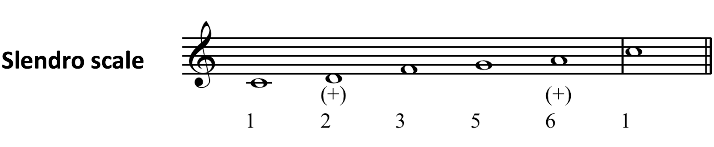
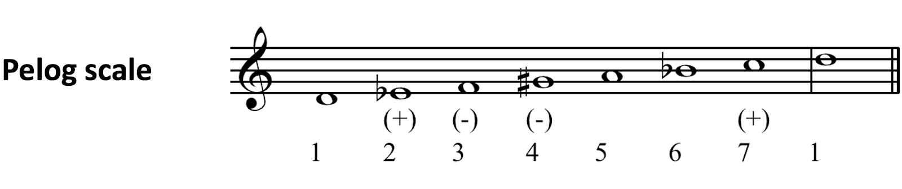
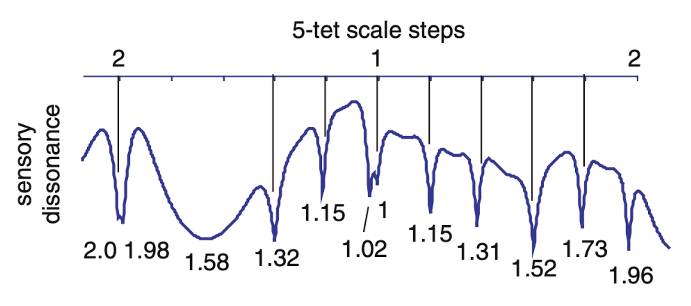

# Music across the world

<!-- How to define music? From Savage et al. (2015): -->

<!-- " It should be noted that the editors of the Encyclopedia did not adopt a formal definition of music in choosing their selections. We thus assume that they followed the common practice in ethnomusicology of defining music as “humanly organized sound” (48) other than speech, with the distinction between speech and music being left to each culture’s emic (insider, subjective) conceptions, rather than being defined objectively by outsiders. Thus, our analyses suggest that there is no absolutely universal and objective definition of music, but that Lomax and Grauer’s definition may offer a useful working def- inition to distinguish music from speech." -->

It has long been understood that music can be found in diverse cultures across the world. A recent ethnographic survey of 315 societies across the world found music to be present in every case [@Mehr2019-xu]. This widespread prevalence of music speaks already to its notional evolutionary function: if music is indeed an indispensable part of human society, this suggests that it has some important utility across human cultures that may have a long evolutionary history.

An important question then arises: how does this music-making vary across the world? One way of studying this question is to 'zoom in' on individual societies and study them using ethnomusicological methods. Traditionally an ethnomusicologist will spend years embedding themselves within a given musical culture to learn about it as an insider, paying attention both to the structural features of the music and the cultural and social roles it plays within the society. The result is typically a highly detailed understanding of a particular musical culture, developed primarily 'on its own terms', without necessarily referring to other musical cultures around the world.

An alternative approach that has ebbed and flowed in popularity over the decades is *comparative musicology*. Comparative musicology seeks to establish a *comparative* understanding of different musical cultures, looking both at the sense in which they are similar and the sense in which they are different. It is a more scientifically oriented approach, in that it seeks to represent musical pieces and cultures as data points that can be compared quantitatively to one another.

Comparative musicology saw initial popularity from the late 1800s, with foundational work by researchers such as Erich von Hornbostel (1877-1935). Relevant studies included investigations of scale systems and instrument usage across the world. Unfortunately, this early work ended up manifesting certain problematic characteristics, for example an 'evolutionist' way of thinking that considered Western art music to be the ultimate end-goal of musical style development, and that considered other musical styles to be 'primitive' in various ways. These philosophical and interpretative issues are part of the reason why ethnomusicology largely displaced comparative musicology for most of the 20th century.

Recent years have seen something of a resurgence of interest in comparative approaches. @Brown2013-lz present a strong argument for setting cross-cultural comparisons at the heart of musicology and music psychology, placing particular emphasis on the importance of studying *musical universals*, features of music which reliably occur across many musical cultures. @Savage2015-rp present a systematic quantitative analysis of the occurrence of different musical features across a set of globally sampled music recordings. @Mehr2019-xu present a systematic quantitative analysis of ethnographic accounts of music performance from all over the world, focusing in particular on the social contexts in which music manifests in these cultures. Psychological studies have investigated the cross-cultural perception of diverse musical dimensions including pitch [@Jacoby2019-ew], consonance [@McDermott2016-sf], and rhythm [@Jacoby2021-xp]. Together, this work is giving us an increasingly complete picture of the diverse ways in which music manifests across the world, allowing us to explore interesting questions about the genetic and cultural processes underlying music's evolution. In the next few sections we will explore different parts of this field.

## Cultural contexts of music-making

An important principle in ethnomusicology is that we should pay serious attention to the social and cultural contexts within which music is produced. These sociocultural elements have most commonly been studied from qualitative perspectives such as ethnography, where the researcher spends a significant amount of time immersed in the relevant culture documenting events that they observe. This approach delivers very rich data with many personal insights. However, by itself it does not contribute directly to a comparative understanding of the world's musics, because no single researcher would have enough time to immerse themselves in a sufficient number of cultures to produce a proper global perspective.

The paper by @Mehr2019-xu addresses this problem by taking a large amount of ethnographic writings indexed in the [*eHRAF World Cultures Database*](https://ehrafworldcultures.yale.edu/ehrafe/), identifying passages related to vocal music, and constructing a large set of variables summarising key features of the writings, including both variables concerning the music itself (e.g. the sex of the singer, the presence of instruments) and variables concerning its behavioural context (e.g. the song appears to be part of a ceremony, or the song is associated with war). They christen the resulting dataset the *NHS Ethnography*, where 'NHS' stands for 'Natural History of Song'. The authors then construct various quantitative analyses that compare these variables across different musical cultures.

Quantitative analyses can quickly becoming overwhelming if they report many different variables at the same time. There are various strategies available for coping with this issue. One popular family of approaches is *dimensionality reduction*, where we try to summarise the collection of variables in terms of a small number of learned *dimensions*, where each dimension is shorthand for a collection of variables that tend to go together. There are several statistical approaches to dimensionality reduction out there, of which the most popular are *principal component analysis* and *factor analysis*. @Mehr2019-xu use a particular approach called Bayesian principal component analysis, a version of principal component analysis which is able to cope with the fact that the ethnographic dataset has missing data in certain places.

The Bayesian principal component analysis returns three main dimensions that together summarise much of the variation in behavioural context for the different songs in the NHS Ethnography. The authors describe these three dimensions as follows:

> -   **Formality**: "Excerpts high along this dimension describe ceremonial events involving adults, large audiences, and instruments; excerpts low on it describe informal events with small audiences and children."
> -   **Arousal**: "Excerpts high along this dimension describe lively events with many singers, large audiences, and dancing; excerpts low on it describe calmer events involving fewer people and less overt affect, such as people singing to themselves."
> -   **Religiosity**: "Passages high along this dimension describe shamanic ceremonies, possession, and funerary songs; passages low on it describe communal events without spiritual content, such as community celebrations."

One might hypothesise that music plays different roles in different cultures: for example, one culture might predominantly use music in a formal religious context, whereas other cultures might predominantly use music in an informal nonreligious context. The quantitative analyses show that there is indeed some cross-cultural variation along these lines. However, the takeaway message from the analyses is actually that there tends to be much more variation within a given culture than between different cultures. In other words, most cultures tend to exhibit multiple modes of music-making that explore different levels of formality, arousal, and religiosity; if we average over these different modes, we find that most cultures actually sit in a middleground for these three different variables.

The authors provide a [web app](https://www.themusiclab.org/nhs_explorer/ethnography/index.html) that allows you to explore how different extracts from the NHS Ethnography sit on these three dimensions:

<iframe src="https://www.themusiclab.org/nhs_explorer/ethnography/index.html" width="100%" height="700px" data-external="1"></iframe>

In a subsequent analysis, the authors take a more granular approach to understanding music's behavioural contexts. They look in particular at a collection of keywords chosen to reflect hypotheses generated from published literature in anthropology, ethnomusicology, and cognitive science. They then look to see how often these keywords occur in the context of the musical parts of the ethnographies, as compared to non-musical parts.

They find indeed that, across different cultures, music tends to be associated in certain contexts above others. Many such contexts are listed in their Table 1, though some are more statistically prevalent than others. There seem to be particularly strong effects for the following contexts:

-   Dance
-   Healing
-   Religious activity, rituals
-   Mourning, death, funerals
-   Processions, spectacles, nuptials
-   Play, games, childhood activities
-   Love

It is interesting to speculate about why these contexts crop up repeatedly across different cultures. Is it because music has particular evolutionary functions that are mediated by its usage in these contexts? Or is it simply that, once you've evolved a musical capacity, these are natural arenas in which to express it?

The second part of the paper focuses on a secondary dataset of cross-cultural music recordings sampled to represent four different song categories chosen in previous work: dance songs, healing songs, love songs, and lullabies. This dataset is termed the *NHS Discography*.

In an initial experiment, the authors demonstrate that Western (or at least Westernised) listeners are capable of categorising cross-cultural song recordings into these four different categories (dance, healing, love, lullaby) at a reasonable success rate, even though in most cases the listeners will have been totally unfamiliar with the source musical culture. Classification performance was largely independent of the listener's musical training, or indeed their self-reported familiarity with traditional music. This suggests that these song types tend to exhibit certain consistent musical features across different cultures that are associated with their particular functions, and that listeners are sensitive to the implications of these features even in the absence of formal musical experience.

In a series of follow-up analyses, the authors explore what musical features might be responsible for distinguishing these different song functions. They find a variety of patterns here, including the following:

-   Dance and healing songs tend to have more differentiated accents than lullabies;
-   Dance songs tend to have fast tempos;
-   Love songs tend to have high variability in interval sizes;
-   Healing songs tend to have lots of stepwise motion.

Again, it is interesting to speculate as to why these song functions might be consistently associated with these musical features across different cultures.

The final part of the paper corresponds to candidate musical universals that are independent of particular behavioural contexts. We will discuss these in the next section.

## Structural features of music

Music researchers have written for many decades about cross-cultural differences in musical styles, and have theorised in particular about the idea of *musical universals*, musical features which might reliably occur across many musical cultures. However, little progress was made on this question in the 20th century, with ethnomusicologists tending to avoid this topic and the baggage it brought from comparative musicology. In this section we will discuss a couple of recent articles that revisit this question of musical universals, bringing a quantitative perspective that simultaneously compares many cultures across the world.

### Savage et al. (2015)

@Savage2015-rp analysed a collection of 304 recordings from the *Garland Encyclopedia of World Music*, a dataset comprising recordings from a variety of sources from all over the world, including both field recordings of traditional indigenous music and studio recordings of nontraditional music. The researchers listened to each recording and coded them in terms of 32 musical features covering various aspects of pitch, rhythm, form, instrumentation, performance style, and social context. These features are strongly inspired by the arguments of @Brown2013-lz.

When examining the recurrence of particular features across different cultures, it's important to account for the notion of cultural relatedness. If we see the same musical feature recur many times in cultures that are completely unrelated to each other, this implies that there is some kind of latent evolutionary pressure that encourages the development of that feature. However, if the same musical feature recurs many times in cultures that are close neighbours, the evidential strength is weaker: it could simply be that the feature developed once by chance in a historical parent culture, and the child cultures just inherited it. @Savage2015-rp therefore use so-called *phylogenetic comparative methods* to adjust for cultural relatedness in their analyses. Their primary analyses operationalise cultural relatedness using data on the historical relatedness of different languages (*language phylogenies*), but they also present supplementary analyses that instead operationalise cultural relatedness using geographic information.

An important question in the the interpretation of the results concerns the definition of 'musical universal'. A strict definition of musical universal would mean that the feature is found in every piece of music, no matter its origin. @Savage2015-rp take a weaker definition of musical universal, defining it as a feature that occurs at least 50% of the time. Such features can be termed *statistical universals*.

The paper identifies a collection of statistical universals spanning different musical domains. The authors summarise them as follows:

> -   **Pitch**: Music tends to use discrete pitches (1) to form nonequidistant scales (2) containing seven or fewer scale degrees per octave (3). Music also tends to use descending or arched melodic contours (4) composed of small intervals (5) of less than 750 cents (i.e., a perfect fifth or smaller).
> -   **Rhythm**: Music tends to use an isochronous beat (6) organized according to metrical hierarchies (7) based on multiples of two or three beats (8)---especially multiples of two beats (9). This beat tends to be used to construct motivic patterns (10) based on fewer than five durational values (11).
> -   **Form**: Music tends to consist of short phrases (12) less than 9 s long.
> -   **Instrumentation**: Music tends to use both the voice (13) and (nonvocal) instruments (14), often together in the form of accompanied vocal song.
> -   **Performance style**: Music tends to use the chest voice (i.e., modal register) (15) to sing words (16), rather than vocables (nonlexical syllables).
> -   **Social context**: Music tends to be performed predominantly in groups (17) and by males (18). The bias toward male performance is true of singing, but even more so of instrumental performance.

Further to this analysis of individual features, @Savage2015-rp also studied the sense in which certain features tend to occur together. In particular, they find a collection of statistically associated features that seem to recur in the context of group performance and dance:

> -   Isochronous beat
> -   Motivic patterns
> -   Few durational values
> -   Phrase repetition
> -   Percussion instruments
> -   Syllabic singing

It is not hard to understand why the above features might be promoted in the context of dancing and group performance: each feature looks like it should be useful for encouraging inter-individual rhythmic entrainment. However, it is less obvious why some of the other musical features might become universal, for example discrete pitches or nonequidistant scales. We will revisit these questions in Section \@ref(potential-origins-of-musical-structures).

### Mehr et al. (2019)

The previously discussed paper by @Mehr2019-xu includes a significant section on candidate musical universals. This follows a detailed analysis of the behavioural contexts of music around the world. This behavioural context part of the paper is very impressive in its scope and quantitative execution; in contrast, unfortunately, the subsequent musical universals section feels a little disappointing, both for its lack of detail and for the Western-centric nature of its methods.

One proposed universal is tonality, specifically the notion that songs tend to be built around a particular tonal centre. This hypothesis is reasonable, but the analysis involves (a) having Western music theorists annotate tonal centres for the melodies, and (b) running the Krumhansl-Kessler keyfinding algorithm on the melodies, an algorithm which is trained on behavioural data from Western listeners. In both cases, one might expect the derived keys to be shaped significantly by the cultural expectations of Western listeners. A better approach to this question would define tonality in a much more culturally neutral way.

A second proposed universal is that melodies vary along two dimensions of complexity: one of which is melodic complexity, and the other of which is rhythmic complexity. These two dimensions are extracted through principal component analysis. Again, the hypothesis seems reasonable, but the support from the data is relatively weak: the two components only explain 13.1% and 10.8% of the variance respectively. In other words, these two dimensions are only explaining a small part of the way in which melodic structure varies across the world.

A third proposed universal is that the prevalence of different melodic and rhythmic bigrams is distributed according to a so-called *power law*. Traditionally speaking, a bigram is a pair of elements from a given alphabet, for example 'AB' or 'CA'. The authors actually do not analyse bigrams in the conventional sense, which confuses things a little bit. Instead, they just look at frequency distributions for (a) melodic pitch intervals and (b) rhythmic ratios between successive notes. Curiously, the authors do not tabulate separate distributions for different cultures, but instead calculate an overall distribution of intervals and ratios across all the musical cultures in their sample. They find that certain intervals are particularly common cross-culturally (unison, major second, and minor third), and likewise certain rhythmic ratios (1:1, 2:1, and 3:1) are particularly common cross-culturally. Moreover, they show that, when ranking the full set of observed intervals/ratios, the distribution of their relative frequencies is well-approximated by a curve of a particular shape corresponding to a *power law*. Power-law shapes have previously been observed in many contexts, including music, language, and painting, but it would be interesting to see that this phenomenon replicates in different musical cultures. Unfortunately, the present analysis does not quite show this, because it doesn't compute separate distributions for individual cultures. However, it is arguably interesting nonetheless to know that we get a power-law distribution if we look at all the cultures jointly. It should be noted though that these distributions are filtered through the transcriptions of expert Western musicians, and may inherit some biases from them. In particular, the process of representing melodies on the Western 12-tone scale arguably forces the musicians to impose Western biases on their transcriptions; likewise, the rhythmic notation forces the musicians to express rhythms in terms of the integer-ratio rhythmic categories used in Western music theory. Future work ought to find ways to reduce these biases, perhaps by representing pitch and rhythm in a culturally neutral continuous space.

The authors provide a nice [web app](https://www.themusiclab.org/nhs_explorer/discography/index.html) that allows you to explore different songs in the NHS Discography organised according to the principal components described above. Different songs are represented as different points; click on a point to learn more about the song, and to play an audio recording.

<iframe src="https://www.themusiclab.org/nhs_explorer/discography/index.html" width="100%" height="700px" data-external="1"></iframe>

### Controversies

It should be noted that the concept of musical universals remain controversial. @Mehr2019-xu conducted a survey of 940 music scholars examining their perspective on this topic. Self-identified ethnomusicologists were particularly sceptical of the concept, with their free-text responses including the following:

> "I'm not sure precisely what the angle is here, but the question of musical universals has largely been settled by ethnomusicology--in short, there are very, very few of them. ... "

> "You cannot be serious. Universals? I understand and appreciate your project (really, human musicking is my intellectual jam). But you cannot suggest that scales are universal. You cannot suggest that tonality is universal. And why pitch organization? Because that's how European music culture thinks. ..."

> "The idea that music is universally understood is a long discounted theory. This line of questioning is condescending to 'people around the world'."

> "A study of universals would negate the rich diversity of the world's cultures. We are different, no matter how many similarities we may share. The value we must find lives in the in between spaces."

> "I fear that this undertaking, spearheaded by the paragon of colonialist expeditions (harvard grad students) risks recapitulating the efforts of comparative musicologists a century ago. Why identify universalities if not to compare and categorize? ..."

> "The idea that there is such a thing as musical universals (let alone that it should be studied) is deeply ethnocentric and Eurocentric. This idea reinforces 19th century European colonial ideology. There is no place for this type of antiquated and prejudiced thinking in a global 21st century education system marked by international and cultural diversity."

> "I prefer not to approach music in a universal way. Every culture perceives facts and music in a different way depending on their cultural background. Thus, I think that only people with similar cultural backgrounds could - or may - understand the music as well as the musical and non- musical behaviors of the people under research. "

> "The problem with the questions about whether this or that use of music is universal or not is that human societies are so many and so various! ..."

> "You are using the term 'music' in a very biased Western way. Frankly, I don't know what you mean by the term. You are treating it as a natural, objective thing that exists. ..."

They make important points, especially concerning the dangers of imposing an overly Western perspective on music studies. Nonetheless, there are many modern musicologists who now think that these statements go too far, and that we should not give up on the goal of developing a comparative understanding of the world's musics. It seems worthwhile to work towards a comparative musicology that acknowledges and rectifies the problematic cultural imperialism found in early work.

## Potential origins of musical structures

The work of researchers like @Mehr2019-xu and @Savage2015-rp constitutes important progress towards understanding what musical universals might be out there. A follow-up question, once we have established the existence of such universals, concerns the mechanisms by which such universals arise. Such work is necessarily speculative, but it gets at the root of an essential musicological question: why musical styles developed the way that they did.

In this section we will consider various influences that may shape the development of particular musical styles. This will include both influences that are relatively fixed between different musical cultures (e.g. the nature of the human voice) and influences which change between different cultures (e.g. local languages, local musical instruments).

### Vocal constraints

#### Small pitch intervals

One of the most obvious features cross-culturally is that melodies tend to contain **small pitch intervals**. A plausible explanation of this is simply that small pitch intervals are easier (or more natural) to sing. As we discussed in a previous section, this phenomenon has a consequence in auditory scene analysis, where we find that notes with similar pitches tend to be grouped together into a single auditory stream, reflecting the fact that notes with similar pitches are likely to come from the same speaker or singer.

Of course, there are always counter-examples to these kinds of rules. Yodelling is an example, where we see big pitch leaps as the singer jumps rapidly between chest voice and falsetto. Experienced yodellers can create impressive pseudo-polyphonic lines as a result.

 

(ref:b8200bdf-7c30-4a88-b12d-e3ddec5b6413) <iframe width="560" height="315" src="https://www.youtube.com/embed/8_UnANdDqJc?start=0" style="display: block; margin-bottom: 25px" title="Yodelling." frameborder="0" allow="accelerometer; autoplay; clipboard-write; encrypted-media; gyroscope; picture-in-picture" allowfullscreen></iframe>

#### Declination

In speech, **declination** refers to the way in which speech utterances tend on average to have downwards pitch trajectories [e.g. @Hart1973-mz; @Vaissiere1983-lo]. A plausible explanation for this is that the speaker's lungs gradually run out of air over the course of the utterance, which makes it increasingly hard to maintain a given pitch height. 

Several researchers have noted that melodies also seem to exhibit pitch declination: in other words, melodies tend to drop in pitch towards the end of phrases [@Sachs1962-lw; @Huron1996-lv]. @Huron1996-lv identified such an effect in a corpus analysis of European folksongs. However, the effect seems to be quite weak in music compared to speech. This might be because singing typically involves more breath support than speech, so the pitch is less likely to drop towards the end of a phrase. It might also be because melodies tend to be drawn from discrete scale systems, which should provide a 'centring' force to act against unintended gradual pitch drops.

#### Late-phrase compression

A related phenomenon is something called '**late-phrase compression**'. In speech, late-phrase compression refers to the way in which pitch range tends to decrease towards the end of an utterance [@Ladd2008-gu]. At the beginning of a sentence, I have lots of air in my lungs. This makes it easy for me to send my voice up and down with little effort. In contrast, if I wait all the way until the end of a sentence, then I'll end up having less air in my lungs, and this makes it harder to jump up and down between pitches.

In a corpus analysis, @Shanahan2011-km investigated whether melodies also exhibit late-phrase compression. It seemed plausible that they would, because melodies are subject to the same kinds of vocal constraints as speech utterances. Indeed, they found evidence for late-phrase compression in Germanic folksongs. However, when they replicated the same analysis with Chinese folksongs, they found the opposite effect: pitch range tended to increase towards the end of musical phrases. This suggests that late-phrase compression effects are likely to correspond to idiosyncrasies of particular musical styles, rather than universal vocal constraints.

#### Low-skip bias

This idea of **low-skip bias** is based on two observations. The first is that pitch skips (or pitch leaps) are vocally demanding, as we've discussed previously. The second observation is that singers generally find it easier to sing towards the lower part of their register than towards the upper part.

On this basis, @Ammirante2015-mn concluded that composers should prefer placing pitch skips in lower registers, because the lower register can help to compensate for the vocally demanding nature of the pitch skip. They describe a corpus analysis that supports their claim. Importantly, they show that this so-called 'low-skip bias' is strongest in vocal music, and occurs less commonly in instrumental music, where there is no longer such a consistent association between register and difficulty.

### Memory constraints

Musical structure manifests as patterns of sound that spread over a variety of time intervals, including both small-scale patterns (e.g. the fluctuation of pitch in a violin's vibrato), mid-scale patterns (e.g. the organisation of notes into melodic phrases), and large-scale patterns (e.g. the arrangement of movements in a symphony). Understanding these different aspects of musical structure requires the ability to hold the relevant musical materials in memory, so that they can make the relevant comparisons and inferences to identify the underlying patterns and structures. To the extent that musicians want their music to be appreciated by the listener, they therefore must operate within the listener's memory constraints. These memory constraints are also important at the point of music production, especially in music traditions that rely heavily on oral transmission; if a melody is too complex to memorise, then it is unlikely to be reproduced effectively by the next performer.

Scientists are still working out how musical memory works and how it may relate to the development of musical styles. We'll outline several possible effects now.

#### Categorical memory representations

Many psychological percepts are derived from essentially continuous physical spaces. For example, pitch is derived from frequency, and frequency is a continuous numeric quantity; likewise, vowel sounds can be expressed in terms of formant frequencies, which again correspond to continuous numeric quantities. However, humans have a strong tendency to remember these percepts not as continuous values, but rather as categorical values. For example, when we hear a melody, we might remember it as a series of scale degrees; likewise, when we hear a spoken sentence, we might remember the words that are spoken rather than the exact acoustic parameters of the utterance. This is not to say that the more continuous parameters are completely absent from memory; we know that people do develop detailed memory representations for such phenomena, especially on repeated listenings. Nonetheless, it does seem that categorical representations have a very important role in melody.

In musical styles across the world, we do seem to see that musical elements are used in a manner that supports categorical memory representations, with these musical elements being drawn from finite vocabularies of pitches (e.g. the scale degrees within a melody) or rhythms (e.g. simple integer duration ratios). It seems plausible that this strategy helps people to remember musical stimuli, which is important both for their ability to appreciate the music as a listener, and for the ability of performers to recreate the music from memory.

#### Repetition

Humans have an excellent capacity to detect repeated patterns, even if the underlying elements are themselves unfamiliar. For example, if we hear a sequence of sounds, we might remember them as 'Three times Sound A, then Sound B, then two more repetitions of Sound A'. Following this logic, we can expect music to be easier to remember if it regularly reuses its own constituent elements. This reuse can take place at various levels of structure; it might mean reusing different notes within a scale, or reusing the same motif multiple times, or repeating whole sections spanning multiple bars. This phenomenon could explain why music across the world tends to manifest various kinds of repetitive structure.

#### Contour perception

The *contour* of a melody may be defined as its overall shape, paying particular attention to the general direction of travel (e.g. upwards versus downwards) and the location of direction changes, and paying less attention to the melody's precise pitch content. Behavioural research has shown that contour has a privileged role in melodic memory, particularly in contexts where the listener must remember a novel melody over a short time period [@Dowling1978-ga]. Correspondingly, to maximise a musical extract's memorability, it's important that the music's motivic repetitions should preserve contour, but not necessarily exact pitch intervals. This is something we see very clearly in common-practice Western music, where motives often recur with their shape preserved but their precise intervallic structure altered.

#### Nonequidistant scales

An equidistant scale is a scale where every adjacent note is separated by the same interval. Examples of equidistant scales include the 12-tone chromatic scale and the whole-tone scale. Conversely, nonequidistant scales are scales where the intervals between adjacent notes vary. Nonequidistant scales have been noted several times as a candidate musical universal, including in the recent paper by @Savage2015-rp.

Why might musical styles across the world tend to converge on nonequidistant scales, when equidistant scales are conceptually simpler? One possibility is that nonequidistant scales make music easier to remember. In particular, it has been noted that nonequidistant scales allow different notes to have distinct, individualised relationships with the other notes in the scale, in contrast to equidistant scales, where the scale is fully symmetric and hence every note is conceptually identical [@Balzano1982-za]. This individualisation may make pitch sequences easier to remember.

To my knowledge, there is no research yet that directly tests whether nonequidistant scales make melodies easier to remember. However, a recent study by @Pelofi2021-jf demonstrates something related: that listeners are better able to learn musical 'grammars' (i.e. artificial musical styles) if these grammars are drawn from nonequidistant rather than equidistant scales.

### Bounded tessituras

Various music theorists have noted that the direction of a melody tends to reverse after a large skip. This phenomenon was perhaps most famously expressed as the **registral direction** principle of Eugene Narmour's 'Implication-Realization Model' of melodic expectation [@Narmour1990-gv; @Narmour1992-ka]

Music theorists have advanced various explanations for this phenomenon. @Meyer1956-em proposed that skips create 'structural gaps' that listeners expect to be filled. @Narmour1990-gv proposed that the dissimilarity between the first two notes in the pattern makes the listener expect further dissimilarity, which comes in the form of reversed interval direction. These explanations are arguably rather *ad hoc*, though...

@Watt1924-xc proposed a much simpler explanation: on average, skips are likely to take the instrument towards the edge of its tessitura, after which point a direction reversal becomes necessary in order to return towards the centre of the tessitura. 

@Von_Hippel2000-yo tested Watt's hypothesis using a corpus analysis. Their conclusion was positive: post-skip reversals were no more common than would be expected by chance given tessitura constraints. In other words, composers weren't actively trying to write post-skip reversals; they were just trying to stay within the instrument's tessitura.

In a follow-up study, @Von_Hippel2002-wa tested listener expectations for post-skip reversals. Interestingly, the results contrasted with the corpus analysis; unlike the composers, the listeners actively expected post-skip reversals, independently of any tessitura constraints. The implication is quite interesting. Originally, post-skip reversals just arise as a byproduct of the composer's requirement to stay within the instrument's tessitura. However, listeners learn to expect post-skip reversals through musical exposure. As a result, they end up expecting reversals whenever they see a pitch skip, even if there are no tessitura constraints currently at play.

### Speech patterns

Let's now consider how speech patterns might shape the development of musical styles. This possibility has been addressed most systematically from the perspective of rhythm. The idea is that the rhythmic properties of a given language or dialect might end up being manifested in the musical rhythms produced by that culture. A few papers have explored this idea, for example @Patel2003-em, and @McGowan2011-sv. We're going to focus today on the latter paper.

@McGowan2011-sv consider three different geographical locations: Donegal, Kentucky, and Shetland. They analyse the speech rhythms of these three different places, and compare them to the rhythms manifested in traditional fiddle playing from these places.

For illustration, here's a clip of someone speaking with a Kentucky accent. We hear how the rhythms of the syllables tend to be rather swung, almost like dotted rhythms in Western musical notation.

 

(ref:cff9fb3d-7d5c-46f0-87f2-32c83ab3605e) <iframe width="560" height="315" src="https://www.youtube.com/embed/nAE-5IG0RrU?start=0" style="display: block; margin-bottom: 25px" title="An example of a Kentucky accent." frameborder="0" allow="accelerometer; autoplay; clipboard-write; encrypted-media; gyroscope; picture-in-picture" allowfullscreen></iframe>

We can contrast this to someone speaking with a Shetland accent. Here the syllables seem much more even.

 

(ref:c76d010c-da4b-470b-b3b0-3da804ffc25a) <iframe width="560" height="315" src="https://www.youtube.com/embed/v37bgydws0E?start=0" style="display: block; margin-bottom: 25px" title="An example of a Shetland accent." frameborder="0" allow="accelerometer; autoplay; clipboard-write; encrypted-media; gyroscope; picture-in-picture" allowfullscreen></iframe>

Let's compare these speech rhythms now to the fiddle music rhythms. Here's an excerpt of some Kentucky fiddle music. We can hear how the basic rhythm is very much swung, analogous to the speech rhythms we heard earlier.

 

(ref:8169d2d4-9eec-4184-912b-0e5426e4c903) <iframe width="560" height="315" src="https://www.youtube.com/embed/Dx49-WxSTnM?start=0" style="display: block; margin-bottom: 25px" title="An example of Kentucky fiddle music." frameborder="0" allow="accelerometer; autoplay; clipboard-write; encrypted-media; gyroscope; picture-in-picture" allowfullscreen></iframe>

We can compare this to an excerpt of some Shetland fiddle music. Here, similar to the Shetland speaker we heard earlier, the rhythm is much more even.

 

(ref:0488e5b6-3f8d-4472-9b3f-817211ec8347) <iframe width="560" height="315" src="https://www.youtube.com/embed/caFrGTt-drg?start=0" style="display: block; margin-bottom: 25px" title="An example of Shetland fiddle music." frameborder="0" allow="accelerometer; autoplay; clipboard-write; encrypted-media; gyroscope; picture-in-picture" allowfullscreen></iframe>

@McGowan2011-sv performed a quantitative analysis along these lines, and found that the trends in rhythmic variability across languages were mirrored by the rhythmic variability across musical styles. Specifically, Donegal and Shetland had relatively even rhythms in both speech and music, whereas Kentucky had relatively uneven rhythms in both speech and music. Now, this is just a sample of three different cultures, so we can't read that much into the results. Nonetheless, they are suggestive of some kind of stylistic interaction between speech and music rhythms.

### Instrument acoustics

We know from earlier in the course that the spectral content of a sound has important implications for the listener. Of course, spectral content is crucial for determining a sound's timbre. It's also important in other ways, though. It determines how the partials interact to create consonance or dissonance, and it determines the spectral similarity of successive sonorities, which is potentially important in determining expectation.

We've mostly been thinking so far about harmonic tone spectra, because these are the kind of spectra produced by the voice as well as by many other musical instruments. If we put harmonic tones into consonance models, we see that consonance and spectral similarity are both maximised when we draw our notes from musical scales containing lots of harmonic intervals, such as the perfect fifth, perfect fourth, and major third. Many musical cultures across the world use scales like this; the Western diatonic scale is just one example.

An interesting question is then, what kinds of scale systems will we see in musical styles that use inharmonic tone spectra? We can't expect that the same harmonic scales will maximise consonance or spectral similarity.

The Balinese gamelan is an interesting example of a musical tradition that makes heavy use of inharmonic instruments. The following video shows an example performance:

 

(ref:6406e02f-807e-47ef-977e-bcb150bc2569) <iframe width="560" height="315" src="https://www.youtube.com/embed/qIq8LNbYKT8?start=0" style="display: block; margin-bottom: 25px" title="Balinese gamelan performance" frameborder="0" allow="accelerometer; autoplay; clipboard-write; encrypted-media; gyroscope; picture-in-picture" allowfullscreen></iframe>

The Balinese gamelan is built on two primary scales: the slendro and the pelog. The slendro scale splits the octave into five more-or-less equally sized intervals; in other words, it approximates a five-tone equal-tempered scale. The pelog scale, meanwhile, varies quite a lot in tuning between orchestras.

{width="100%"}

{width="100%"}

@Sethares2005-ko has argued that these scale systems developed in order to maximise consonance. His argument begins with the bonang, one of the key instruments in the gamelan orchestra. The bonang is a collection of small gongs, typically hit with padded sticks.

](images/1x1.png)

 

(ref:392a6642-6ecd-44b9-9a5c-b9ce4ac29ad9) <video controls width=100%> <source src='videos/bonang.mp4' type='video/mp4'> </video>

Gamelan music often combines inharmonic instruments like the bonang with harmonic instruments such as the voice and the flute. So, let's look at the dissonance profile produced when we combine a bonang with a harmonic sound. Low points in this plot correspond to points with low dissonance, or equivalently high consonance. These consonant points fall outside the harmonic scale. We can see though that they align quite nicely to five-tone equal temperament, as manifested in the slendro scale.

{width="100%"}

Let's consider now the saron, a second inharmonic instrument within the gamelan orchestra.

 

(ref:bbf36091-cb4c-413c-9333-eaa822aa4a16) <iframe width="560" height="315" src="https://www.youtube.com/embed/W1xdd8LpHR4?start=0" style="display: block; margin-bottom: 25px" title="Demonstration of the saron." frameborder="0" allow="accelerometer; autoplay; clipboard-write; encrypted-media; gyroscope; picture-in-picture" allowfullscreen></iframe>

If we go through the same exercise for the saron, we find that the consonance profile fits remarkably nicely to the scale degrees of the pelog scale. You can see this by comparing the bottom two lines of numbers in this figure: the bottom line gives the tunings of the pelog scale in cents, whereas the middle line gives the consonance peaks in cents. The two sets of numbers are aligned rather closely, meaning that the pelog scale fits closely to the consonance peaks.

{width="100%"}

These demonstrations are provocative, but they come with some caveats. One issue in particular is that gamelan tuning (in particular that of the pelog) varies substantially between gamelans. The figure above plots the pelog scale from the Swastigitha gamelan against a dissonance curve computed for the spectrum of the Swastigitha saron, as measured by @Sethares2005-ko. There is a need to replicate these analyses with a broader range of gamelan instruments and tuning systems to verify that the relationship is indeed a reliable one.

## Conclusions and further thoughts

This section introduced several phenomena that might shape melodic structures in musical styles. In the context of vocal constraints, we focused particularly on the way in which the lungs run out of breath during an utterance, and the implications that this might have for musical pitch [@Huron1996-lv]. We also considered the way in which lower registers are generally easier to sing in than higher registers, meaning that composers are more likely to place pitch skips in the former rather than the latter [@Ammirante2015-mn]. Following @Watt1924-xc, we discussed how bounded tessituras might provide an explanation for Narmour's registral direction principle. In the context of speech patterns, we focused particularly on the relationship between speech rhythms and musical rhythms, and discussed a study that addresses this relationship from the perspective of fiddle music and different English dialects [@McGowan2011-sv]. Lastly, we discussed how the inharmonic scales of the Balinese gamelan might be explained in terms of the tone spectra of its instruments [@Sethares2005-ko].

In many of these cases, the stylistic bias comes originally not from the mind of the listener, but from some kind of physical constraint, for example the nature of sound production in the human voice, the bounded tessitura of a musical instrument, or the spectral content of a musical tone. Once composers start producing music that reflects this bias, though, listeners will become familiar with this kind of music, and internalise its patterns through statistical learning. These internalised patterns can then shape phenomena such as musical expectation, even in contexts where the original physical biases have been removed. So, the biases begin as something physical and external to the listener's mind, but eventually they end up being psychological and internal to the mind.

An interesting trend in recent work is to explore these questions of stylistic evolution in laboratory experiments [e.g. @Ravignani2016-om; @Shanahan2019-ia]. Many of these studies rely on the transmission chain method, where a participant learns to perform a particular musical extract, and then plays it for the next participant, who then learns it off them and performs for the next participant, and so on. This method can be used to simulate the effects of oral transmission on musical styles. It's quite difficult to get these kinds of studies right, but they offer a nice contrasting perspective to corpus analyses of pre-existing music.
