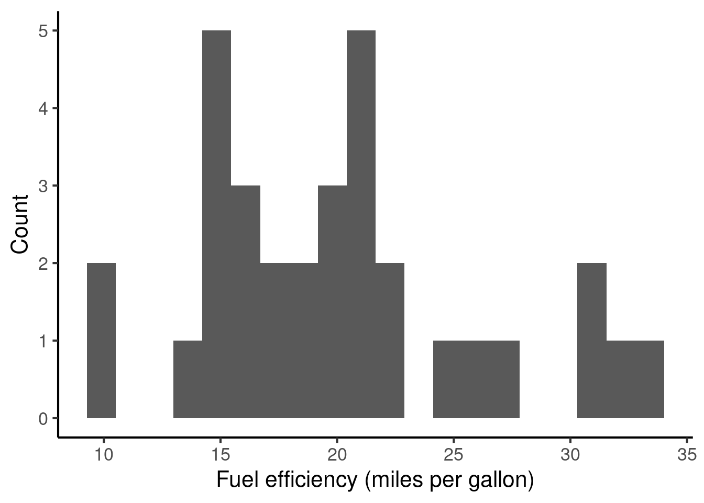
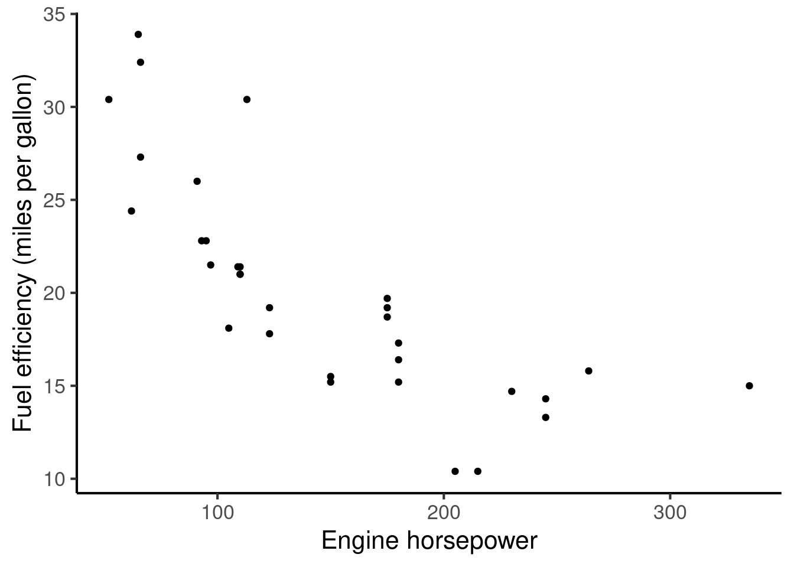

# (PART) Quantitative methods {.unnumbered}

# Variables

## Introduction

Quantitative methods, at their core, are all about characterising two things:

(a) distributions of variables;

(b) relationships between variables.

These relationships can be summarised either numerically (e.g. using tables) or graphically (e.g. using plots). For example, we might study how fuel efficiency (measured in miles per gallon) is distributed in a collection of cars:

We might follow that up by studying how fuel efficiency relates to the car engine's horsepower:

It feels very natural to speak about car engines in these numeric constructs such as miles per gallon and horsepower, and to quantify relationships between them using data plots. In contrast, it is less obvious how to construct equivalent numeric constructs for human psychology, where many of the relevant concepts (e.g. personality, attention, consciousness) are hard to define and even harder to measure. This task of defining appropriate variables is one of the key challenges of psychology research, and it's the focus of the present chapter.

## Scientific variables

In scientific contexts, a variable may be defined as a measurement with a well-defined set of potential values. One example might be age (in years), corresponding to a number ranging typically between 0 and 100. Another example might be nationality, which might take values such as French, German, or Italian.

Variables come in many forms, and these forms have important implications for how you design an experiment as well as how you analyse the resulting data. Here are several types of variable, as commonly defined in methods textbooks:

-   **Categorical variables (a.k.a. nominal variables).** These take one of a finite set of values, with these values having no intrinsic ordering. An example might be nationality, which could take values such as French, German, and Indian. A special kind of categorical variable is a **binary variable (a.k.a. dichotomous variable)**: this is simply a categorical variable with only two possible values, which comes up for example in True/False questions.

-   **Ordinal variables.** Like categorical variables, these take one of a finite set of values, but unlike categorical variables, these values have an intrinsic order. An example of an ordinal variable might be a participant's response to the following question: "How much do you like jazz music?" where the participant has to choose from four options labelled 1-4:

    1.  Not at all;

    2.  A little;

    3.  A lot;

    4.  Very much.

-   **Continuous variables**. These are variables that take numeric values within a continuous range. A truly continuous variable should be able to be specified to an arbitrary degree of precision: for example, we might say that the temperature is 45.832 degrees Centigrade. There are two main types of continuous variable:

    -   **Interval variables**. A variable is an 'interval' variable if (and only if) addition and subtraction are 'meaningful' operations. For example, the time of day is an interval variable, because it makes sense to say 'ten minutes after' (addition) or 'five minutes before' (subtraction) a given time.

    -   **Ratio variables.** These are like interval variables, but they have an additional property: multiplication is also a meaningful operation. Money is an example of a ratio variable, because it makes sense to say that Anna (for example) has twice as much money as Bob. Temperature in Centigrade is meanwhile **not** a ratio variable, because it doesn't make sense to say that 20°C is 20 times as hot as 1°C (at least, not if we listen to our physics teacher).

It is worth making a few notes at this point:

-   In practice, most analysis methods used in psychology do not differentiate between interval and ratio variables, so it is rarely worth losing much sleep over this distinction.

-   There are nonetheless often grey areas where different variable categories overlap. For example, a student might take a multiple-choice exam with a 100 questions, and therefore possible marks would be 1, 2, 3, ..., 99, or 100. This is technically not a fully continuous variable, because the set of possible marks is finite, and it is not possible to get 'in-between' marks such as 22.5 or 33.7. However, in many situations (e.g. data analysis) it will be useful here to treat the variable as if it is indeed continuous.

-   A particularly debated area is multiple-choice questionnaires, where participants have to choose from multiple numbered options arranged in a scale, for example:

    1.  Not at all;

    2.  A little;

    3.  A lot;

    4.  Very much.

    Some might argue that this variable is ordinal, because it's not obvious that addition and subtraction make sense here. Others might say that participants naturally understand that the scale is meant to be interpreted as an interval scale, and hence respond in a manner that is consistent with that. This question is not really resolved in the literature, but it is fairly accepted practice in these scenarios to pretend like the variable is an interval variable.

## Psychological variables

Psychological studies can include various kinds of variables. These can be organised more-or-less into the following categories:

1.  Experimental manipulations;
2.  Physical behaviours;
3.  Neural responses;
4.  Physiological responses;
5.  Latent traits;
6.  Demographics;

Let's discuss each of these in turn.

### Manipulations

Psychological studies often involve performing some kind of *manipulation* on the participant or the stimulus. For example, we might randomly split the participants into two groups, and play half of them Mozart and the other half Britney Spears. We'd then have a variable called 'Participant group' which takes two possible values, Mozart and Britney spears:

| Participant name | Participant group |
|------------------|-------------------|
| Peter            | Britney Spears    |
| Gemma            | Britney Spears    |
| Paul             | Mozart            |
| Catharine        | Mozart            |
| Juliet           | Britney Spears    |
| ...              | ...               |

Likewise, we might have a dataset of chords, and play them with either a piano timbre or an organ timbre:

| Chord            | Timbre |
|------------------|--------|
| Major triad      | Piano  |
| Major triad      | Organ  |
| Minor triad      | Piano  |
| Minor triad      | Organ  |
| Diminished triad | Piano  |
| Diminished triad | Organ  |

The examples above are categorical variables, but we can also have continuous experimental variables, for example if we were to give each participant a random amount of music-store credit upon entering the experiment:

+---------------------------------+----------------------------------+
| Participant name                | Starting credit (£)              |
+=================================+==================================+
| Peter                           | 2.33                             |
+---------------------------------+----------------------------------+
| Gemma                           | 1.50                             |
+---------------------------------+----------------------------------+
| Paul                            | 1.40                             |
+---------------------------------+----------------------------------+
| Catharine                       | 2.45                             |
+---------------------------------+----------------------------------+
| Juliet                          | 2.00                             |
+---------------------------------+----------------------------------+
| ...                             | ...                              |
+---------------------------------+----------------------------------+

### Physical behaviours

A *behaviour* is something that a person does with their physical body. This could be something specific to the laboratory context (e.g. pressing a green button on a response pad), but it could also mean something in everyday life, for example buying a particular CD in a shop.

Psychoacoustic experiments often produce variables in this category. For example, we might play a participant two tones, and ask them to press 'Button A' if the first one was the highest pitch, and 'Button B' if the second tone was the highest pitch. We might then end up with a dataset like the following, where the 'Response' column is the behavioural variable:

| Participant ID | Frequency 1 (Hz) | Frequency 2 (Hz) | Response |
|----------------|------------------|------------------|----------|
| 1              | 440              | 460              | B        |
| 1              | 420              | 421              | A        |
| 1              | 375              | 400              | B        |
| ...            | ...              | ...              | ...      |

Behavioural variables also come up in studies of everyday musical behaviours. For example, a recent paper [@Park2019-kb] studied global music listening patterns as collected through the music streaming service Spotify, and identified how people in different countries listen to different kinds of music at different times of day. A dataset from such a study might look like this:

+----------------+--------------+--------------+-----------------------------+
| Participant ID | Date         | Time         | Musical track               |
+================+==============+==============+=============================+
| 1              | 03-01-2020   | 08:57        | 'Toxic' by Britney Spears   |
+----------------+--------------+--------------+-----------------------------+
| 1              | 03-01-2020   | 14:27        | 'Caravan' by Duke Ellington |
+----------------+--------------+--------------+-----------------------------+
| 1              | 04-01-2020   | 10:03        | 'Lingus' by Snarky Puppy    |
+----------------+--------------+--------------+-----------------------------+
| ...            | ...          | ...          | ...                         |
+----------------+--------------+--------------+-----------------------------+

Here the behavioural variable would be the musical track that the individual chose to listen to. Of course, we can get pedantic here about the extent to which an individual actively chooses to listen to a specific musical track: for example, if they've selected 'Shuffle' then Spotify will be choosing the next song for them, albeit from a limited selection. But the general point is clear, that this dataset reflects to some extent real-world decisions that the individual is making about what music to listen to.

Music psychology experiments are often particularly interested in quantifying listeners' *subjective* experiences when they listen to music: for example, the sense in which a listener finds certain sounds beautiful, or happy, or moving. Though it is difficult (impossible?) to measure subjective experiences directly, it is perfectly possible to ask the participant to describe these subjective experiences. For example, if we were interested in subjective beauty, we might ask the participant to rate the stimulus for beauty on a scale from 1 to 4, where 1 means 'not at all beautiful' and 4 means 'very beautiful'.

### Neural responses

It has been known for decades that psychological processes are ultimately mediated by the brain. Historically speaking, the brain's workings have been opaque to external observers, but recent neuroscientific techniques now give us various ways to measure aspects of brain activity. The resulting data is typically highly complex, and interpreting it is no easy task. However, the approach is appealing because it gives a real insight into how psychological processes are mediated by neural biology. Some important examples are given below:

-   *Electroencephalography (EEG)* records tiny electrical currents from the scalp that reflect firing patterns of neurons in the outer layers of the brain. EEG has a high temporal sensitivity which makes it particularly good for tracking the time course of responses to auditory stimuli. However, it is limited in its ability to localise brain activity to particular regions.

-   *Magnetoencephalography* (MEG) records faint magnetic fields that, similar to EEG, reflect firing patterns of neurons in the brain. Like EEG, MEG has a high temporal sensitivity, but it also has somewhat greater localisation abilities than EEG.

-   *Functional magnetic resonance imaging* (fMRI) measures changes in blood flow through the brain. This is useful because (as it turns out) blood flow is a reliable marker of neural activity; when a particular brain region is experiencing high neural activity, blood flow to that region will increase so as to provide more oxygen for respiration. fMRI has much better localisation capacity than EEG or MEG; however, its temporal sensitivity is much lower than either method, producing data on the granularity of seconds rather than milliseconds.

### Physiology

Psychological processes also affect the body in systematic and measurable ways. These are termed *physiological* effects. In musical contexts, physiological effects are most commonly associated with emotional responses. For example, in cases of high emotional arousal, participants tend to exhibit faster heart rates and respiration rates, as well as high skin temperature and perspiration. These can be measured using standardised laboratory equipment as discussed in the Emotion chapter.

### Latent traits

In everyday life we often speak of certain personal characteristics that are not physically measurable (e.g. height, weight) but rather reflect something less tangible. In psychology we call these characteristics *latent traits*. A fundamental challenge in psychology research is how to quantify these latent traits.

One example of a latent trait is *personality*. A prominent psychological theory of personality is the so-called *Big Five* model, which characterises personality in terms of five underlying factors:

1.  Extraversion;

2.  Agreeableness;

3.  Openness to experience;

4.  Conscientiousness;

5.  Neuroticism.

The idea is that each person's personality can be summarised (to some extent) as a collection of five scores, one for each of these five dimensions.

How do we measure these different dimensions? It's hardly as if we can take out a ruler and measure the size of different areas of the brain corresponding to these different personality traits. Even if we had a spare magnetic resonance imaging (MRI) scanner lying around with which to measure individual brain anatomy, the mapping between brain dimensions and psychological traits tends to be rather too complicated for such a procedure to be practical in most situations.

Instead, like many latent traits, we tend to assess personality using *questionnaires*. A questionnaire is simply a collection of standardised questions that we administer to a participant. Many question formats are possible, but in quantitative studies it's particularly common to administer questionnaires with numeric responses. For example, when assessing someone's personality, we might ask them the following question, sourced from the Ten Item Personality Inventory (TIPI) [@Gosling2003-bt]:

> *Please indicate the extent to which you agree with the following statement.*
>
> I see myself as: sympathetic, warm.

We could then ask the participant to give their response on a seven-point scale:

1.  Disagree strongly
2.  Disagree moderately
3.  Disagree a little
4.  Neither agree nor disagree
5.  Agree a lot
6.  Agree moderately
7.  Agree strongly

The question is designed to assess the participant's *agreeableness*. High scores (e.g. 6, 7) reflect an agreeable participant, whereas low scores (e.g. 1, 2) reflect a disagreeable participant.

A given questionnaire would typically contain multiple such questions. In the TIPI, there are ten questions in total, two for each of the five personality dimensions. The second agreeableness question looks like this:

> *Please indicate the extent to which you agree with the following statement.*
>
> I see myself as: critical, quarrelsome.

This second question is what we call a *reverse-scored* question. When we analyse data from reverse-scored questions, we interpret high numbers as a low numbers and low numbers as high numbers. In this case, participants who responded 'Disagree strongly' would receive a score of 1, whereas participants who responded 'Agree strongly' would receive a score of 7. The necessity to reverse-score the question comes from the nature of the words being used: while 'sympathetic' and 'warm' are near-synonyms of 'agreeable', 'critical' and 'quarrelsome' are near-antonyms (i.e. opposites). To get an overall agreeableness score, we could then simply average the numeric results from the first and second (reverse-scored) agreeableness questions. For example, if I wrote 'Agree moderately' to the question 'I see myself as sympathetic, warm', and 'Disagree strongly' to the question 'I see myself as critical, quarrelsome', I'd get an agreeableness score of `(6 + 1) / 2 = 3.5`.

### Demographics

Lastly, we have demographic variables. These are generic characteristics of individuals as seen for example in a census. It is important to record at least some of these variables in order to build an approximate picture of the participant group. Some examples are given below:

-   Age

-   Gender

-   Country of birth

-   Country of residence

-   Educational level (measured e.g. in terms of the highest educational qualification received)

-   Socioeconomic status (corresponding broadly to one's income level and position within society)

Of these, age, gender, and country of residence are considered particularly essential for psychological studies; it is difficult to publish a paper that omits this information.

## Musical variables

Music psychology studies also often involve some kind of music, and often it is possible to derive useful variables from this music. Here we will consider three main categories of musical variables:

1.  Human annotations
2.  Computational features
3.  Other metadata

### Human annotations

Human annotations are variables that represent human evaluations of the music, typically collected in advance of the main study itself. These annotations could come from expert musicians who are fluent in relevant music theory and terminology; for example, we could ask some expert musicians to annotate the implied harmonies for various folk melodies. Alternatively, non-expert listeners can also provide useful annotations in some cases, though typically it is necessary to get a larger number of such listeners and average over their responses in order to get reliable data. An example is given in the fictional dataset below:

| Melody ID | Tonic | Mode  |
|-----------|-------|-------|
| 1         | A     | Minor |
| 2         | F     | Major |
| 3         | G     | Major |
| ...       | ...   | ...   |

### Computational features

It is also possible to generate useful variables by running musical extracts through computer algorithms. Variables extracted in such a way are typically called *features*.

There are many such algorithms out there, designed to perform all kinds of tasks. Particularly relevant are algorithms designed explicitly for the purpose of psychological modelling.

These computer algorithms can be differentiated in terms of the kind of data that they ingest. Some take so-called *symbolic* data, whereas others take *audio* data.

#### Symbolic approaches

We say that music is represented 'symbolically' when we write it down in terms of a (relatively) small set of discrete symbols. Classical score notation is an example of a symbolic notation system, with categorical representations for both rhythm (e.g. minim, dotted minim, crotchet, quaver) and pitch (e.g. C4, C#4, F5). When dealing with computers, we tend to write things as numbers where possible, so we might write the first phrase of 'Twinkle twinkle little star' as follows:

| Note ID | Pitch | Time | Duration |
|---------|-------|------|----------|
| 1       | 60    | 0    | 1        |
| 2       | 60    | 1    | 1        |
| 3       | 67    | 2    | 1        |
| 4       | 67    | 3    | 1        |
| 5       | 69    | 4    | 1        |
| 6       | 69    | 5    | 1        |
| 7       | 67    | 6    | 2        |

We then might feed this data into a collection of symbolic algorithms in order to extract some useful features for our experiment. For a simple example, suppose we run two algorithms: a key-finding algorithm and a melodic expectation algorithm. Let's further agree that we run both in a sliding-window fashion, such that the algorithm at timepoint 1 only sees data from timepoints 0 and 1, and so on.

| Note ID | Pitch | Time | Duration | Est. tonic | Est. mode | Probability |
|---------|-------|------|----------|------------|-----------|-------------|
| 1       | 60    | 0    | 1        | F          | Major     | 0.1         |
| 2       | 60    | 1    | 1        | F          | Major     | 0.3         |
| 3       | 67    | 2    | 1        | C          | Major     | 0.2         |
| 4       | 67    | 3    | 1        | C          | Major     | 0.3         |
| 5       | 69    | 4    | 1        | C          | Major     | 0.3         |
| 6       | 69    | 5    | 1        | C          | Major     | 0.4         |
| 7       | 67    | 6    | 2        | C          | Major     | 0.4         |

Here we've ended up with three computational features in our fictional dataset:

-   'Est. tonic' tells us the tonic as estimated by the key-finding algorithm. It starts off thinking that the melody is in F (with the first note being the dominant), but once it hears the third note it decides that the melody is in C after all. A well-known such algorithm is the *Krumhansl-Kessler key-finding algorithm* [@krumhansl1990cognitive].

-   'Est. mode' tells us the estimated mode; in our case it believes that the melody is in the major mode throughout.

-   'Probability' tells us how likely the melodic expectation algorithm believes the current note to be, taking into account what happened so far in the melody. Prominent examples of melodic expectation algorithms are Temperley's melodic expectation algorithm [@Temperley2008-tj] and Pearce's Information Dynamics Of Music (IDyOM) model [@Pearce2005-bm].

#### Audio approaches

A disadvantage of symbolic approaches is that they require music to be encoded in a symbolic format. This is not always easy to achieve, especially for musical styles that tend not to use musical scores. Moreover, from the perspective of psychological simulation, there is something unrealistic about relying on a symbolic encoding of a particular musical extract, because symbolic encodings typically discard important parts of the musical stimulus (e.g. timbre, room acoustics, performance parameters).

An alternative is to use audio-based algorithms. These algorithms analyse audio files directly, and do not require a symbolic encoding stage. Rather than returning feature values for each note, they will more commonly return feature values for many different timesteps, for example:

| Stimulus ID | Time (s) | Roughness |
|-------------|----------|-----------|
| 1           | 0.0      | 0.85      |
| 1           | 0.1      | 0.75      |
| 1           | 0.2      | 0.50      |
| 1           | 0.3      | 0.65      |
| 1           | 0.4      | 0.66      |
| 1           | 0.5      | 0.20      |
| 1           | 0.6      | 0.25      |
| 1           | 0.7      | 0.22      |
| 1           | 0.8      | 0.39      |
| ...         | ...      | ...       |

Depending on the study, it may often make sense to average over all the timesteps to create one feature value per stimulus. In this case the dataset might look something like this:

| Stimulus ID | Mean roughness |
|-------------|----------------|
| 1           | 0.65           |
| 2           | 0.34           |
| 3           | 0.44           |
| 4           | 0.40           |
| ...         | ...            |

There are various useful audio-analysis toolboxes out there in the literature, for example:

-   [MIRToolbox](https://www.jyu.fi/hytk/fi/laitokset/mutku/en/research/materials/mirtoolbox)

-   [Essentia](https://essentia.upf.edu/)

-   [IPEM Toolbox](https://www.ugent.be/lw/kunstwetenschappen/ipem/en/research/projects/finishedprojects/ipem-toolbox.htm)

-   [Janata Lab Music Toolbox](https://atonal.ucdavis.edu/resources/software/jlmt/)

### Other metadata

When using pre-existing pieces (e.g. classical music compositions) one can often source many other musical variables based on the music's metadata. One might for example include the music genre, the composer, the date of composition, the number of record sales, and so on.

## Limitations

When we define scientific variables, we are in most cases trying to *operationalise* some fundamental concept of interest. For example, we might be interested in learning about the subjective pleasantness of musical chords, and we operationalise this concept by asking a collection of participants to rate the pleasantness of particular musical chords on a scale of 1 to 7. Operationalisation is invaluable to psychology, because without it we can't measure most of the things we care about. However, it's also very dangerous, because an improper operationalisation can cause us to draw highly misleading conclusions from our experiments. It's therefore essential to maintain a critical perspective on variable definitions at all times, both when conducting one's own studies and when reading other studies in the literature.

There are two main features that contribute to the quality of an operationalisation: *reliability* and *validity*. Let's consider each in turn.

### Reliability

A measurement procedure's *reliability* may be defined as the extent to which it produces similar measurements under similar conditions. In the context of psychological measures, this is most commonly interpreted as meaning 'if I were to measure the same person multiple times, would I get similar results?' In the context of measuring someone's height, we'd class a measuring scale as 'reliable' if it gave a similar reading if we weighed the same person twice in a row. In the context of a personality questionnaire, we might expect a reliable questionnaire to give the same participant similar scores no matter whether they take the test on a Tuesday versus a Wednesday.

A useful thing to know is that low reliability can generally be combated by increasing the sample size (e.g. the number of participants, the number of stimuli, etc.). If we average over many data points, the noise reduces, and we are left with a clearer signal. Of course, increasing sample size comes with its own logistic costs, and so it is generally helpful to try and use reliable measures wherever possible.

Some of our psychological variables have very high reliability. For example, if we ask a UK participant to report their age in a demographic questionnaire, they are likely to give a very reliable answer as long as they are not incentivised to lie. Others have relatively low reliability; for example, many neuroimaging modalities have intrinsically low reliability, in large part because the brain is always doing many other things in addition to processing the current experimental stimulus.

Reliability is necessary but not sufficient for an operationalisation to be effective. What if we measure an adult's extraversion by counting how many friends they had in primary school? This measure will be highly *reliable* in the sense that this number is not going to change now that the adult has left school, so we're always going to get the same answer no matter how many times we ask the question. On the other hand, this question is clearly not a particularly 'good' measure of extraversion, because there are many other factors that can contribute to the size of someone's friendship group, for example whether they were home-schooled or not. This brings us to the following notion of *validity*.

### Validity

A measurement procedure's *validity* may be defined as the extent to which the procedure truly measures what it's meant to measure. Validity is much harder to establish than reliability, because it requires deep engagement with the psychological processes surrounding a measurement.

Validity issues are particularly salient for latent traits, for example personality and intelligence. In this context researchers often use the more specific term *construct validity* [@Cronbach1955-ep]. The issue here is that we are talking about latent constructs that are impossible to measure and very difficult to introspect effectively about. It is possible to create standardised instruments for measuring these constructs, for example IQ tests or personality tests, but it is very easy for certain biases or confounds to find their way into these instruments. For example, the self-report component of the Goldsmiths Musical Sophistication Index (Gold-MSI) assesses the participant's singing abilities by asking them how much they agree with the following statements:

-   If somebody starts singing a song I don't know, I can usually join in.

-   I can sing or play music from memory.

-   I am able to hit the right notes when I sing along with a recording.

-   I am not able to sing in harmony when somebody is singing a familiar tune. [reverse-scored]

-   I don't like singing in public because I'm afraid that I would sing wrong notes. [reverse-scored]

-   After hearing a new song two or three times, I can usually sing it by myself.

-   I only need to hear a new tune once and I can sing it back hours later.

This questionnaire does seem to do quite a good job in practice of capturing variation in singing abilities, even in participants without formal musical training. Nonetheless, it has a clear limitation, namely that it relies primarily on the participant's *conception* of their own musical abilities rather than their actual musical abilities. Humble participants, or participants whose peer group is highly musically talented, are therefore likely to deliver lower ratings than equivalently skilled participants who are less humble or who have less musically talented peer groups.

A dangerous thing about validity is that it cannot be combated by increasing sample size. Validity problems will cause systematic biases in the data analyses that only become stronger, not weaker, with more data. This phenomenon is becoming particularly relevant in the era of big data, where companies are collecting larger and larger datasets containing all kinds of information about consumers, without necessarily investing equal effort in minimising bias in their data-collection methods.

Validity is something important to consider and discuss both in the study planning stage and in the study write-up stage. In the planning stage, one should carefully consider the operationalisations being adopted, and try to design them such as to maximise validity. Of course, it is never possible to achieve perfection here. In the write-up stage, it is therefore important to be explicit and open about the potential validity limitations of the present work, and to explain how these should or should not affect the conclusions being made. It is always acceptable to point to ways in which future work could or should address these limitations.

## Summary

We have established a broad variety of relevant variables for psychological studies, and for music and science research in general. We spoke in particular of various families of scientific variables:

-   Categorical variables (a.k.a. nominal variables), including binary variables (a.k.a. dichotomous variables);

-   Ordinal variables;

-   Continuous variables, including interval variables and ratio variables.

We also covered various kinds of psychological variables:

-   Experimental manipulations;

-   Physical behaviours;

-   Neural responses;

-   Physiological responses;

-   Latent traits;

-   Demographics

as well as musical variables, both human- and computer-derived.

Finally, we emphasised the importance of critically evaluating the way that we operationalise theoretical constructs (e.g. personality, intelligence) using scientific methods, and discussed ways in which an operationalisation might prove to be compromised in terms of reliability or validity.
