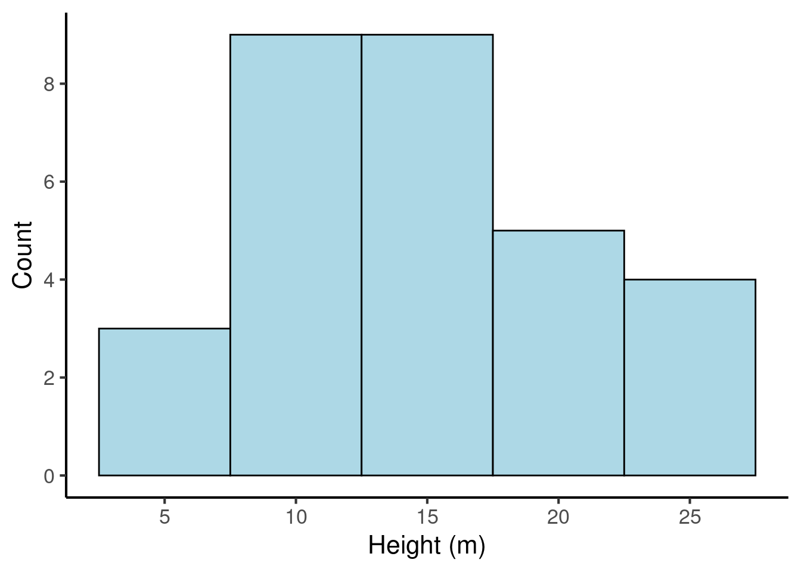
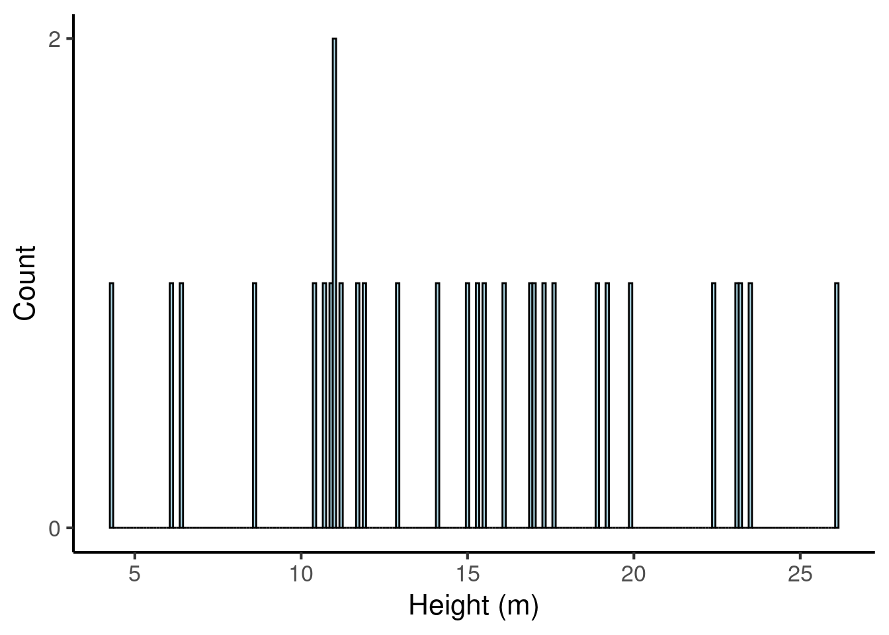
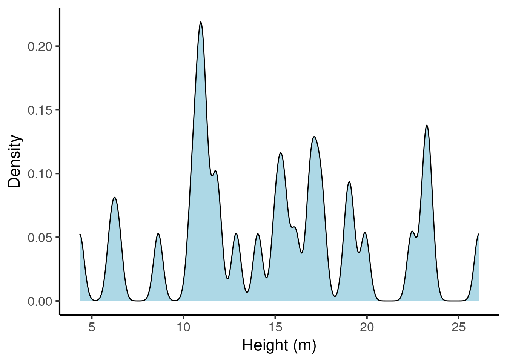
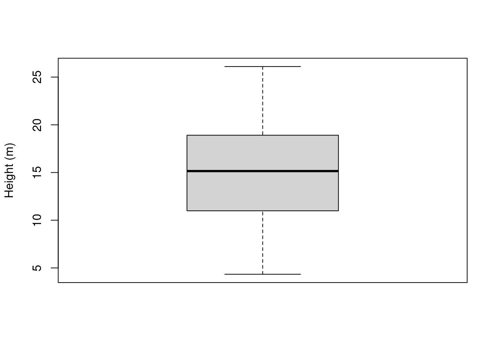
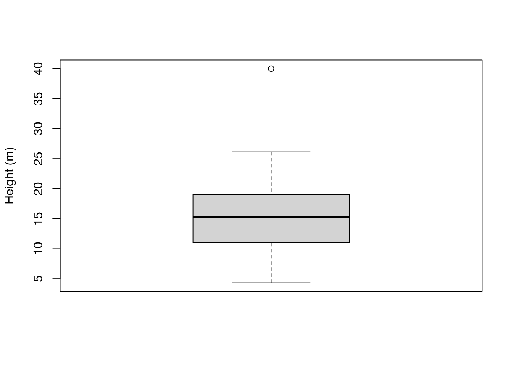
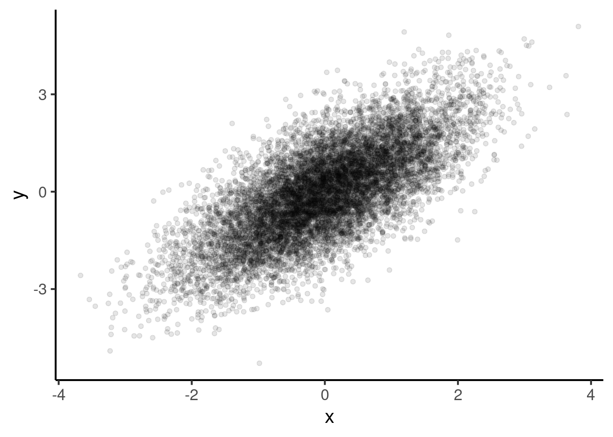
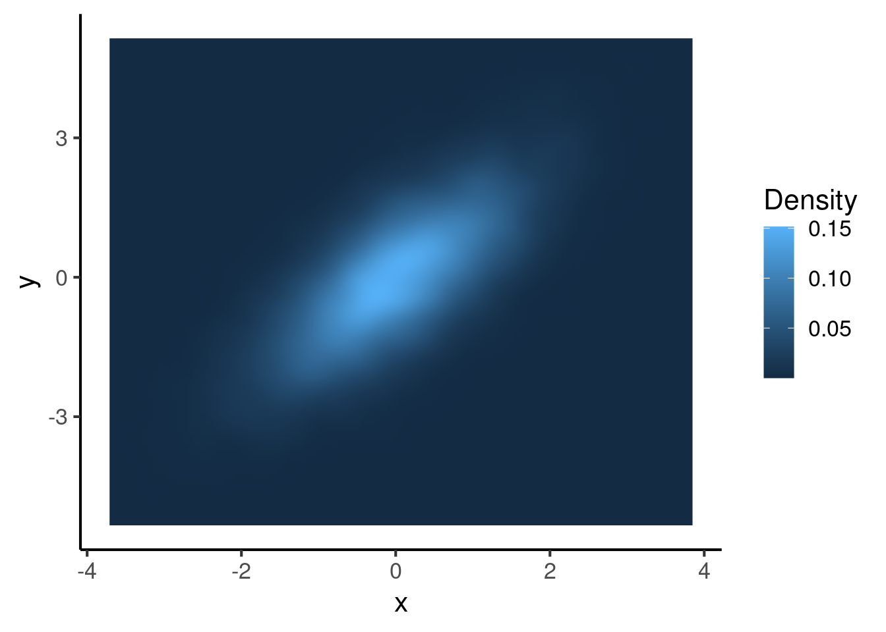
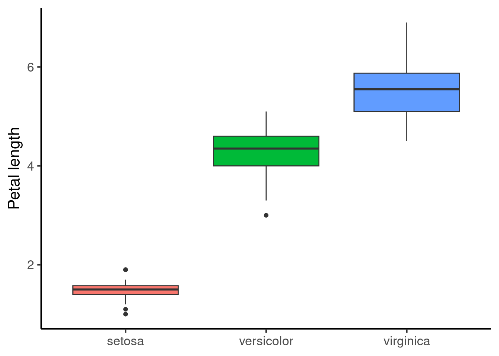
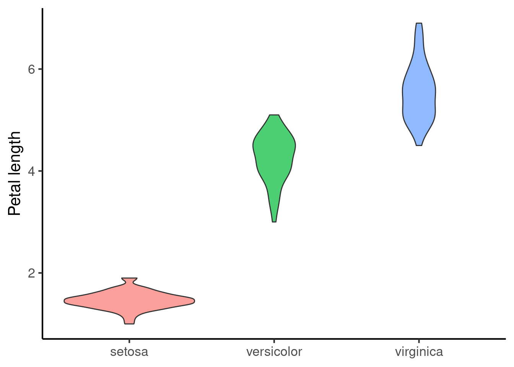
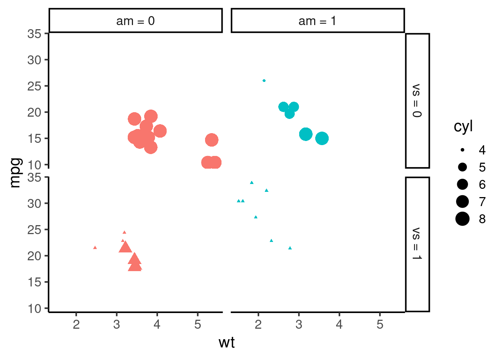

# Data visualisation


Plots are a powerful way to gain insights into empirical data. Done appropriately, they distil down the most important trends within a dataset in a manner that can be grasped intuitively by readers even with minimal scientific knowledge.

This chapter will introduce a variety of common plotting strategies. A familiarity with these different methods will be very helpful both for reading scientific papers and for writing up one's own research projects.

Plots can be produced by many different software packages. Most of the plots in this chapter are produced using R, a programming language used by many scientists for their statistical analyses. R is free, and you can download it [here](https://www.r-project.org/). Most people do not use R directly, but instead use RStudio, a so-called integrated development environment (IDE) that facilitates common programming tasks. You can download RStudio for free [here](https://www.rstudio.com/products/rstudio/download/). However, a quick and easy way to try out the R code provided in this chapter is to use Google Colab notebooks, which provide easy access to an R environment via your web browser. By default Google Colab notebooks run a different programming language called Python, but you can start up an R notebook via [this link](https://colab.to/r) (you may need a Google account).

This chapter contains various self-contained code examples. For example, the following example plots a histogram:


```r
hist(rnorm(50))
```


To try this code in your own coding environment (be that RStudio or Google Colab), simply press the copy-paste symbol in the top right of the code block, and then paste the code into your coding interface. If you then execute it (usually by pressing Enter or CMD/Ctrl + Enter, depending on your interface), you should replicate the figure from the textbook. Note that some pieces of code may depend on datasets or packages loaded in code blocks further up the page; you will need to copy those code blocks into your interface too in order for your code to work.

**Note 1**: knowledge of the R programming language is **not** necessary for the Cambridge Tripos music and science courses. These code examples are provided primarily for interest's sake, though students conducting their own Music and Science dissertation projects may find them useful. For a short yet effective introduction to R for scientific programming, please refer to the free R tutorials provided by the [Software Carpentry project](https://software-carpentry.org/lessons/). For a longer interactive introduction to R for data science, consider registering for DataCamp. DataCamp is a subscription-based service, but university instructors can (at the time of writing) get free access for their students by signing up to the [DataCamp for Classrooms](https://www.datacamp.com/groups/classrooms) scheme. Cambridge students at the Centre for Music and Science should contact Peter Harrison (pmch2\@cam.ac.uk) for access.

**Note 2**: Most of these examples use the `ggplot2` package. This package is an extension of the R programming language that provides a special syntax for constructing plots. This syntax is very powerful and supports lots of customisation. However, this power comes with the downside of a certain amount of starting complexity. It is also possible to create plots using 'base' R, that is, R's built-in functions. Base R plots are typically simpler to start out, but only offer limited customisation opportunities. Here we focus on `ggplot2` because it is ultimately the tool one would want to use to create plots for journal publications.

Here is some generic setup code that we will use to prepare our subsequent figures:


## Plotting one variable

The simplest graphs plot only one variable at a time. If we are only plotting one variable, this typically means we want to plot that variable's *distribution*, which summarises the kinds of values that a variable takes within a dataset.

The available plot types depend on whether we are plotting a *continuous* variable or a *categorical* variable (see Section \@ref(scientific-variables)).

### Categorical variables

A dataset containing just one categorical variable might look something like this:


```r
fave_animals <- tibble(
  "favourite_animal" = sample(
    c("Dogs", "Cats", "Fish"),
    size = 50,
    replace = TRUE, 
    prob = c(2, 1, 0.3)
  )
)
fave_animals %>% 
  DT::datatable(
    options = list(
      searching = FALSE,
      rowId = FALSE
    )
  )
```

```{=html}
<div id="htmlwidget-59a22a001c4d95451b73" style="width:100%;height:auto;" class="datatables html-widget"></div>
<script type="application/json" data-for="htmlwidget-59a22a001c4d95451b73">{"x":{"filter":"none","vertical":false,"data":[["1","2","3","4","5","6","7","8","9","10","11","12","13","14","15","16","17","18","19","20","21","22","23","24","25","26","27","28","29","30","31","32","33","34","35","36","37","38","39","40","41","42","43","44","45","46","47","48","49","50"],["Cats","Dogs","Dogs","Fish","Cats","Dogs","Dogs","Dogs","Fish","Dogs","Fish","Cats","Dogs","Dogs","Dogs","Dogs","Cats","Dogs","Dogs","Cats","Fish","Dogs","Dogs","Dogs","Cats","Dogs","Dogs","Dogs","Dogs","Dogs","Dogs","Dogs","Dogs","Cats","Fish","Dogs","Dogs","Dogs","Fish","Dogs","Cats","Dogs","Dogs","Dogs","Cats","Dogs","Dogs","Cats","Dogs","Cats"]],"container":"<table class=\"display\">\n  <thead>\n    <tr>\n      <th> <\/th>\n      <th>favourite_animal<\/th>\n    <\/tr>\n  <\/thead>\n<\/table>","options":{"searching":false,"rowId":false,"order":[],"autoWidth":false,"orderClasses":false,"columnDefs":[{"orderable":false,"targets":0}]}},"evals":[],"jsHooks":[]}</script>
```

Distributions of single categorical variables are usually plotted with bar charts, or, less commonly, with pie charts.

#### Bar charts

Like most graphs, bar charts have two axes. Each axis is a reference line running along the margins of the graph that helps us to interpret the values within the graph. Typically one of these axes runs horizontally, and is called the *horizontal axis* (or 'x-axis'); the other then runs vertically, and is called the *vertical axis* (or 'y-axis). These axes have several *ticks* along their lengths; these ticks identify how different positions in the plot correspond to different variables or variable values.

Bar charts will generally have one column for each level of the categorical variable. The height of the column corresponds to the number of occurrences of each level (the 'count'). In this dataset we had 11 cats, so the height of the 'Cats' column is 11.


```r
fave_animals %>% 
  ggplot(aes(x = favourite_animal)) + 
  geom_bar() +
  scale_x_discrete("Favourite animal") + 
  scale_y_continuous("Count")
```


#### Pie charts

Pie charts are often seen in business applications, but they have a bad reputation among scientists. To quote from the R documentation for the `pie` function:

> Pie charts are a very bad way of displaying information. The eye is good at judging linear measures and bad at judging relative areas. A bar chart or dot chart is a preferable way of displaying this type of data.

> Cleveland (1985), page 264: “Data that can be shown by pie charts always can be shown by a dot chart. This means that judgements of position along a common scale can be made instead of the less accurate angle judgements.” This statement is based on the empirical investigations of Cleveland and McGill as well as investigations by perceptual psychologists.

Nonetheless, we might as well show how to make one.


```r
counts <- table(fave_animals)
pie(counts)  
```


### Continuous variables

Let's now consider plotting a single *continuous* variable. A dataset containing a single continuous variable might look like this:


```r
tree_heights <- tibble(height = rnorm(30, mean = 15, sd = 7))

tree_heights %>% DT::datatable(
  options = list(
    searching = FALSE,
    rowId = FALSE
  )
)
```

```{=html}
<div id="htmlwidget-e8243cad70c255e2466d" style="width:100%;height:auto;" class="datatables html-widget"></div>
<script type="application/json" data-for="htmlwidget-e8243cad70c255e2466d">{"x":{"filter":"none","vertical":false,"data":[["1","2","3","4","5","6","7","8","9","10","11","12","13","14","15","16","17","18","19","20","21","22","23","24","25","26","27","28","29","30"],[17.0401236486222,11.896956887471,15.0077374614214,15.5203892690616,10.8733533766835,11.0193188702705,14.0537496941332,23.2466089760124,4.33503239699167,19.157623313399,17.3306525984946,22.4416988609345,12.8707125345599,17.590131669414,16.8696915354056,11.2023597830584,23.4550746418822,23.1228183098647,19.901495546605,26.1078341817859,18.9094049789571,6.06385454079374,10.9871421003418,6.42771169571151,11.6861955449248,10.6574332594311,15.2948111120096,8.62354846013288,16.1062014068285,10.4179074925683]],"container":"<table class=\"display\">\n  <thead>\n    <tr>\n      <th> <\/th>\n      <th>height<\/th>\n    <\/tr>\n  <\/thead>\n<\/table>","options":{"searching":false,"rowId":false,"columnDefs":[{"className":"dt-right","targets":1},{"orderable":false,"targets":0}],"order":[],"autoWidth":false,"orderClasses":false}},"evals":[],"jsHooks":[]}</script>
```

Five kinds of plots are common for plotting distributions of continuous variables: *histograms*, *kernel density plots*, *dot plots*, and *box-and-whisker* plots. They all do more or less the same, but are constructed somewhat differently.

#### Histograms

A histogram is like a version of a bar plot but for continuous variables. Here's a histogram for our tree height data:


```r
tree_heights %>% 
  ggplot(aes(x = height)) + 
  geom_histogram(binwidth = 5, fill = "lightblue", colour = "black") +
  scale_x_continuous("Height (m)", breaks = seq(from = 0, to = 30, by = 5)) + 
  scale_y_continuous("Count", breaks = seq(from = 0, to = 10, by = 2)) 
```



We can see that the histogram corresponds to a number of bars. Each bar has an associated count, just like the bar plot. Where do these counts come from? They are produced by first *binning* the continuous variable into categories based on each number's value. In the above example, each bin is 5 m wide; the first bin contains numbers between -2.5 and 2.5, the second bin contains numbers between 2.5 and 7.5, and so on. We then count the number of values that fall into each bin, and use these counts as the bin heights.

The appropriate bin width depends on the amount of the data. Narrow bins give us more precision, but if we don't have enough data, most bins don't get any values, and the histogram fails to visualise the distribution well:


```r
tree_heights %>% 
  ggplot(aes(x = height)) + 
  geom_histogram(binwidth = 0.1, fill = "lightblue", colour = "black") +
  scale_x_continuous("Height (m)", breaks = seq(from = 0, to = 30, by = 5)) + 
  scale_y_continuous("Count", breaks = seq(from = 0, to = 10, by = 2)) 
```



Likewise, if our bins are too wide, we lose a lot of precision:


```r
tree_heights %>% 
  ggplot(aes(x = height)) + 
  geom_histogram(binwidth = 20, fill = "lightblue", colour = "black") +
  scale_x_continuous("Height (m)") + 
  scale_y_continuous("Count") 
```


#### Kernel density plots

A limitation of the histogram is the way that count values jump at bin boundaries, which suggests a discontinuity to the data that may not actually be present. Kernel density plots address this issue by producing what is in essence a smoothed version of a histogram. A kernel density plot for our tree heights looks like this:


```r
tree_heights %>% 
  ggplot(aes(x = height)) + 
  geom_density(fill = "lightblue") +
  scale_x_continuous("Height (m)", breaks = seq(from = 0, to = 30, by = 5)) +
  scale_y_continuous("Density")
```


Now that we no longer have bins, it is no longer meaningful to put counts on the vertical axis. Instead we have 'density'. The idea here is as follows: you get counts by multiplying distances on the horizontal axis by counts on the vertical axis (mathematically, this is formalised as the process called *integration*). So, for example, if the density plot had a density of 2.5 over the range 15-20 m, we would know that there are approximately $2.5 \times (20 - 15) = 12.5$ trees with a height between 15 and 20.

Similar to histograms, it is possible to change the precision of the density estimator, with familiar trade-offs between precision and sparsity. This is achieved by changing the *bandwidth* parameter, which is analogous to the bin width in the histogram. Here is a the same density plot with a small bandwidth parameter:


```r
tree_heights %>% 
  ggplot(aes(x = height)) + 
  geom_density(fill = "lightblue", bw = 0.25) +
  scale_x_continuous("Height (m)", breaks = seq(from = 0, to = 30, by = 5)) +
  scale_y_continuous("Density")
```



And the same plot with a high bandwidth parameter:


```r
tree_heights %>% 
  ggplot(aes(x = height)) + 
  geom_density(fill = "lightblue", bw = 10) +
  scale_x_continuous("Height (m)", breaks = seq(from = 0, to = 30, by = 5)) +
  scale_y_continuous("Density")
```


#### Dotplots

The definition of density can be quite difficult to understand for naive readers. This problem can be improved by overlaying the density plot with a dotplot. Dotplots illustrate each observation with an explicit 'dot'. This helps the reader understand the relationship between individual observations and the estimated density.


```r
tree_heights %>% 
  ggplot(aes(x = height)) + 
  geom_density(fill = "lightblue") +
  geom_dotplot(method = "histodot") +
  scale_x_continuous("Height (m)", breaks = seq(from = 0, to = 30, by = 5)) + 
  scale_y_continuous("Density", limits = c(0, 0.07)) 
#> Bin width defaults to 1/30 of the range of the data. Pick better value with `binwidth`.
```


#### Box-and-whisker plots 

Box-and-whisker plots (often abbreviated to 'box plots') are more common in older papers, probably because they are easier to compute and draw by hand. A box plot for tree heights looks like the following:


```r
boxplot(tree_heights, ylab = "Height (m)")
```



The box plot illustrates the data distribution in terms of several basic statistics:

- The maximum (plotted at the top of the top 'whisker')
- The minimum (plotted at the bottom of the bottom 'whisker')
- The median (a thick line in the middle of the box)
- The first and third quartiles (corresponding to the boundaries of the box)

We will discuss these quantities in a subsequent chapter. The important thing for now is to appreciate that they characterise the centre and the spread of the observed values.

Sometimes you will see boxplots with points lying outside the whiskers:


```r
tree_heights$height %>% 
  as.numeric() %>% 
  c(40) %>% 
boxplot(ylab = "Height (m)")
```



These points correspond to *outliers*. An outlier is a point that falls far outside the main distribution. If we take the length of the box (which is known mathematically as the *interquartile range*), multiply it by 1.5, and stack it on top and bottom of the box, this gives us the area outside of which points will be classified as outliers.

## Plotting two variables

### Two continuous variables

A dataset with two continuous variables might look something like this:


```r
cars <- mtcars %>% select(wt, mpg) %>% as_tibble()
cars %>% DT::datatable(
    options = list(
      searching = FALSE,
      rowId = FALSE
    )
  )
```

```{=html}
<div id="htmlwidget-62322b30683bf1b7f530" style="width:100%;height:auto;" class="datatables html-widget"></div>
<script type="application/json" data-for="htmlwidget-62322b30683bf1b7f530">{"x":{"filter":"none","vertical":false,"data":[["1","2","3","4","5","6","7","8","9","10","11","12","13","14","15","16","17","18","19","20","21","22","23","24","25","26","27","28","29","30","31","32"],[2.62,2.875,2.32,3.215,3.44,3.46,3.57,3.19,3.15,3.44,3.44,4.07,3.73,3.78,5.25,5.424,5.345,2.2,1.615,1.835,2.465,3.52,3.435,3.84,3.845,1.935,2.14,1.513,3.17,2.77,3.57,2.78],[21,21,22.8,21.4,18.7,18.1,14.3,24.4,22.8,19.2,17.8,16.4,17.3,15.2,10.4,10.4,14.7,32.4,30.4,33.9,21.5,15.5,15.2,13.3,19.2,27.3,26,30.4,15.8,19.7,15,21.4]],"container":"<table class=\"display\">\n  <thead>\n    <tr>\n      <th> <\/th>\n      <th>wt<\/th>\n      <th>mpg<\/th>\n    <\/tr>\n  <\/thead>\n<\/table>","options":{"searching":false,"rowId":false,"columnDefs":[{"className":"dt-right","targets":[1,2]},{"orderable":false,"targets":0}],"order":[],"autoWidth":false,"orderClasses":false}},"evals":[],"jsHooks":[]}</script>
```

#### Scatter plots

The standard way of plotting two continuous variables together is the *scatter plot*. A scatter plot for our car dataset would look something like this:


```r
cars %>% 
  ggplot(aes(x = wt, y = mpg)) +
  geom_point()
```


Here each observation (i.e. each row in the dataset) is represented by a single point. The values of the two variables define the horizontal and vertical positions of these points.

Often these points will demonstrate some kind of systematic trend. We can illustrate this trend to the reader by adding a *trend line*, which will be computed automatically using some statistical procedure like *linear regression* (we'll discuss this in a subsequent chapter).


```r
cars %>% 
  ggplot(aes(x = wt, y = mpg)) +
  geom_smooth(method = "lm", formula = "y ~ x") +
  geom_point() 
```


#### Line plots

In some situations it makes sense to connect the points with lines. This often happens when we have time as one of our variables. In this case it is often aesthetically preferable to hide the points and just show the lines. The result is called a *line plot*.


```r
temp_over_time <- tibble(
  year = as.numeric(time(nhtemp)),
  temperature = as.numeric(nhtemp)
)
  
temp_over_time %>% DT::datatable(
  options = list(
    searching = FALSE,
    rowId = FALSE
  )
)
```

```{=html}
<div id="htmlwidget-31f6eeda866e13789732" style="width:100%;height:auto;" class="datatables html-widget"></div>
<script type="application/json" data-for="htmlwidget-31f6eeda866e13789732">{"x":{"filter":"none","vertical":false,"data":[["1","2","3","4","5","6","7","8","9","10","11","12","13","14","15","16","17","18","19","20","21","22","23","24","25","26","27","28","29","30","31","32","33","34","35","36","37","38","39","40","41","42","43","44","45","46","47","48","49","50","51","52","53","54","55","56","57","58","59","60"],[1912,1913,1914,1915,1916,1917,1918,1919,1920,1921,1922,1923,1924,1925,1926,1927,1928,1929,1930,1931,1932,1933,1934,1935,1936,1937,1938,1939,1940,1941,1942,1943,1944,1945,1946,1947,1948,1949,1950,1951,1952,1953,1954,1955,1956,1957,1958,1959,1960,1961,1962,1963,1964,1965,1966,1967,1968,1969,1970,1971],[49.9,52.3,49.4,51.1,49.4,47.9,49.8,50.9,49.3,51.9,50.8,49.6,49.3,50.6,48.4,50.7,50.9,50.6,51.5,52.8,51.8,51.1,49.8,50.2,50.4,51.6,51.8,50.9,48.8,51.7,51,50.6,51.7,51.5,52.1,51.3,51,54,51.4,52.7,53.1,54.6,52,52,50.9,52.6,50.2,52.6,51.6,51.9,50.5,50.9,51.7,51.4,51.7,50.8,51.9,51.8,51.9,53]],"container":"<table class=\"display\">\n  <thead>\n    <tr>\n      <th> <\/th>\n      <th>year<\/th>\n      <th>temperature<\/th>\n    <\/tr>\n  <\/thead>\n<\/table>","options":{"searching":false,"rowId":false,"columnDefs":[{"className":"dt-right","targets":[1,2]},{"orderable":false,"targets":0}],"order":[],"autoWidth":false,"orderClasses":false}},"evals":[],"jsHooks":[]}</script>
```


```r
temp_over_time %>% 
  ggplot(aes(x = year, y = temperature)) +
  geom_line()
```


#### Kernel density plot

If we try to plot a scatter plot with a huge number of observations, it'll soon become hard to read. 


```r
big_dataset <- tibble(
  x = rnorm(n = 1e4),
  y = x + rnorm(n = 1e4)
)
  
big_dataset %>% 
  ggplot(aes(x = x, y = y)) + 
  geom_point()
```


```r
big_dataset %>% 
  ggplot(aes(x = x, y = y)) + 
  geom_point(alpha = 0.1)
```



This works quite well. An alternative though is to avoid plotting individual points at all, and instead create a two-dimensional density plot.


```r
big_dataset %>% 
  ggplot(aes(x = x, y = y)) + 
  stat_density_2d(
    aes(fill = ..density..), 
    geom = "raster", 
    contour = FALSE, 
    interpolate = TRUE
  ) +
  scale_fill_continuous("Density") +
  theme(
    legend.position = "right"
  )
```



### One categorical variable, one continuous variable

When we plot a categorical variable against a continuous variable, we typically take our techniques from plotting one-dimensional continuous variables, and apply them repeatedly for the different levels of the categorical variable. Consider the following dataset, for example:


```r
flower_data <- 
  iris %>% select(species = Species, petal_length = Petal.Length)

flower_data %>% 
  DT::datatable(
    options = list(
      searching = FALSE,
      rowId = FALSE
    )
  )
```

```{=html}
<div id="htmlwidget-348fd263812f402b6668" style="width:100%;height:auto;" class="datatables html-widget"></div>
<script type="application/json" data-for="htmlwidget-348fd263812f402b6668">{"x":{"filter":"none","vertical":false,"data":[["1","2","3","4","5","6","7","8","9","10","11","12","13","14","15","16","17","18","19","20","21","22","23","24","25","26","27","28","29","30","31","32","33","34","35","36","37","38","39","40","41","42","43","44","45","46","47","48","49","50","51","52","53","54","55","56","57","58","59","60","61","62","63","64","65","66","67","68","69","70","71","72","73","74","75","76","77","78","79","80","81","82","83","84","85","86","87","88","89","90","91","92","93","94","95","96","97","98","99","100","101","102","103","104","105","106","107","108","109","110","111","112","113","114","115","116","117","118","119","120","121","122","123","124","125","126","127","128","129","130","131","132","133","134","135","136","137","138","139","140","141","142","143","144","145","146","147","148","149","150"],["setosa","setosa","setosa","setosa","setosa","setosa","setosa","setosa","setosa","setosa","setosa","setosa","setosa","setosa","setosa","setosa","setosa","setosa","setosa","setosa","setosa","setosa","setosa","setosa","setosa","setosa","setosa","setosa","setosa","setosa","setosa","setosa","setosa","setosa","setosa","setosa","setosa","setosa","setosa","setosa","setosa","setosa","setosa","setosa","setosa","setosa","setosa","setosa","setosa","setosa","versicolor","versicolor","versicolor","versicolor","versicolor","versicolor","versicolor","versicolor","versicolor","versicolor","versicolor","versicolor","versicolor","versicolor","versicolor","versicolor","versicolor","versicolor","versicolor","versicolor","versicolor","versicolor","versicolor","versicolor","versicolor","versicolor","versicolor","versicolor","versicolor","versicolor","versicolor","versicolor","versicolor","versicolor","versicolor","versicolor","versicolor","versicolor","versicolor","versicolor","versicolor","versicolor","versicolor","versicolor","versicolor","versicolor","versicolor","versicolor","versicolor","versicolor","virginica","virginica","virginica","virginica","virginica","virginica","virginica","virginica","virginica","virginica","virginica","virginica","virginica","virginica","virginica","virginica","virginica","virginica","virginica","virginica","virginica","virginica","virginica","virginica","virginica","virginica","virginica","virginica","virginica","virginica","virginica","virginica","virginica","virginica","virginica","virginica","virginica","virginica","virginica","virginica","virginica","virginica","virginica","virginica","virginica","virginica","virginica","virginica","virginica","virginica"],[1.4,1.4,1.3,1.5,1.4,1.7,1.4,1.5,1.4,1.5,1.5,1.6,1.4,1.1,1.2,1.5,1.3,1.4,1.7,1.5,1.7,1.5,1,1.7,1.9,1.6,1.6,1.5,1.4,1.6,1.6,1.5,1.5,1.4,1.5,1.2,1.3,1.4,1.3,1.5,1.3,1.3,1.3,1.6,1.9,1.4,1.6,1.4,1.5,1.4,4.7,4.5,4.9,4,4.6,4.5,4.7,3.3,4.6,3.9,3.5,4.2,4,4.7,3.6,4.4,4.5,4.1,4.5,3.9,4.8,4,4.9,4.7,4.3,4.4,4.8,5,4.5,3.5,3.8,3.7,3.9,5.1,4.5,4.5,4.7,4.4,4.1,4,4.4,4.6,4,3.3,4.2,4.2,4.2,4.3,3,4.1,6,5.1,5.9,5.6,5.8,6.6,4.5,6.3,5.8,6.1,5.1,5.3,5.5,5,5.1,5.3,5.5,6.7,6.9,5,5.7,4.9,6.7,4.9,5.7,6,4.8,4.9,5.6,5.8,6.1,6.4,5.6,5.1,5.6,6.1,5.6,5.5,4.8,5.4,5.6,5.1,5.1,5.9,5.7,5.2,5,5.2,5.4,5.1]],"container":"<table class=\"display\">\n  <thead>\n    <tr>\n      <th> <\/th>\n      <th>species<\/th>\n      <th>petal_length<\/th>\n    <\/tr>\n  <\/thead>\n<\/table>","options":{"searching":false,"rowId":false,"columnDefs":[{"className":"dt-right","targets":2},{"orderable":false,"targets":0}],"order":[],"autoWidth":false,"orderClasses":false}},"evals":[],"jsHooks":[]}</script>
```

We can start by plotting this data using multiple box plots:


```r
flower_data %>% 
  ggplot(aes(x = species, y = petal_length, fill = species)) + 
  geom_boxplot() +
  scale_x_discrete(NULL) + 
  scale_y_continuous("Petal length") +
  theme(legend.position = "none")
```



We can also plot multiple kernel density plots. There are several ways of doing this. One is to place the kernel density plots on top of each other:


```r
flower_data %>% 
  ggplot(aes(x = petal_length, fill = species)) +
  geom_density(alpha = 0.7) +
  scale_x_discrete("Petal length") + 
  scale_y_continuous("Density") +
  scale_fill_discrete("Species") +
  theme(legend.position = "right")
```


Or in separate rows:


```r
flower_data %>% 
  ggplot(aes(x = petal_length, fill = species)) +
  geom_density(alpha = 0.7) +
  scale_x_discrete("Petal length") + 
  scale_y_continuous("Density") +
  scale_fill_discrete("Species") +
  facet_wrap(~ species, ncol = 1) +
  theme(legend.position = "none")
```


Or as a so-called *violin plot*:


```r
flower_data %>% 
  ggplot(aes(x = species, y = petal_length, fill = species)) +
  geom_violin(alpha = 0.7) +
  scale_x_discrete(NULL) +
  scale_y_continuous("Petal length") +
  scale_fill_discrete("Species") +
  theme(legend.position = "none")
```



The appropriate choice will depend on the number of variables, their distribution, and the statistical relationships you are trying to highlight in the data.

## Plotting more than two variables

It is possible to plot additional variables in the same figure by manipulating the *aesthetics* and the *faceting*.

In the context of plotting, aesthetics correspond to particular features of graphical elements. For example, we might manipulate the size, shape, and colour of a point. We might map the size to a continuous variable, and the shape and colour to categorical variables. This way we can add more dimensions of variation to a two-dimensional scatter plot.


```r
mtcars %>% 
  mutate(am = factor(am)) %>% 
  ggplot(aes(x = wt, y = mpg, size = cyl, colour = am)) +
  geom_point() + 
  scale_colour_discrete(breaks = c(0, 1)) +
  theme(legend.position = "right")
```


Facets meanwhile correspond to the different panels of a plot. Different facets can correspond to different levels of a categorical variable, or even different *combinations* of levels of a categorical variable. For example, I could have plotted the graph above with a different facet for each value of `am`:


```r
mtcars %>% 
  mutate(am = recode_factor(am, "0" = "am = 0", "1" = "am = 1")) %>% 
  ggplot(aes(x = wt, y = mpg, size = cyl, colour = am)) +
  geom_point() + 
  scale_colour_discrete(breaks = c(0, 1)) +
  facet_wrap(~ am) +
  theme(legend.position = "right")
```


Even though colour is in theory redundant here, it can be nice to keep it anyway to differentiate different facets.

More complex figures can facet by multiple variables at the same time, producing a grid of facets...


```r
mtcars %>% 
  mutate(
    am = recode_factor(am, "0" = "am = 0", "1" = "am = 1"),
    vs = recode_factor(vs, "0" = "vs = 0", "1" = "vs = 1")
  ) %>% 
  ggplot(aes(x = wt, y = mpg, size = cyl, colour = am, shape = vs)) +
  geom_point() + 
  scale_colour_discrete(breaks = c(0, 1)) +
  scale_shape_discrete(guide = "none") +
  facet_grid(vs ~ am) +
  theme(legend.position = "right")
```



If we do this well, we can fit a lot of pertinent information into a figure. Beware, though -- if we do it poorly, we can confuse the reader a lot!
