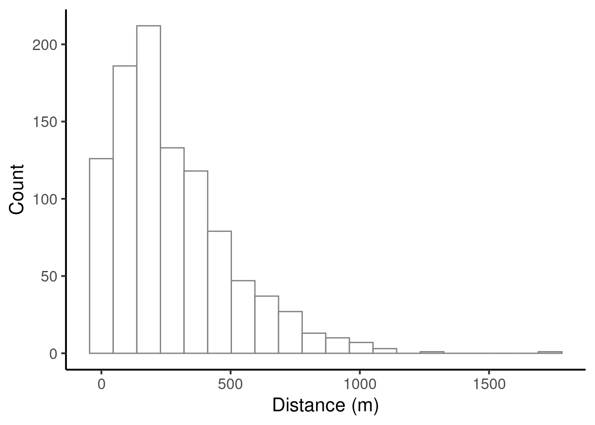
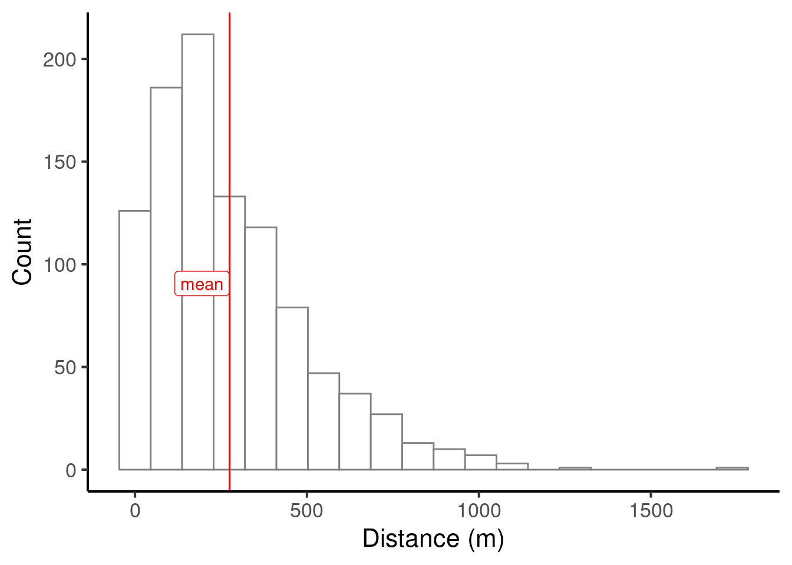
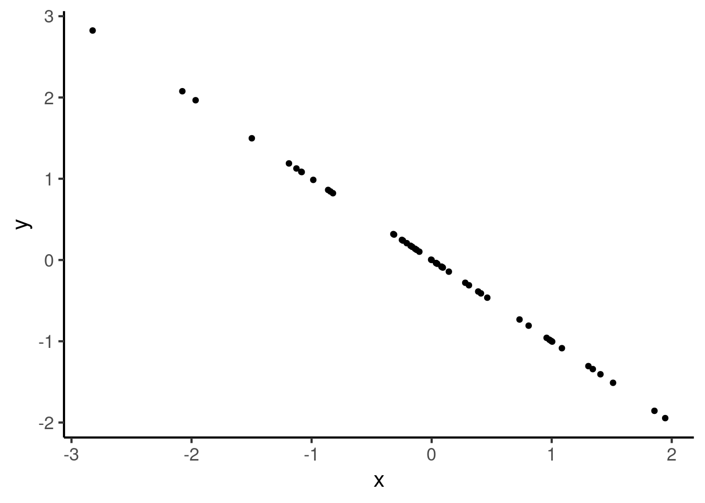
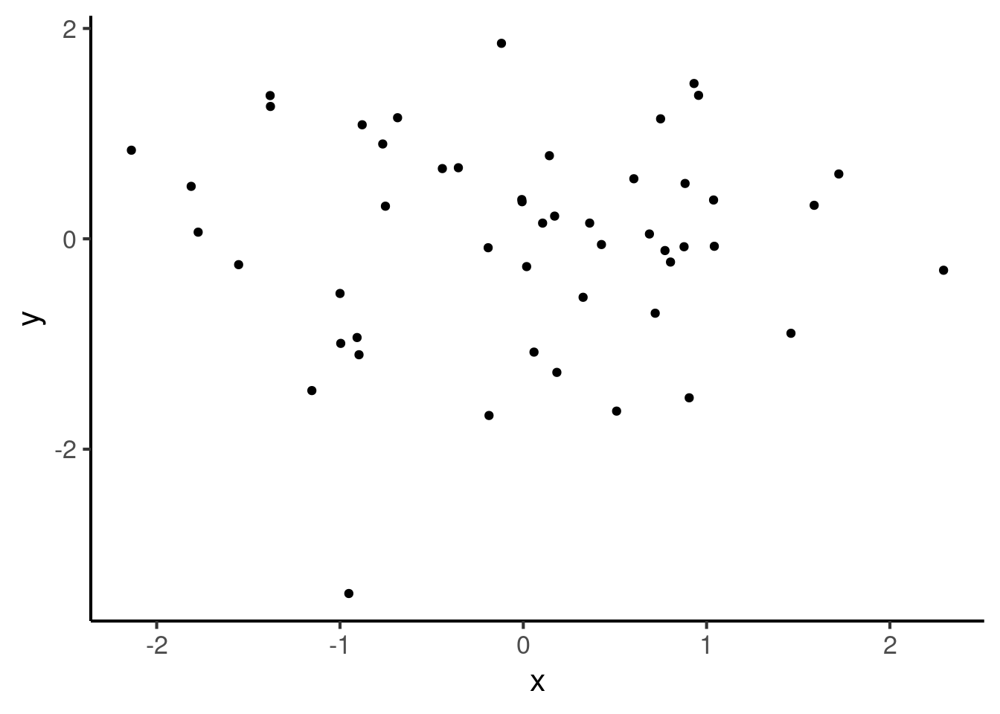
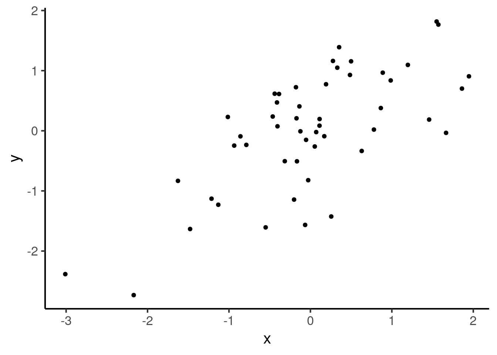
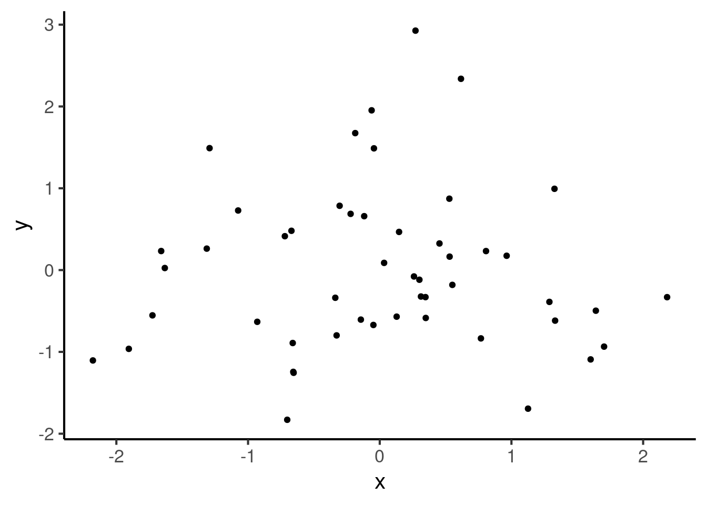
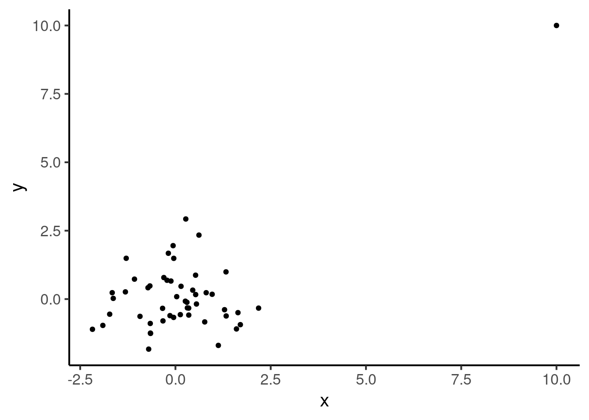
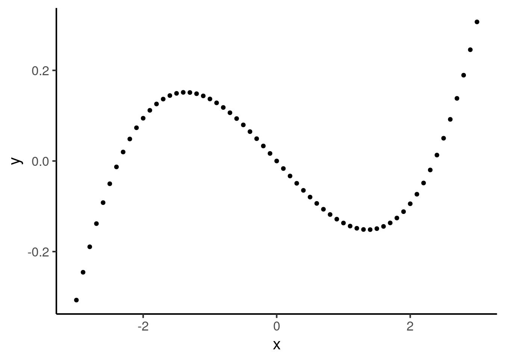
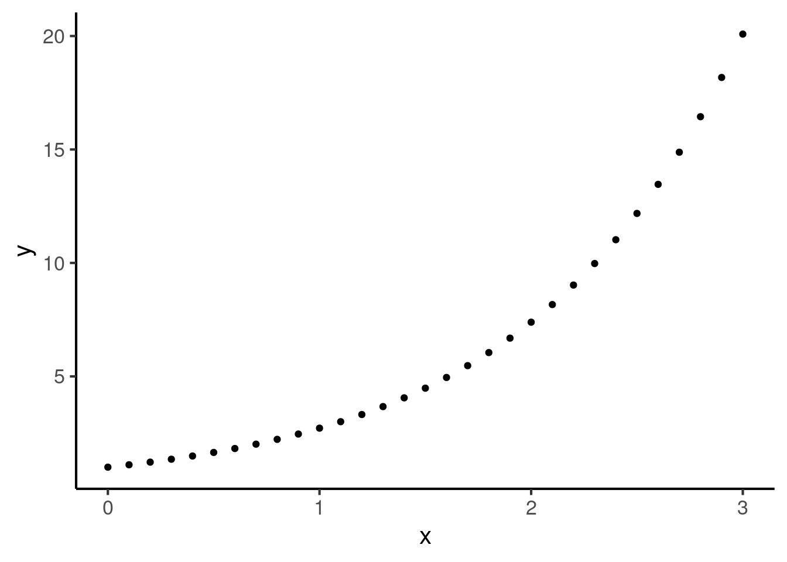

# Descriptive statistics


*Descriptive statistics* are numbers that summarise key aspects of a given dataset. These statistics often form integral parts of particular visualisations (Chapter \@ref(data-visualisation)); for example, the median and interquartile range are two important statistics in box-and-whisker plots. In this chapter we will discuss various kinds of descriptive statistics and their applications.

## Single variables

In the following we will consider the task of summarising the `distance` variable in the following dataset:


```{=html}
<div class="datatables html-widget html-fill-item-overflow-hidden html-fill-item" id="htmlwidget-2e9aee0e22115d0314e7" style="width:100%;height:auto;"></div>
<script type="application/json" data-for="htmlwidget-2e9aee0e22115d0314e7">{"x":{"filter":"none","vertical":false,"data":[["1","2","3","4","5","6","7","8","9","10","11","12","13","14","15","16","17","18","19","20","21","22","23","24","25","26","27","28","29","30","31","32","33","34","35","36","37","38","39","40","41","42","43","44","45","46","47","48","49","50","51","52","53","54","55","56","57","58","59","60","61","62","63","64","65","66","67","68","69","70","71","72","73","74","75","76","77","78","79","80","81","82","83","84","85","86","87","88","89","90","91","92","93","94","95","96","97","98","99","100","101","102","103","104","105","106","107","108","109","110","111","112","113","114","115","116","117","118","119","120","121","122","123","124","125","126","127","128","129","130","131","132","133","134","135","136","137","138","139","140","141","142","143","144","145","146","147","148","149","150","151","152","153","154","155","156","157","158","159","160","161","162","163","164","165","166","167","168","169","170","171","172","173","174","175","176","177","178","179","180","181","182","183","184","185","186","187","188","189","190","191","192","193","194","195","196","197","198","199","200","201","202","203","204","205","206","207","208","209","210","211","212","213","214","215","216","217","218","219","220","221","222","223","224","225","226","227","228","229","230","231","232","233","234","235","236","237","238","239","240","241","242","243","244","245","246","247","248","249","250","251","252","253","254","255","256","257","258","259","260","261","262","263","264","265","266","267","268","269","270","271","272","273","274","275","276","277","278","279","280","281","282","283","284","285","286","287","288","289","290","291","292","293","294","295","296","297","298","299","300","301","302","303","304","305","306","307","308","309","310","311","312","313","314","315","316","317","318","319","320","321","322","323","324","325","326","327","328","329","330","331","332","333","334","335","336","337","338","339","340","341","342","343","344","345","346","347","348","349","350","351","352","353","354","355","356","357","358","359","360","361","362","363","364","365","366","367","368","369","370","371","372","373","374","375","376","377","378","379","380","381","382","383","384","385","386","387","388","389","390","391","392","393","394","395","396","397","398","399","400","401","402","403","404","405","406","407","408","409","410","411","412","413","414","415","416","417","418","419","420","421","422","423","424","425","426","427","428","429","430","431","432","433","434","435","436","437","438","439","440","441","442","443","444","445","446","447","448","449","450","451","452","453","454","455","456","457","458","459","460","461","462","463","464","465","466","467","468","469","470","471","472","473","474","475","476","477","478","479","480","481","482","483","484","485","486","487","488","489","490","491","492","493","494","495","496","497","498","499","500","501","502","503","504","505","506","507","508","509","510","511","512","513","514","515","516","517","518","519","520","521","522","523","524","525","526","527","528","529","530","531","532","533","534","535","536","537","538","539","540","541","542","543","544","545","546","547","548","549","550","551","552","553","554","555","556","557","558","559","560","561","562","563","564","565","566","567","568","569","570","571","572","573","574","575","576","577","578","579","580","581","582","583","584","585","586","587","588","589","590","591","592","593","594","595","596","597","598","599","600","601","602","603","604","605","606","607","608","609","610","611","612","613","614","615","616","617","618","619","620","621","622","623","624","625","626","627","628","629","630","631","632","633","634","635","636","637","638","639","640","641","642","643","644","645","646","647","648","649","650","651","652","653","654","655","656","657","658","659","660","661","662","663","664","665","666","667","668","669","670","671","672","673","674","675","676","677","678","679","680","681","682","683","684","685","686","687","688","689","690","691","692","693","694","695","696","697","698","699","700","701","702","703","704","705","706","707","708","709","710","711","712","713","714","715","716","717","718","719","720","721","722","723","724","725","726","727","728","729","730","731","732","733","734","735","736","737","738","739","740","741","742","743","744","745","746","747","748","749","750","751","752","753","754","755","756","757","758","759","760","761","762","763","764","765","766","767","768","769","770","771","772","773","774","775","776","777","778","779","780","781","782","783","784","785","786","787","788","789","790","791","792","793","794","795","796","797","798","799","800","801","802","803","804","805","806","807","808","809","810","811","812","813","814","815","816","817","818","819","820","821","822","823","824","825","826","827","828","829","830","831","832","833","834","835","836","837","838","839","840","841","842","843","844","845","846","847","848","849","850","851","852","853","854","855","856","857","858","859","860","861","862","863","864","865","866","867","868","869","870","871","872","873","874","875","876","877","878","879","880","881","882","883","884","885","886","887","888","889","890","891","892","893","894","895","896","897","898","899","900","901","902","903","904","905","906","907","908","909","910","911","912","913","914","915","916","917","918","919","920","921","922","923","924","925","926","927","928","929","930","931","932","933","934","935","936","937","938","939","940","941","942","943","944","945","946","947","948","949","950","951","952","953","954","955","956","957","958","959","960","961","962","963","964","965","966","967","968","969","970","971","972","973","974","975","976","977","978","979","980","981","982","983","984","985","986","987","988","989","990","991","992","993","994","995","996","997","998","999","1000"],["112.67","265.22","83.73","684.71","299.52","85.69","339.00","406.76","362.16","165.44","654.46","314.31","113.45","0.25","523.24","215.66","221.61","466.86","430.50","367.00","459.37","419.22","240.93","1.15","373.99","213.37","193.47","22.13","135.79","321.33","600.78","203.93","313.78","213.84","28.74","146.29","149.82","212.72","515.30","413.81","191.78","174.94","395.16","357.08","103.61","100.95","308.08","415.33","202.03","448.07","316.37","114.83","302.34","50.33","626.56","833.06","154.49","59.15","360.55","197.53","1011.96","216.84","393.16","230.92","95.98","266.39","5.59","638.01","258.33","912.54","335.94","100.61","371.53","71.59","38.75","290.37","141.54","225.23","240.88","118.23","121.43","197.51","540.40","18.79","367.01","300.35","503.63","165.66","309.41","284.59","125.49","550.14","534.66","396.07","681.62","357.57","36.77","120.72","41.32","136.57","113.58","233.93","74.37","259.41","108.53","749.17","400.68","456.73","312.91","716.91","111.30","138.50","626.30","109.10","183.56","150.07","162.82","170.20","340.75","189.30","131.29","595.42","182.19","188.87","204.45","399.55","209.82","217.17","104.62","162.06","237.81","118.33","350.46","19.11","293.98","18.02","166.23","127.74","108.90","213.21","2.56","539.92","11.19","138.19","51.68","94.95","876.76","228.67","35.95","12.36","329.47","221.12","163.16","72.16","21.05","55.86","484.01","113.45","28.19","788.77","323.13","177.67","502.18","449.65","113.75","926.76","174.63","25.29","195.70","270.69","970.69","247.77","331.20","209.09","160.33","217.77","420.80","871.83","492.47","550.15","40.71","479.05","273.55","22.37","347.72","192.90","637.67","92.88","143.72","72.54","189.35","317.34","97.57","433.16","42.82","58.74","629.41","62.24","319.83","152.09","319.19","719.43","681.53","160.87","0.99","1055.19","386.89","353.04","222.19","344.87","191.81","322.02","148.80","29.25","480.26","657.32","164.84","38.78","380.08","215.71","8.22","225.45","112.10","159.09","47.67","762.97","160.84","14.15","268.32","283.66","65.60","27.27","110.60","360.76","212.63","204.85","358.18","44.82","514.27","223.88","398.05","494.56","274.38","78.31","535.49","1.00","125.14","174.51","191.47","490.32","254.52","318.63","210.61","176.00","394.77","530.09","3.32","361.35","310.57","144.56","469.03","150.68","169.25","441.08","731.02","285.29","145.08","44.57","160.85","70.92","173.91","315.44","81.67","1125.21","258.96","524.93","1.05","407.52","33.48","459.61","316.37","147.56","589.02","101.84","119.59","63.88","106.56","467.26","325.29","485.59","150.53","310.98","279.20","25.16","753.45","254.12","414.50","470.28","214.51","165.36","451.81","58.81","829.40","151.65","706.44","654.62","242.76","359.88","61.28","297.94","497.53","246.29","139.74","108.36","217.52","505.54","134.84","200.31","35.30","340.78","583.48","649.19","428.61","3.65","337.61","330.98","156.91","262.23","80.13","390.24","161.55","16.13","154.45","602.75","160.28","405.19","467.69","225.92","157.09","127.51","407.12","57.09","279.67","168.31","0.73","26.40","458.48","186.62","425.31","795.94","640.96","389.70","311.87","186.33","678.35","367.63","46.04","193.50","2.46","185.86","9.90","585.54","111.33","143.76","190.85","371.93","390.00","360.08","120.83","29.78","150.77","287.15","85.35","210.78","46.60","223.26","252.87","195.41","191.90","747.74","413.64","518.93","72.89","260.84","532.86","213.29","0.01","303.24","2.77","86.90","588.94","372.86","512.65","293.99","202.46","72.76","683.84","234.55","99.88","443.38","507.20","799.17","116.19","150.40","146.08","153.03","154.59","167.19","629.65","102.36","150.87","382.90","523.19","92.07","130.95","348.40","489.48","175.35","24.90","727.05","627.28","100.55","211.54","7.20","360.55","690.98","12.52","91.07","110.50","104.70","0.59","342.50","18.30","219.78","366.76","185.30","451.31","219.63","109.55","381.21","143.12","751.21","221.18","439.73","270.15","36.68","29.56","144.75","277.48","1.96","472.27","115.97","94.67","16.90","23.26","236.99","344.68","0.10","63.51","351.58","139.92","909.48","562.65","367.43","226.03","287.49","101.18","376.21","643.21","510.04","86.63","13.45","202.56","327.11","598.14","33.29","308.03","276.71","545.58","219.18","156.22","48.61","129.46","155.38","989.35","1032.06","191.35","59.20","1.41","346.06","54.26","960.54","77.45","248.94","1736.55","52.38","294.22","52.59","303.93","78.98","241.53","166.98","45.12","227.38","481.42","684.23","29.06","175.63","534.35","51.85","7.29","71.38","67.72","235.08","148.20","276.24","145.04","310.42","154.70","544.32","96.80","290.18","77.55","270.80","215.09","10.29","195.73","541.10","390.84","256.09","44.27","537.53","241.94","140.13","701.94","92.41","293.22","574.66","369.24","165.14","145.71","305.76","345.75","228.92","587.05","211.39","101.97","351.99","0.17","314.84","341.46","180.25","51.55","149.70","668.16","95.95","1.75","427.90","132.04","130.50","42.15","220.29","396.36","118.54","115.62","514.22","176.02","192.67","112.77","453.82","64.65","438.68","426.01","137.52","438.44","479.93","362.12","851.12","1.60","46.86","28.78","261.59","680.81","715.31","339.23","447.35","195.60","334.26","310.95","93.56","167.62","197.57","612.91","59.92","0.04","415.26","86.25","142.74","455.09","93.28","159.08","651.12","349.62","353.26","197.21","49.60","20.46","180.53","841.70","273.97","260.84","300.27","151.38","27.13","1137.73","144.82","166.66","6.02","175.93","176.06","174.54","6.21","755.85","747.75","393.12","53.21","400.06","176.22","162.86","602.14","41.02","130.45","97.65","229.17","15.92","101.54","400.46","333.30","66.96","357.76","4.11","159.18","399.65","107.88","217.42","14.80","438.26","4.19","162.17","174.59","237.98","85.30","773.29","24.91","281.53","31.12","225.51","344.76","54.86","397.36","299.87","476.74","82.75","67.34","6.76","162.38","31.68","392.72","240.22","919.80","47.56","541.58","127.88","23.07","361.41","24.66","57.97","97.38","271.47","64.12","508.27","43.65","272.79","256.05","56.85","143.99","108.30","471.57","670.41","59.51","462.85","209.44","1.51","94.26","332.26","256.50","4.39","363.37","383.59","165.60","100.94","829.50","206.50","222.07","50.92","31.26","18.82","145.11","601.55","744.01","674.89","579.72","177.87","41.36","161.42","3.56","163.93","708.58","253.34","513.98","339.49","91.16","740.11","208.84","66.77","240.08","19.10","442.95","342.66","156.66","134.12","464.58","57.20","65.82","322.91","140.20","461.20","185.22","545.87","341.10","0.51","31.95","575.01","393.45","67.74","31.13","494.42","86.82","762.43","750.80","23.21","82.45","39.02","386.95","35.58","0.57","849.69","485.84","429.31","107.17","222.64","373.95","36.38","199.66","263.42","720.89","380.05","574.83","255.48","52.02","159.32","11.20","462.33","620.90","212.02","66.16","511.21","255.21","151.19","522.81","93.72","530.97","82.86","314.70","451.12","31.96","316.37","202.18","389.28","89.87","207.10","608.90","261.77","431.07","181.00","60.75","222.71","41.28","10.07","537.49","54.64","4.92","482.55","222.52","116.70","189.18","144.44","482.97","403.75","8.49","305.33","403.52","387.22","3.88","178.29","832.75","423.44","9.21","11.25","339.95","189.93","472.15","290.93","242.33","265.22","261.27","37.37","988.88","26.17","221.45","125.21","761.80","487.53","122.19","270.21","536.30","939.68","292.95","59.33","65.86","843.32","0.26","1324.25","173.46","139.69","259.30","463.70","293.09","1.71","305.37","329.53","384.82","60.53","2.55","162.00","70.39","92.91","69.28","149.18","164.39","423.23","479.83","89.08","164.82","307.30","614.62","213.38","9.66","276.32","200.69","751.17","302.90","113.18","142.17","131.40","265.76","263.57","458.43","297.26","154.58","70.82","378.03","212.07","265.03","516.45","743.34","69.28","702.70","79.80","284.41","274.12","170.61","613.05","107.90","385.09","222.22","71.90","552.38","0.15","128.07","17.73","267.66","283.95","51.39","382.46","60.37","384.73","277.72","400.28","71.08","245.47","138.30","22.26","258.21","751.66","109.48","184.99","393.02","232.65","818.23","406.45","976.52","304.24","49.88","322.18","72.73","63.21","186.97","463.86","303.02","428.41","458.28","190.36","3.30","423.18","911.06","237.43","30.42","154.43","71.54","216.34","389.38","443.74","277.10","71.61","428.19","597.23","946.37","133.27","335.57","545.50","201.22","348.72","272.28","197.65","261.78","473.20","319.03","137.71","0.46","89.01","220.83","6.77","928.83","20.96","47.26","635.25","0.11","406.97","158.56","330.92","447.19","68.74","101.19","35.74","68.44","311.92","343.56","852.02","238.78","332.90","240.98","134.38","409.75","333.05","253.00","86.34","216.65","419.02","389.48","135.06","106.42","345.57","499.18","251.14","164.02","78.06","145.56","21.35","102.39"]],"container":"<table class=\"display\">\n  <thead>\n    <tr>\n      <th> <\/th>\n      <th>distance<\/th>\n    <\/tr>\n  <\/thead>\n<\/table>","options":{"searching":false,"rowId":false,"columnDefs":[{"orderable":false,"targets":0}],"order":[],"autoWidth":false,"orderClasses":false}},"evals":[],"jsHooks":[]}</script>
```

Here is a histogram illustrating the variable's distribution (see Chapter \@ref(data-visualisation) for an introduction to histograms):



We will now consider various descriptive statistics that can be computed for this variable.

### Centrality

'Centrality' statistics describe the location of a dataset's centre. There are three classic centrality statistics: the *mean* (also known as the 'average'), the *median*, and the *mode*.

#### Mean

We compute the mean of $N$ datapoints by summing them together and dividing by $N$. In mathematical notation, we can write the following:

$$
\textrm{mean}(x_1, x_2, \ldots, x_N) = 
\frac{x_1 + x_2 + \ldots + x_N}{N} = 
\frac{1}{N}\sum_{i=1}^N{x_i}
$$

For example, the mean of 6.47, 2.32, and 1.57 is

$$
\frac{6.47 + 2.32 + 1.57}{3} = 3.453
$$

Let's compute the mean of our larger dataset and plot it on our histogram.



We can compute the mean in R with code like the following:


```r
x <- c(5, 3, 2, 4, 3)
mean(x)
#> [1] 3.4
```

#### Median

The median is computed as follows: we rank the data points in numeric order, and then take the middle data point. For example, suppose that we want to compute the median of the following numbers:

$$
5, 2.5, 8.3, 7, 1.2
$$

We first arrange them in ascending order:

$$
1.2, 2.5, 5, 7, 8.3
$$

We then select the middle number:

$$
1.2, 2.5, \mathbf{5}, 7, 8.3
$$

So, our median will be 5.

If we have an odd number of values, there will be exactly one number in the middle. If we have an even number of values, there will be exactly two numbers in the middle. In this case, we take the two middle values and average them to get the median.

Let's add the median to our histogram:


In this example the median is significantly smaller than the median. This is commonly the case with *skewed* distributions. Skewed distributions can often be found in socioeconomic studies; for example, income distributions tend to have the majority of incomes bunched towards the bottom of the distribution, contrasting with a smaller number of much higher incomes towards the top of the distribution. This yields the paradoxical situation that the 'average' person earns less than the average income.

We can compute the median in R with code like the following:


```r
x <- c(5, 3, 2, 4, 3)
median(x)
#> [1] 3
```

#### Mode

The *mode* is only properly defined for variables that can only take a finite number of values. It is defined as the value that is observed most often in the dataset. For example, suppose we record the following dataset tabulating the number of cars owned by different families:


```{=html}
<div class="datatables html-widget html-fill-item-overflow-hidden html-fill-item" id="htmlwidget-5633904f254e322c458e" style="width:100%;height:auto;"></div>
<script type="application/json" data-for="htmlwidget-5633904f254e322c458e">{"x":{"filter":"none","vertical":false,"data":[["1","2","3","4","5","6","7","8","9","10","11","12","13","14","15","16","17","18","19","20","21","22","23","24","25","26","27","28","29","30","31","32","33","34","35","36","37","38","39","40","41","42","43","44","45","46","47","48","49","50","51","52","53","54","55","56","57","58","59","60","61","62","63","64","65","66","67","68","69","70","71","72","73","74","75","76","77","78","79","80","81","82","83","84","85","86","87","88","89","90","91","92","93","94","95","96","97","98","99","100"],[2,2,1,2,0,2,1,1,1,1,0,1,1,0,1,1,1,2,1,1,2,1,1,1,1,0,1,1,1,2,3,1,1,1,2,1,2,1,2,1,2,0,1,2,1,1,2,2,1,1,2,1,1,2,1,3,1,2,1,2,0,1,2,0,1,0,0,1,3,2,2,1,2,2,2,1,1,0,1,2,3,2,0,2,2,1,2,1,2,0,2,2,2,2,2,1,1,3,3,1]],"container":"<table class=\"display\">\n  <thead>\n    <tr>\n      <th> <\/th>\n      <th>num_cars<\/th>\n    <\/tr>\n  <\/thead>\n<\/table>","options":{"searching":false,"rowId":false,"columnDefs":[{"className":"dt-right","targets":1},{"orderable":false,"targets":0}],"order":[],"autoWidth":false,"orderClasses":false}},"evals":[],"jsHooks":[]}</script>
```

We can plot the counts of each number in a bar plot:


The mode then corresponds to the highest bar, 1.

#### Which centrality statistic should I report?

In most practical contexts we tend to report the mean. We occasionally report the median if we believe that the dataset is highly skewed or contains many outliers.

### Spread

Alongside centrality, it is useful to characterise the *spread* of our dataset. There are various relevant statistics here, including the range, standard deviation, and interquartile range.

#### Range

The range simply corresponds to the difference between the highest and the lowest values observed in the dataset. Suppose we have the following dataset:

$$
5, 3, 2, 4, 3
$$ The minimum value is 2, and the maximum value is 5, so the range is 3.

The range is often described as an unreliable statistic because it is highly sensitive to outliers, that is, rare extreme values in the distribution. The following two statistics are however less sensitive to such outliers.

#### Standard deviation

The standard deviation can be informally understood as the average distance of each observation from the mean. We can compute it in R using code like the following:


```r
x <- c(5, 3, 2, 4, 3)
sd(x)
#> [1] 1.140175
```

The mathematical definition of standard deviation has some subtleties, though.

1.  The 'average' here is computed by taking the 'root mean square' (i.e., taking the distances from the mean, squaring them, adding them, then taking the square root).

2.  By default, we compute what is called the 'sample standard deviation', which has a built-in adjustment factor to account for uncertainty in the mean. The result is that the definition of standard deviation has $n-1$ in the denominator (the lower part of the fraction) rather than $n$.

The mathematical definition of the standard deviation is then:

$$
s = \sqrt{\frac{\sum_{i=1}^{N}(x_i - \bar{x}) ^ 2}{N-1}}
$$

Here $x_i$ refers to the $i$th value in the dataset, and $\bar{x}$ refers to the mean value in the dataset. The sigma notation ()

If you are unfamiliar with this kind of mathematical notation, you may wish to have a look at Section \@ref(a-note-on-mathematical-notation). Don't worry too much, though: this mathematical definition is **not** required for the Cambridge undergraduate courses, and you are unlikely to need to worry about it in most situations.

#### Interquartile range

The interquartile range is another measure of spread. It is based on the concept of *percentiles*. The *x*-th percentile of a given dataset is the value below which *x*% of the sample falls. For example, the 25th percentile is the value below which 25% of the sample falls. We can compute percentiles in R with code like the following:


```r
x <- c(3, 6, 4, 3, 2, 2, 2, 3, 5, 6, 4, 5, 4, 3, 2, 5)
quantile(x, probs = c(0.25, 0.5, 0.75))
#>  25%  50%  75% 
#> 2.75 3.50 5.00
```

The interquartile range is based on the 25th and 75th percentile:


We compute the interquartile range as the difference between the 25th percentile and the 75th percentile. In this case, the interquartile range would be 290.4108358.

In R, we can compute the interquartile range using the `IQR` function:


```r
x <- c(3, 6, 4, 3, 2, 2, 2, 3, 5, 6, 4, 5, 4, 3, 2, 5)
IQR(x)
#> [1] 2.25
```

#### Which spread statistic should I report?

In most practical contexts we tend to report the standard deviation. It is often useful to report the range as well. It is quite rare to report the interquartile range, but we sometimes report it if we believe that the dataset is highly skewed or contains many outliers.

## Pairs of variables

### Pairs of continuous variables

Often we want to understand how certain pairs of variables relate to each other. In Chapter \@ref(data-visualisation) we learned various techniques for plotting such relationships. For example, we saw that pairs of continuous variables can be visualised using a scatter plot:


A key descriptive statistic in this context (two continuous variables) is the *correlation coefficient*. The correlation coefficient is a way of quantifying the strength of the relationship between two variables.

A correlation of 1 means a perfect positive correlation, where the relationship between the two variables is perfectly summarised by a straight line with a positive (i.e. ascending) gradient:


A correlation of -1 also means that the relationship is perfectly summarised by a straight line, but one with negative gradient:



These cases may be contrasted with a correlation of 0, which corresponds to the absence of a relationship:



Intermediate numbers between these values then correspond to noisy relationships. In a noisy relationship, one variable gives some information about the other variable, but not enough to perfectly predict it. Here we have an example of a correlation of 0.7:



Here is a correlation of -0.4:


There are different types of correlation coefficients out there. The most common is the *Pearson correlation coefficient*, which is what we've been plotting just now. This is the default used by most statistical software. In R, you can compute the Pearson correlation coefficient as follows:


```r
x <- c(3, 6, 4, 3, 6, 5, 4, 8, 6)
y <- c(0, 2, 3, 2, 3, 4, 7, 4, 5)
cor(x, y)
#> [1] 0.3015113
```

#### Outliers

A troublesome thing about the Pearson correlation coefficient is that it is rather sensitive to outliers (i.e. extreme data values). This will be illustrated with an example. Suppose we start with a dataset where the correlation coefficient is 0:




```r
cor(x, y)
#> [1] 0.3015113
```

Now let's add one outlier to this dataset, with a large x value and a large y value.



If we compute the correlation between these two variables, we find that it has now increased to a rather large number, despite the fact that the original dataset had no correlation at all:


```r
cor(df2$x, df2$y)
#> [1] 0.6667556
```

There are fortunately other types of correlation coefficient that are *robust* to these kinds of issues. These are called *non-parametric* correlation coefficients (this contrasts with the Pearson coefficient, which is a *parametric* coefficient). Two such coefficients are particularly popular: the *Spearman* and the *Kendall* correlation coefficients. These coefficients both also give numbers between -1 and 1. They are, however, much less sensitive to outliers. Let's see what they return for our dataset:


```r
cor(df2$x, df2$y, method = "spearman")
#> [1] 0.05411765

cor(df2$x, df2$y, method = "kendall")
#> [1] 0.03686275
```

All else aside, many statisticians prefer the Pearson correlation coefficient because it has certain useful statistical properties. However, it is a good idea to use a non-parametric coefficient if one is worried about outliers.

#### Linearity

It is important to note that correlation coefficients only look for *increasing* or *decreasing* relationships. They do not look for more complex shapes. For example, the following curve illustrates a situation where $y$ is perfectly predicted from $x$, yet the correlation coefficient is 0:




```r
cor(df$x, df$y) %>% round(3)
#> [1] 0
```

The Pearson correlation coefficient is particularly picky in that it looks specifically for *straight* lines (in statistics lingo: *linear relationships*). So, the following curve has a Pearson correlation coefficient less than 1:




```r
cor(df$x, df$y) %>% round(3)
#> [1] 0.933
```

In contrast, the nonparametric correlation coefficients only look for *monotonic* (i.e. always increasing or always decreasing) relationships. This means they return 1 for the above plot.


```r
cor(df$x, df$y, method = "spearman") %>% round(3)
#> [1] 1

cor(df$x, df$y, method = "kendall") %>% round(3)
#> [1] 1
```

This is because nonparametric statistics only look at the *order* of points, not their precise values.

### Pairs of other variable types

For some reason it is uncommon to provide descriptive statistics for pairs of other variable types (e.g. categorical with categorical, or categorical with discrete). We will therefore not discuss such statistics here.
