# (PART) Computational approaches {.unnumbered}

# Computational music psychology


## Science and computational models

Scientific theories take various forms. In physics, theories often take the form of equations. For example, Newton's theory of gravitation may be summarised by the following equation, which describes the force $F$ experienced by two objects with masses $m_1$ and $m_2$ separated by a distance of $r$:

$$
F = G \frac{m_1 m_2}{r^2}
$$ where $G$ is the gravitational constant.

In psychology, equations are less common. Instead, psychological theories are often expressed verbally. For example, Juslin's BRECVEMA model [@juslin2013] states that emotional responses to music are primarily mediated by eight psychological mechanisms (brain stem reflexes, rhythmic entrainment, evaluative conditioning, contagion, visual imagery, episodic memory, musical expectancy, and aesthetic judgment), and provides verbal accounts of each of these mechanisms. For example, Juslin writes the following about the brain stem reflex [@juslin2013]:

> *Brain stem reflex* refers to a process whereby an emotion is induced by music because one or more fundamental acoustic characteristics of the music are taken by the brain stem to signal a potentially important and urgent event that needs attention. In music, this could involve sounds that are sudden, loud, or dissonant, or that feature accelerating patterns. Brain stem reflexes are quick, automatic, and unlearned. A famous example that may evoke a brain stem reflex in a listener given a certain sound level is the kettledrum stroke in Joseph Haydnʼs Symphony No. 94. More commonly perhaps, such reactions result from dynamic changes in the music (e.g., a full orchestra or band coming in after a short solo intro). Brain stem reflexes may increase *arousal* and evoke feelings of *surprise* in the listener.

This brain-stem component of Juslin's theory is already more complex than Newton's theory. It refers to a variety of musical features (suddenness, loudness, dissonance, acceleration), physiological states (arousal) and subjective experiences (surprise), as opposed to Newton's theory which explains gravity solely in terms of mass ($m_1$, $m_2$) and distance ($r$).

On the other hand, Juslin's theory is considerably less *precise* than Newton's theory. For example, it mentions various musical features that may contribute to the brain-stem reflex (e.g. suddenness, loudness, dissonance) but it does not explain how these features should be computed for a given piece of music, or how these features should be weighted to determine the brain-stem reflex. As it stands, Juslin's theory is unable to predict exactly what kind of brain-stem response should be elicited by a given piece of music. In contrast, Newton's theory is very precise indeed. It tells us exactly what we need to measure about each object (mass, distance), with these attributes having well-established measurement instruments available in the science laboratory (e.g. rulers, mass balances). Moreover, once we have measured these attributes, Newton's theory tells us exactly how to combine them to give a precise numeric prediction of the resulting force.

Why is precision desirable in a scientific theory?

-   **Precise theories carry more information than imprecise theories.** Compare Newton's full gravitational theory ($F = G \frac{m_1 m_2}{r^2}$) to the following imprecise verbal version: "Gravitational force increases (a) as the mass of the two objects increase and (b) as the distance between the two objects decreases". All information in the imprecise version is contained within the precise version, but the imprecise version is missing detail about the nature of the mass and distance relationships.

-   **Precise theories are more empirically testable.** The scientific method relies heavily on conducting experiments to test different theories. To test a theory, we need to generate predictions from the theory, and compare them to what we see in our experiment. In this context, precise theories have a clear advantage: they specify precisely what features need to be measured, and how the resulting information ought to be processed, producing a precise prediction as a result. Even subtle deviations from that prediction can have informative results: for example, Newton's theory failed to predict certain perturbation's in the planet Mercury's orbit that were only eventually resolved by Einstein's theory of general relatively. Imprecise theories are comparatively poorly suited to prediction generation. They rely on concepts that are only loosely defined, and they rely on the the reader filling certain gaps with their own intuitions and assumptions. As a result, the theories do not generate precise predictions, and this makes them hard to falsify, because the same theory is compatible with many different datasets.

-   **Precise theories have useful engineering applications.** Once a theory is developed with sufficient precision, we can use it to generate predictions with minimal input from the researcher. This can have many useful engineering applications. In the context of aeronautical engineering, simulations of jet engine architectures can help engineers to optimise engine designs without having to run thousands of costly experiments with real engines. In the context of music psychology, simulations of (for example) emotion perception can be used to guide music recommendation systems, helping listeners to retrieve music that matches their mood.

Many of the phenomena we are interested in music psychology (e.g. emotion, expression, aesthetics) are highly complex, relying on many psychological processes that are themselves complex and hard to define. If we did eventually develop a comprehensive and precise theory of musical emotions, we would hardly be able to apply it with a back-of-the-envelope calculation like we could with Newton's theory. Fortunately, modern computers now vastly extend our abilities to perform numeric computations, and this makes it for the first time practical to develop and test precise theories of complex psychological phenomena.

When we develop a psychological theory that is sufficiently precise to be implemented as a computer program, we call it a *computational model*. The process of developing such theories, and implementing their corresponding computer programs, is then called *computational modelling*.

## What does a computer program look like?

Before diving into specific music psychology models, let us spend a little time looking at general principles of computer programming.

A computer program is simply a set of instructions that can be carried out by a computer in order to fulfil a certain task. For example, suppose I wish to check whether a given number $N$ is prime.[^computational-music-psychology-1] If I were instructing a human to do this, I would give them some instructions like the following:

[^computational-music-psychology-1]: A number $N$ is prime if it cannot be divided exactly by any integers apart from itself and $1$. An integer is a whole number, for example $-1$, $0$, $1$, $2$, and $3$. The number $6$ is *not* prime, because it can be divided by $2$ and by $3$. In contrast, $7$ *is* prime; it cannot be divided by any one of $2$, $3$, $4$, $5$, or $6$.

1.  For each integer $i$ from $2$ to $N - 1$:

    1.  Calculate $y = N/i$

    2.  If $y$ is an integer, then $N$ is not prime. Stop the calculation here.

2.  If we get to the end without $y$ ever being an integer, then we can conclude that $N$ is indeed prime.

For example, suppose we want to check whether 9 is prime. We start by setting $i$ to $2$, and we calculate $y = 9/2 = 4.5$. Looking at $4.5$, we see that it is not an integer, so we move on and set $i$ to $3$. Now $y = 9/3=3$, and $3$ is an integer, so we conclude that $9$ is not prime, and we stop the calculation there.

These instructions might be fine for a human, but if we want to give instructions to a computer, we typically need to provide them in a *programming language*. Many different programming languages have been developed over the last few decades. For scientific programming, two stand out in recent years: R and Python. Both can be downloaded for free, and both have many high-quality tutorials available on the Internet.[^computational-music-psychology-2]

[^computational-music-psychology-2]: The [Software Carpentry](https://software-carpentry.org/) initiative provides excellent free tutorials for R and Python targeted at scientific researchers. DataCamp provides a particularly strong range of interactive tutorials for R and Python targeted at data scientists. DataCamp is a subscription-based service, but university instructors can (at the time of writing) get free access for their students by signing up to the [DataCamp for Classrooms](https://www.datacamp.com/groups/classrooms) scheme. Cambridge students at the Centre for Music and Science should contact Peter Harrison (pmch2\@cam.ac.uk) for access.

Here is an implementation of our prime number checker written for the R programming language. Take a moment to read it through line by line. If you are new to programming, there will be many new things here. Nonetheless, the syntax is designed to be intuitive, and with some thought you should be able to make a good guess at what is happening at each point.


```r
is_prime <- function(N) {
  for (i in seq(from = 2, to = N - 1)) {
    y <- N / i
    if (is_integer(y)) {
      return(FALSE)
    }
  }
  TRUE
}

is_integer <- function(x) {
  x == round(x)
}
```

Our implementation includes two functions: one called `is_prime`, and one called `is_integer`. In mathematics, a function is an algorithm that takes an input (called an argument) and returns an output. In this case, `is_prime` takes a number `N` as an input, and returns `TRUE` if the number is prime, and `FALSE` otherwise. The function `is_integer` meanwhile takes a number `x` as an input, and returns `TRUE` if the number is an integer, and `FALSE` otherwise.

These functions also define certain variables. A variable is a named container for a piece of data. We can use variables to store the results of intermediate computations within our functions. For example, the `is_prime` function defines a variable `y` using the following code:

``` {.r}
y <- N / i
```

The token `<-` is used in R to denote variable assignment. It takes the expression on the right-hand side ($N / i$), computes the result, and assigns it to the left-hand side.

Each function contains a series of instructions for the computer to execute. These instructions are expressed as a series of lines of code. Ordinarily these lines are executed one after each other, but in special cases they execute in a more complex order. One such case is the 'for' loop. When in a 'for' loop, we repeat the same passage of code multiple times, each time updating the value of a particular variable within the loop. Take the following simple example:


```r
for (i in seq(from = 1, to = 6)) {
  message(paste("The current value of i is", i))
}
#> The current value of i is 1
#> The current value of i is 2
#> The current value of i is 3
#> The current value of i is 4
#> The current value of i is 5
#> The current value of i is 6
```

Here we have a variable `i`, and we set this variable first to `1` , then to `2` , then to `3` , and so on until we get to `6`.

Our `is_prime` function contained a slightly more complicated 'for' loop, which looked like this:

``` {.r}
for (i in seq(from = 2, to = N - 1)) {
  y <- N / i
  if (is_integer(y)) {
    return(FALSE)
  }
}
```

Instead of looping from `1` to `6`, we're now looping from `2` to `N - 1`. In each loop, we compute an intermediate variable called `y` . We then check if `y` is an integer. If it is an integer, then we use the `return` keyword to quit the loop as well as its containing function, returning the answer `FALSE`.

Let's define a new version of `is_prime` where we print information about what's happening at each point.


```r
is_prime <- function(N) {
  message(paste0("Checking whether the number ", N, " is prime..."))
  for (i in seq(from = 2, to = N - 1)) {
    message(paste0("Let i = ", i, ":"))
    y <- N / i
    message(paste0("  Let y = ", N, "/", i, " = ", y))
    if (is_integer(y)) {
      message(paste0(
        "  ", y, " is an integer, so ", i, " divides ", N, 
        ", so ", N, " is not prime."
        ))
      return(FALSE)
    } else {
      message(paste0(
        "  y is not an integer, so ", i, " does not divide ", N, "."
        ))
    }
  }
  message(paste0(N, " had no divisors so it must be prime."))
  TRUE
}

is_integer <- function(x) {
  x == round(x)
}
```

Now we can evaluate it on a few numbers and see what happens.


```r
is_prime(4)
#> Checking whether the number 4 is prime...
#> Let i = 2:
#>   Let y = 4/2 = 2
#>   2 is an integer, so 2 divides 4, so 4 is not prime.
#> [1] FALSE

is_prime(5)
#> Checking whether the number 5 is prime...
#> Let i = 2:
#>   Let y = 5/2 = 2.5
#>   y is not an integer, so 2 does not divide 5.
#> Let i = 3:
#>   Let y = 5/3 = 1.66666666666667
#>   y is not an integer, so 3 does not divide 5.
#> Let i = 4:
#>   Let y = 5/4 = 1.25
#>   y is not an integer, so 4 does not divide 5.
#> 5 had no divisors so it must be prime.
#> [1] TRUE

is_prime(6)
#> Checking whether the number 6 is prime...
#> Let i = 2:
#>   Let y = 6/2 = 3
#>   3 is an integer, so 2 divides 6, so 6 is not prime.
#> [1] FALSE
```

We can see that the functions are indeed carrying out the logic that we requested.

It's worth noting that we could just as easily have implemented our algorithm in Python. The resulting code looks a little different, but the underlying logic is exactly the same:


```python
def is_prime(N):
    for i in range(2, N):
        y = N / i
        if is_integer(y):
            return False
    return True
  
def is_integer(x):
    return x == round(x)
  
is_prime(5)
#> True

is_prime(6)
#> False
```

You can easily try these code examples out on your own computer. A quick way to try both R and Python examples is via [Google Colaboratory](https://colab.research.google.com/?utm_source=scs-index#scrollTo=-Rh3-Vt9Nev9) (or 'Colab' for short). You will need a Google account to use this. This service allows you to spin up R or Python sessions in your web browser that you can use interactively. Use the following links to create your own sessions:

-   [Create a new Python notebook](https://colab.research.google.com/notebook#create=true)

-   [Create a new R notebook](https://colab.research.google.com/notebook#create=true&language=r)

You can then copy and paste the above code into these notebooks. Use Command-Enter (Mac) or Ctrl-Enter (Windows) to execute code in a given block.

If you are interested in pursuing R/Python in the longer-term, you will probably want to install them on your computer. This will take a little more work, but there is good documentation online.

To install R, you should follow the following two steps:

-   Install the [R software](https://cran.r-project.org/mirrors.html) itself

-   Install [RStudio Desktop](https://www.rstudio.com/products/rstudio/download/#download), an interface for helping you to write R code

There are more options out there for installing and using Python. One simple installation is to use [Anaconda](https://docs.anaconda.com/anaconda/install/index.html), which packages up Python alongside many other commonly used packages. You then need to decide what interface you want to use with Python. An option that's easy to get going with is the Jupyter Notebook, but for more advanced use you will likely want to use IPython (included with Anaconda) or PyCharm (recommended if you want to do web programming one day, e.g. designing online experiments with PsyNet).

## What do music psychology models look like?

There are many computational models of music perception and production in the literature (see [@Temperley2013-fg] for a review). A good way to get a feel for computational modelling is to dive deeply into a few examples. Here we will consider two such models in detail: the Krumhansl-Schmuckler key-finding algorithm [@krumhansl1990cognitive], and the Hutchinson-Knopoff dissonance algorithm [@hutchinson1978]. They might appear somewhat complex on first sight, but don't worry, you're not expected to understand all the details straight away!

### The Krumhansl-Schmuckler key-finding algorithm

#### Overview

This algorithm is designed to simulate how listeners identify the *key* of a given musical passage. Now, identifying keys is often trivial to someone reading a musical score. Many musical pieces have their key written in their title, for example "Sonata No. 6 in D major, K. 284" or "Symphony No. 9 in D minor, Op. 125". Even if the key is not present in the title, we can typically narrow down the key to one of two options by inspecting the key signature at the beginning of the piece. However, none of this written information is necessarily available to the music *listener*; they must instead somehow identify the key purely from the notes that they hear.

The Krumhansl-Schmuckler algorithm proposes a mechanism for this process. The algorithm can be succinctly summarised as follows:

1.  Different keys use different pitch classes to different degrees.[^computational-music-psychology-3]

2.  Listeners possess internal templates that summarise the pitch-class distribution for different musical keys.

3.  During a musical piece, listeners track the distribution of pitch classes within that piece. The inferred key then corresponds to the key whose pitch-class distribution matches best to the observed distribution.

[^computational-music-psychology-3]: Pitch classes denote sets of pitches separated by whole numbers of octaves. In the Western 12-tone scale, there are exactly 12 pitch classes: C, C\#, D, D\#, E, F, F\#, G, G\#, A, A\#, and B.

#### Implementation details

In order to implement this as a computer model, we need to fill in a few details.

First, we ask, what exactly do the listeners' templates look like? In the original Krumhansl-Schmuckler algorithm, these templates are derived empirically from behavioural experiments using Krumhansl and Kessler's [@krumhansl1982] *probe-tone* paradigm, where the listener is asked to rate the 'fit' of a particular musical note in a particular musical context. These experiments produced the following templates:


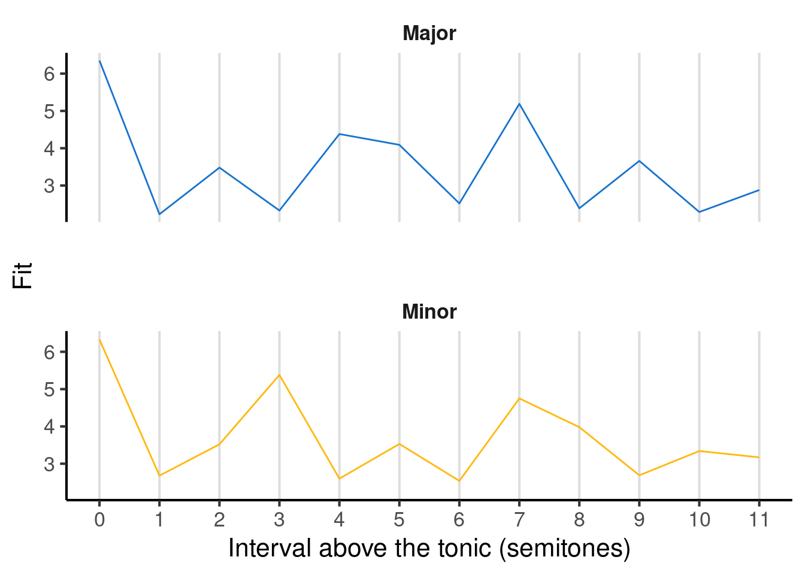

In the above figure, pitch classes are expressed as intervals above the tonic, written in semitones. This means for example that the tonic corresponds to 0 semitones, the major third corresponds to 4 semitones, and the perfect fifth to 7 semitones.

Note how the major template exhibits high fit for pitch classes from the major scale (0, 2, 4, 5, 7, 9, 11), and low fit for the other pitch classes (1, 3, 6, 8, 10). Similarly, the minor template exhibits high fit for pitch classes from the minor scale (0, 2, 3, 5, 7, 8) and low fit for the others.

To derive the pitch-class template for a given musical key, we need to replot the horizontal axis in terms of absolute pitch classes rather than intervals above the tonic. To achieve this transformation, we simply take the interval and add it onto the tonic. For example, if we are in F major, then an interval of 0 semitones corresponds to F, an interval of 1 semitone corresponds to F\#, and so on.

The following figure illustrates the resulting pitch-class profiles for different tonics, with the tonic marked as a dashed red line. As the tonic moves upwards, the pitch-class profile 'rotates' along with it.

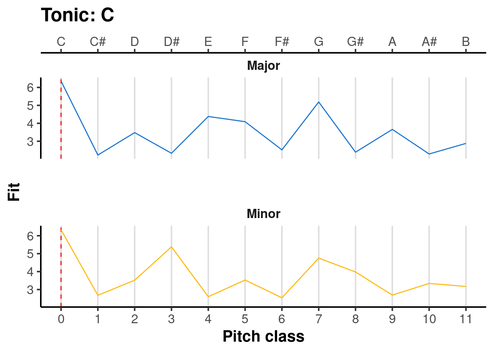

So, we have now established what the templates look like for the 24 major and minor keys. There remains one question, however: how do we compare the listener's pitch-class distribution to these template distributions? There are various possibilities here [@albrecht2013], but the original Krumhansl-Kessler algorithm uses a standard statistic called the *Pearson correlation*. We don't need to worry about the mathematical details here. The important thing to know is that the Pearson correlation can be interpreted as a measure of *similarity*, and it takes values between -1 (maximally dissimilar) and 1 (maximally similar).

#### Worked example

Let's now see this algorithm applied in practice. We'll take the well-known lullaby 'Twinkle, Twinkle, Little Star', which looks like the following in traditional music notation:

, via Wikimedia Commons.](images/twinkle-twinkle.png){width="100%"}

Our first step is to translate this melody into machine-readable notation. We can write it in tabular format, where the first column is the pitch (expressed as a MIDI note), and the second column is the duration (expressed in crotchets, or quarter notes).


```{=html}
<div class="datatables html-widget html-fill-item" id="htmlwidget-f9e59fba7c7d2e3d09a7" style="width:100%;height:auto;"></div>
<script type="application/json" data-for="htmlwidget-f9e59fba7c7d2e3d09a7">{"x":{"filter":"none","vertical":false,"data":[["1","2","3","4","5","6","7","8","9","10","11","12","13","14","15","16","17","18","19","20","21","22","23","24","25","26","27","28","29","30","31","32","33","34","35","36","37","38","39","40","41","42"],[60,60,67,67,69,69,67,65,65,64,64,62,62,60,67,67,65,65,64,64,62,67,67,65,65,64,64,62,60,60,67,67,69,69,67,65,65,64,64,62,62,60],[1,1,1,1,1,1,2,1,1,1,1,1,1,2,1,1,1,1,1,1,2,1,1,1,1,1,1,2,1,1,1,1,1,1,2,1,1,1,1,1,1,2]],"container":"<table class=\"display\">\n  <thead>\n    <tr>\n      <th> <\/th>\n      <th>Pitch<\/th>\n      <th>Duration<\/th>\n    <\/tr>\n  <\/thead>\n<\/table>","options":{"searching":false,"rowId":false,"columnDefs":[{"className":"dt-right","targets":[1,2]},{"orderable":false,"targets":0},{"name":" ","targets":0},{"name":"Pitch","targets":1},{"name":"Duration","targets":2}],"order":[],"autoWidth":false,"orderClasses":false}},"evals":[],"jsHooks":[]}</script>
```


We then compute the relative durations of each pitch class in the melody. To convert pitches to pitch classes we divide by 12 and take the remainder; for example, the pitch 67 is equal to 12 \* 5 + 7, so its pitch class is 7. Applying this logic, and expressing durations as a percentage of the total melody duration, we get the following:

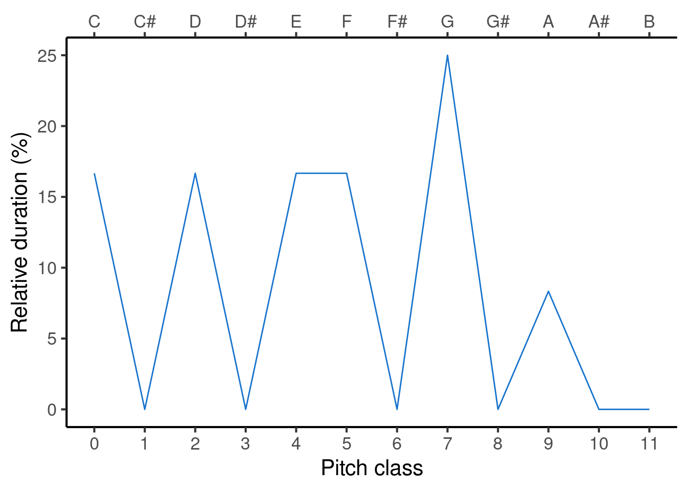

Now our task is to compare this profile with all the different reference profiles, to work out which provides the best fit. The following animation evaluates each reference profile in turn (top panel) and displays the resulting correlation (bottom panel).

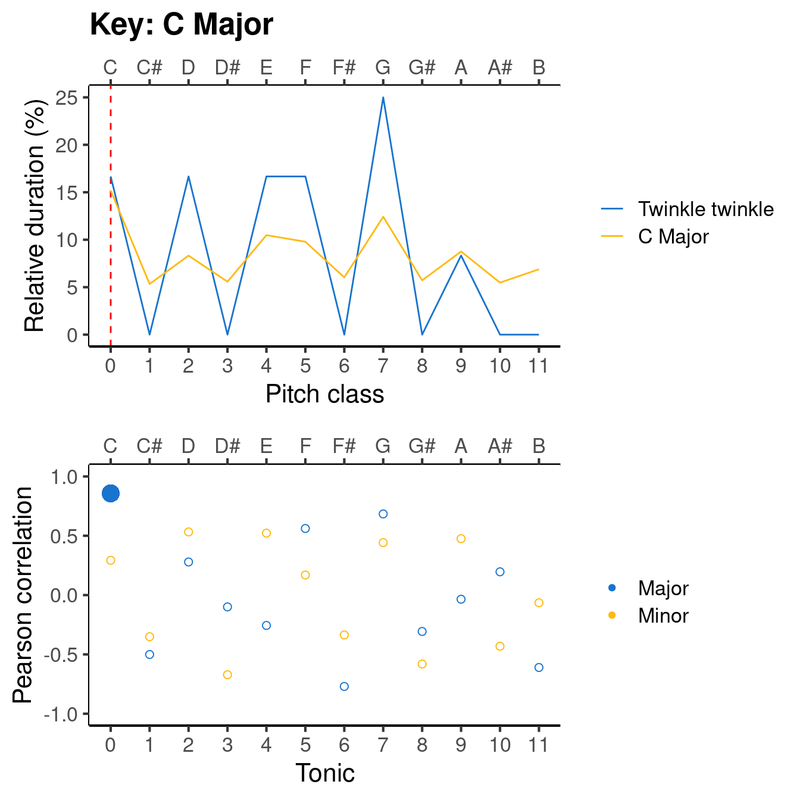

The results can be expressed in a table like the following. You can click on particular column headers to sort by the values in that column.


```{=html}
<div class="datatables html-widget html-fill-item" id="htmlwidget-69491d657cd72d0d1958" style="width:100%;height:auto;"></div>
<script type="application/json" data-for="htmlwidget-69491d657cd72d0d1958">{"x":{"filter":"none","vertical":false,"data":[["1","2","3","4","5","6","7","8","9","10","11","12","13","14","15","16","17","18","19","20","21","22","23","24"],["C","C#","D","D#","E","F","F#","G","G#","A","A#","B","C","C#","D","D#","E","F","F#","G","G#","A","A#","B"],["Major","Major","Major","Major","Major","Major","Major","Major","Major","Major","Major","Major","Minor","Minor","Minor","Minor","Minor","Minor","Minor","Minor","Minor","Minor","Minor","Minor"],["0.86","-0.50","0.28","-0.10","-0.26","0.56","-0.77","0.68","-0.31","-0.03","0.20","-0.61","0.29","-0.35","0.53","-0.67","0.52","0.17","-0.34","0.44","-0.58","0.48","-0.43","-0.06"]],"container":"<table class=\"display\">\n  <thead>\n    <tr>\n      <th> <\/th>\n      <th>Tonic<\/th>\n      <th>Mode<\/th>\n      <th>Correlation<\/th>\n    <\/tr>\n  <\/thead>\n<\/table>","options":{"searching":false,"columnDefs":[{"orderable":false,"targets":0},{"name":" ","targets":0},{"name":"Tonic","targets":1},{"name":"Mode","targets":2},{"name":"Correlation","targets":3}],"order":[],"autoWidth":false,"orderClasses":false}},"evals":[],"jsHooks":[]}</script>
```


If we sort the 'Correlation' column by descending values, we see the following top three key candidates: C major, F major, and G major. Conversely, if we sort the column by ascending values, we see the following bottom three candidates: F\# major, A minor, and C\# major. So, the algorithm selects C major as the inferred key for the melody, which happily is consistent with what most music theorists would say if they examined the score.

#### Where should the templates come from?

The original Krumhansl-Schmuckler algorithm uses template profiles derived from behavioural experiments using the probe-tone paradigm. The implementation leaves open the question of where exactly these templates come from.

One possibility is that the templates are learned through exposure to particular musical styles. By hearing pieces in particular musical keys, the listener learns that particular keys tend to be associated with particular pitch-class distributions. This learning process is complicated by the fact that the listener has to learn the key profiles without being told what key individual pieces are in. Inspiration for understanding this process can come from the machine-learning field of *unsupervised learning*, which studies algorithms for learning structure from unlabelled data. In particular, several key-finding algorithms have used a technique called *latent Dirichlet allocation* to learn both key labels and key profiles directly from unlabelled musical corpora [@moss2021; @Hu2009].

#### Limitations

The Krumhansl-Schmuckler algorithm has been very influential within the field of music psychology, and many subsequent key-finding algorithms use a similar kind of template-matching process [@albrecht2013; @Bellmann2005; @Sapp2011; @Temperley1999a]. Nonetheless, the algorithm is limited by the fact that it ignores the *order* in which notes are played, despite psychological evidence that note order may indeed matter for listeners' key judgments [@brown1988; @matsunaga2005].

For illustration, consider the following two tone sequences from @matsunaga2005. Both of these sequences use exactly the same pitch classes, just in a different order, and with one of the pitch classes transposed upwards by an octave. The first sequence elicits a very clear tonal centre:

{width='100%'}

<br>


(ref:43821d48-a9aa-4c44-9f32-9ce17bc7ef0e)  <audio controls controlsList='nodownload' style='display: block; margin-top: 10px'><source src='audio/matsunaga-tonally-clear.mp3' type='audio/mpeg'></audio>

In contrast, the second tone sequence elicits much more ambiguous tonal centre:

{width='100%'}

<br>


(ref:941abbd7-fbae-4215-8f5a-5d460c1d0008)  <audio controls controlsList='nodownload' style='display: block; margin-top: 10px'><source src='audio/matsunaga-tonally-ambiguous.mp3' type='audio/mpeg'></audio>

@matsunaga2005 studied these two sequences alongside 58 others with the same pitch classes, and demonstrated that they elicit wide variations in key judgments. This means that the Krumhansl-Schmuckler algorithm cannot be capturing the full story, then.

Consequently, an interesting avenue of future research concerns extending the Krumhansl-Schmuckler algorithm to incorporate sensitivity to tone order. One such solution was trialled by @Toiviainen2003a, based on a dataset of relatedness judgments for pairs of tones in major and minor key contexts [@krumhansl1990cognitive]; however, this version of the algorithm failed to predict listener behaviour better than the original Krumhansl-Schmuckler algorithm. Not long later, @Madsen2007 presented a version of the Krumhansl-Schmuckler algorithm based on distributions of pairs of scale degrees as observed in music corpora, but found only marginal improvements in the algorithm's ability to recover musical keys from annotated music corpora. These failures to improve significantly upon the Krumhansl-Schmuckler algorithm are interesting, and suggest that we still have more to learn about key-finding.

### R implementation

See below for a full implementation of the Krumhansl-Schmuckler algorithm, written for the R programming language. This is provided for interest only, you are not expected to understand it, especially if you have never used R before! However, it is worth spending a while reading through the code line by line to try and get a feel for what is happening at each step. If you are confused about what a particular function does, you can click on its name to see its documentation.

To explore this code further, you can follow [this link](https://colab.research.google.com/drive/1tFJWKTjXs0qNR3eIXwR-sTsEuUOC1img#scrollTo=08Pjk6Oz9m85) to access an online interface that allows you to edit and run the code interactively in your web browser. You will need a (free) Google account to continue; alternatively, Cambridge students can simply sign in using their Cambridge email address.


```r
# Load dependencies (packages which
# provide us with some useful functions).
library(dplyr)
library(purrr)

# We write out the Krumhansl-Kessler probe tone profiles.
# There are two such profiles:
# one for the major mode and one for the minor mode.
kk_profiles <- list(
  Major = c(
    6.35, 2.23, 3.48, 2.33, 4.38, 4.09, 
    2.52, 5.19, 2.39, 3.66, 2.29, 2.88
  ),
  Minor = c(
    6.33, 2.68, 3.52, 5.38, 2.60, 3.53,
    2.54, 4.75, 3.98, 2.69, 3.34, 3.17
  )
)

# We define a function for deriving the Krumhansl-Kessler 
# profile for a given mode and tonic.
get_kk_profile <- function(mode, tonic) {
  # We begin by extracting the reference profile for that 
  # particular mode.
  ref_profile <- kk_profiles[[mode]]
  
  # We want our profile to give the fit ratings for the 
  # absolute pitch classes 0 to 11.
  absolute_pitch_classes <- 0:11
  
  # To express these pitch classes relative to the provided
  # tonic, we subtract the tonic and apply the modulo 12
  # operator (i.e. remainder after division by 12).
  relative_pitch_classes <- (absolute_pitch_classes - tonic) %% 12

  # This tells us where to look in the reference profile.
  ref_profile[1 + relative_pitch_classes]
}

# We now compile a table of all the possible key profiles,
# produced by rotating the original Krumhansl-Kessler key profiles
# through all 12 possible tonics.

# This code iterates over the numbers 0 to 11, 
# setting the tonic first to 0, then to 1, then to 2, 
# and so on...
kk_all_key_profiles <- map_dfr(0:11, function(tonic) {
  # This code iterates over the two modes (major and minor)...
  c("Major", "Minor") %>% 
    set_names(., .) %>% 
    map_dfr(function(mode) {
      # ... and gets the Krumhansl-Kessler profile for each one.
      tibble(
        tonic = tonic,
        mode = mode,
        profile = list(get_kk_profile(mode, tonic))
      )
    })
})

kk_all_key_profiles
#> # A tibble: 24 × 3
#>    tonic mode  profile   
#>    <int> <chr> <list>    
#>  1     0 Major <dbl [12]>
#>  2     0 Minor <dbl [12]>
#>  3     1 Major <dbl [12]>
#>  4     1 Minor <dbl [12]>
#>  5     2 Major <dbl [12]>
#>  6     2 Minor <dbl [12]>
#>  7     3 Major <dbl [12]>
#>  8     3 Minor <dbl [12]>
#>  9     4 Major <dbl [12]>
#> 10     4 Minor <dbl [12]>
#> # ℹ 14 more rows

# Here we define a function that takes a melody as an input
# and returns the estimated key.
kk_estimate_key <- function(
    pitches,  # a vector of pitches for each note in the melody
    durations # a vector of durations for each note in the melody
  ) {
  pc_distribution <- 
    tibble(pitch = pitches, duration = durations) %>%
    mutate(
      # We convert pitches into pitch classes by dividing by 12
      # and taking the remainder.
      pitch_class = factor(pitch %% 12, levels = 0:11)
    ) %>%
    
    # We sum the durations for each pich class.
    group_by(pitch_class, .drop = FALSE) %>%
    summarise(
      duration = sum(duration)
    ) %>%
    
    mutate(
      pitch_class = as.numeric(as.character(pitch_class)),
      # We normalise each duration by dividing by the total duration
      # (this is actually not strictly necessary if we are using
      # standared correlation measures).
      rel_duration = duration / sum(duration)
    )

  correlations <- 
    kk_all_key_profiles %>% 
    mutate(
      correlation = map_dbl(
                  # This function iterates over 
        profile,  # <-- the template profiles
        cor,      # <-- computing the Pearson correlation
        pc_distribution$rel_duration # <-- with the observed durations
      ))
  
  # We choose the profile that maximises the correlation 
  # with the observed distribution.
  chosen <- correlations %>% slice(which.max(correlations$correlation))
  
  chosen %>%
    select(tonic, mode, correlation) %>%
    as.list()
}

# We can use this function to estimate keys for arbitrary melodies,
# where each melody is specified as the combination of
# (a) a list of pitches and 
# (b) a list of durations.
kk_estimate_key(
  pitches =   c(60, 62, 65, 67, 69, 67), 
  durations = c(1, 0.5, 0.5, 1, 0.5, 0.5)
)
#> $tonic
#> [1] 0
#> 
#> $mode
#> [1] "Major"
#> 
#> $correlation
#> [1] 0.8145112

kk_estimate_key(
  pitches =   c(60, 63, 65, 67, 68, 67), 
  durations = c(1, 0.5, 0.5, 1, 0.5, 0.5)
)
#> $tonic
#> [1] 0
#> 
#> $mode
#> [1] "Minor"
#> 
#> $correlation
#> [1] 0.7749897
```

### The Hutchinson-Knopoff dissonance algorithm

#### Overview

The Hutchinson-Knopoff dissonance algorithm attempts to explain how listeners perceive certain chords as dissonant (unpleasant) and others as consonant (pleasant) [@hutchinson1978]. The algorithm is based on the hypothesis that dissonance derives from negatively valenced interactions between the harmonics in a given chord's frequency spectrum. This idea has its roots in the writings of @Helmholtz1875-fm. Though many other consonance/dissonance algorithms have been developed since its original presentation, the Hutchinson-Knopoff algorithm still performs remarkably well when benchmarked against current competitors from the literature [@Harrison2020-gx].

#### Detailed description

The algorithm takes a musical chord as its input. This chord would typically be specified as list of fundamental frequencies for each of its constituent tones; for example, a C diminished triad might be specified by the frequencies 261.6 Hz, 311.1 Hz, and 370.0 Hz.

The first step is to expand each chord tone into its implied harmonics. Each harmonic corresponds to a whole-number multiple of the fundamental frequency, so for example the lowest tone of the triad would contain harmonics at 261.6 Hz, 261.6 \* 2 Hz, 261.6 \* 3 Hz, and so on.

In the absence of further information about the chord, we need to make some assumptions about the amplitudes of the harmonics. In their original paper, Hutchinson and Knopoff propose that the amplitudes could be modelled as following a harmonic series, namely 1, 1/2, 1/3, 1/4, and so on. However, this assumption can easily be replaced with more detailed information about the harmonic amplitudes present in a particular musical timbre.

Expanding the chord tones gives us a frequency spectrum like the following:

<div class="figure">
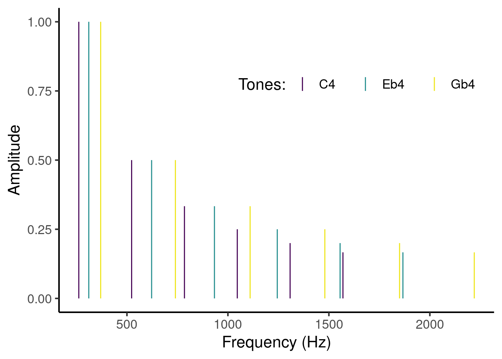
<p class="caption">(\#fig:unnamed-chunk-17)Frequency spectrum for a closed C diminished triad rooted on middle C (C4). The chord is modelled as containing 6 harmonics per tone, with amplitudes following a harmonic series. The three tones are differentiated by three different colours.</p>
</div>

In the above example, each tone has been expanded into 6 harmonics; in a serious analysis we might consider 11 or more harmonics. Each tone is plotted in a distinct colour, and each harmonic appears as a vertical line with a given frequency and a given amplitude.

The model works by considering pairwise interactions between partials in this spectrum. Each pair of partials contributes something towards the overall dissonance of the chord.

To estimate these pairwise contributions, we iterate over all pairs of partials in the chord. This means first looking at the interaction between partial 1 and partial 2, then at the interaction between partial 1 and partial 3, then at partial 1 and partial 4, and so on. Once we have considered all possible interactions involving partial 1, we then look at the interaction between partial 2 and partial 3, then partial 2 and partial 4, and so on. This process is illustrated in the following animation:

<div class="figure">
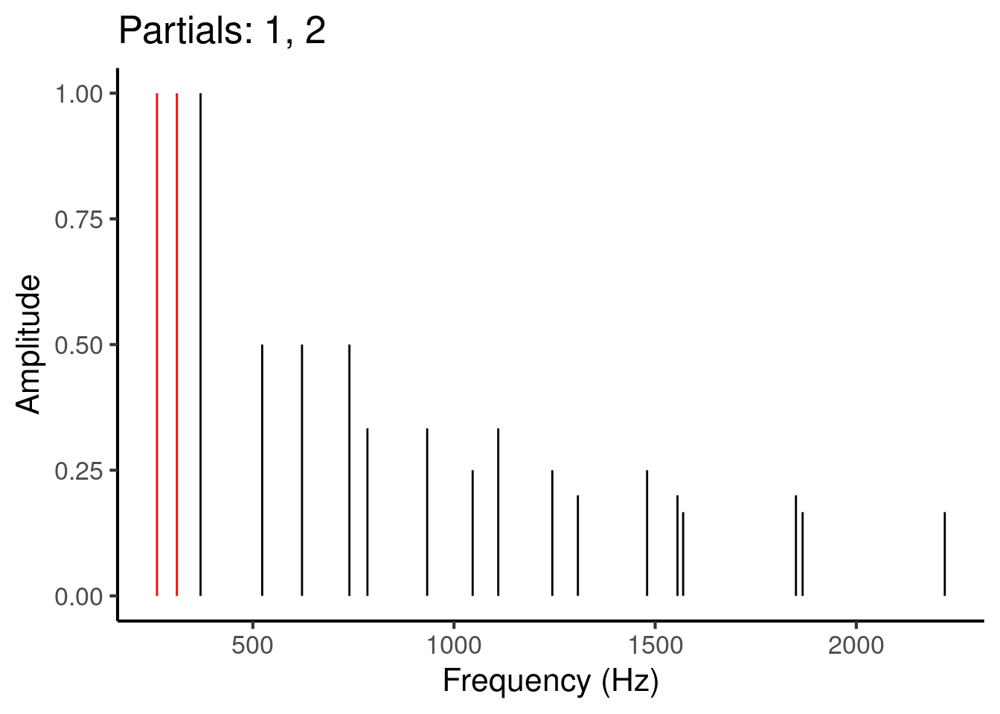
<p class="caption">(\#fig:unnamed-chunk-18)Animation illustrating the process of iterating over different pairs of partials (red) in the frequency spectrum.</p>
</div>

Let's suppose we are trying to calculate the dissonance induced by partials 4 and 5. We begin by writing down their frequencies and amplitudes:


| Partial| Frequency (Hz)| Amplitude|
|-------:|--------------:|---------:|
|       4|          523.2|       0.5|
|       5|          622.2|       0.5|


The elicited dissonance comes from interference between these two partials. The extent to which two partials interfere depends on the *critical bandwidth* for those partials. The critical bandwidth tells us how close two partials have to be before they start interfering with each other. It is typically estimated using psychoacoustic experiments measuring masking effects.[^computational-music-psychology-4]

[^computational-music-psychology-4]: Masking is when a particular sound obscures the perception of another sound. It is analogous to the phenomenon of occlusion in vision perception.

The critical bandwidth is thought to correspond to a certain physical distance on the basilar membrane, estimated to be approximately 1 mm. Tones within a certain physical distance cause overlapping excitation patterns, producing interference effects such as masking and beating.


For low frequencies, a given physical distance on the basilar membrane will correspond to a relatively small frequency difference. For example, at 200 Hz, a 1 mm movement corresponds to a frequency change of approximately 50 Hz; in contrast, at 10,000 Hz, a 1 mm movement corresponds to a frequency change of approximately 700 Hz.

Since critical bandwidth depends on physical distance, and since the same physical distance corresponds to higher frequency distances at higher frequencies, we find that critical bandwidth also increases for higher frequencies. @hutchinson1978 model this relationship using the following mathematical expression:

```{=tex}
\begin{equation}
\mathrm{critical\ bandwidth}=1.72 \times \mathrm{frequency}^{0.65}
(\#eq:critical-bandwidth)
\end{equation}
```
where both critical bandwidth and frequency are expressed in Hz. This relationship looks like the following:

<div class="figure">
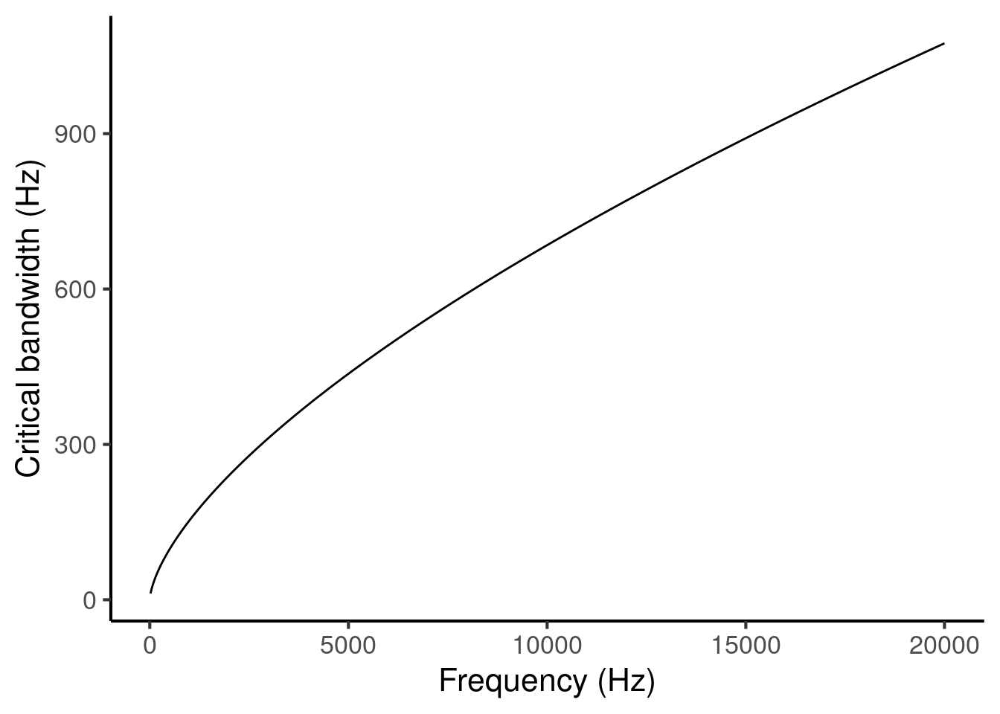
<p class="caption">(\#fig:critical-bandwidth-frequency)Critical bandwidth as a function of frequency.</p>
</div>

It is interesting to express the same relationship using pitch notation instead of frequency notation. If we do so, we get the following curve:

<div class="figure">
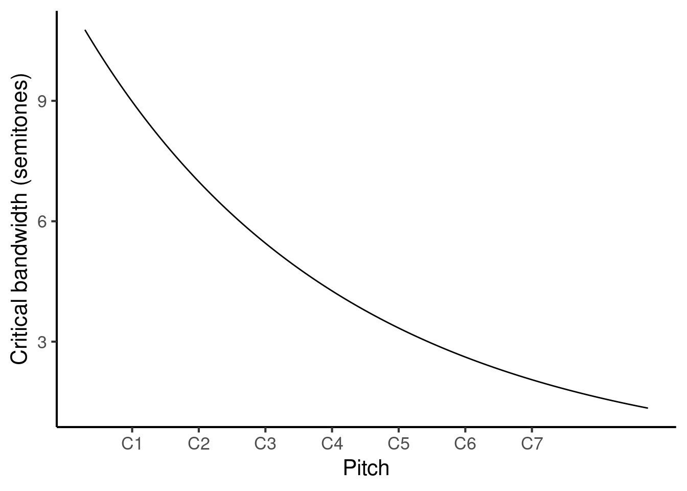
<p class="caption">(\#fig:unnamed-chunk-21)Critical bandwidth as a function of pitch.</p>
</div>

The relationship appears to be inverted: we see now that, as pitch height increases, the critical band corresponds to *narrower* pitch intervals (as measured in semitones). Why is this? Well, before we were measuring critical bandwidth in terms of absolute frequency differences (measured in Hz), whereas now we are measuring critical bandwidth in terms of pitch intervals, which correspond to frequency *ratios*. While the absolute frequency distance does indeed increase as the base frequency increases, it doesn't decrease as fast as the base frequency. This means that the frequency ratio increases, and hence the pitch interval increases.

This phenomenon has an interesting consequence for dissonance perception. It implies that a particular pitch interval may sound dissonant when played in a lower register, on account of the tones being localised to the same critical band, but may then become consonant when played in a higher register, because the critical bandwidth decreases causing the tones to be localised to separate critical bands. This phenomenon seems to provide a good explanation for voice spacing patterns in common-practice Western tonal music [@huron1992; @harrison2020].

Let us return to the task of modelling the dissonance induced by partials 4 and 5. We begin by estimating the local **critical bandwidth** for these two partials. We do this by taking the average of the two frequencies and feeding it into Equation \@ref(eq:critical-bandwidth) (Figure \@ref(fig:critical-bandwidth-frequency)). In our example, we had frequencies of 532.2 Hz and 659.2 Hz, so our mean frequency is 591.2 Hz. So, our estimated critical bandwidth is

$$
1.72 \times 591.2 ^ {0.65} = 108.9 \mathrm{\ Hz}.
$$

Note that instead of using the mathematical equation, we could alternatively have found this number graphically, by taking a zoomed-in version of Figure \@ref(fig:critical-bandwidth-frequency), drawing a vertical line upwards from 591.2 Hz on the horizontal axis, finding its intersection with the plot line, and drawing a horizontal line to the vertical axis:

<div class="figure">
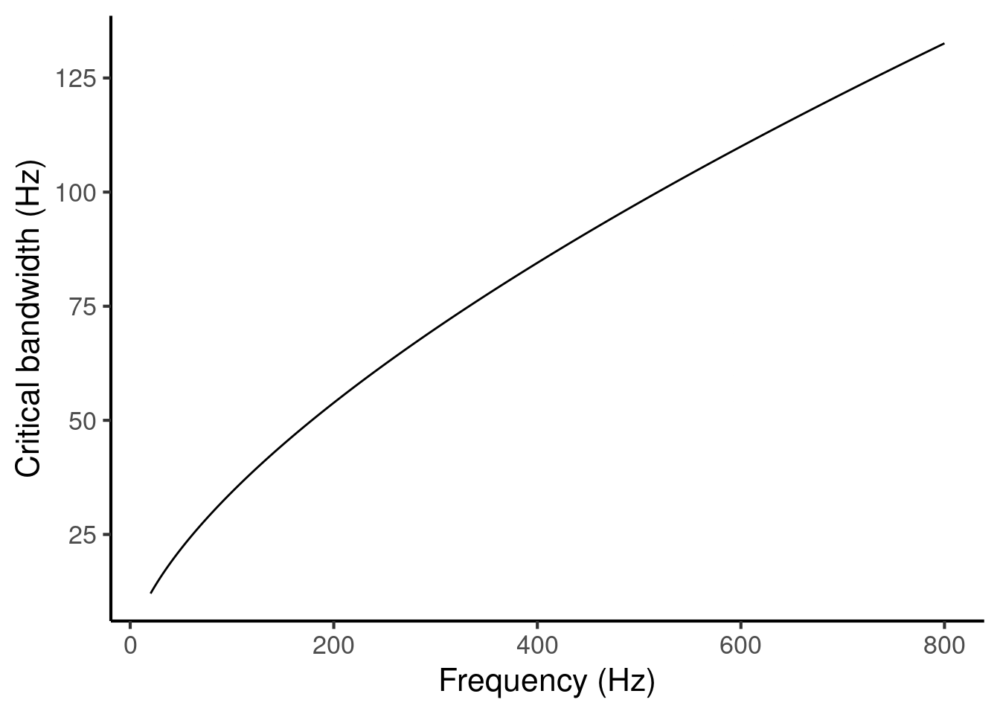
<p class="caption">(\#fig:unnamed-chunk-22)Calculating critical bandwidth from pitch.</p>
</div>

We then express the distance between these two partials in units of critical bandwidth. We achieve this simply by dividing the distance in Hz by the critical bandwidth. This gives us:

$$
\frac{659.2 - 532.2}{108.9} = 1.17
$$

We then plug this number (1.17) into an idealised *dissonance curve* that characterises how dissonance varies as a function of the critical bandwidth distance between a pair of pure tones. Hutchinson & Knopoff's dissonance curve looks something like an inverted U, with a peak at 0.25 critical bandwidths:[^computational-music-psychology-5]

[^computational-music-psychology-5]: Hutchinson & Knopoff presented their original curve graphically as an interpolation of results from previous psychoacoustic experiments. Bigand and colleagues (1996) subsequently introduced a parametric approximation that takes the following form:

    $$
    \left(
    4y \exp \left( 1 - 4y \right) 
    \right) ^ 2
    $$

    where $y$ is the critical bandwidth distance. We tend to prefer the latter form because it is easy to implement computationally.

<div class="figure">
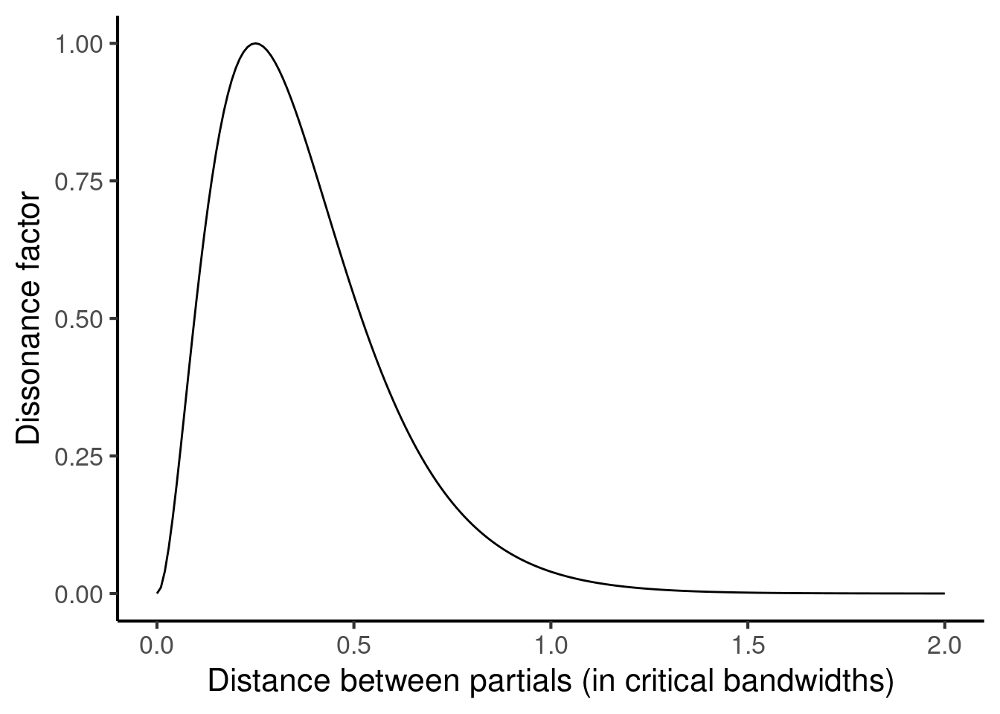
<p class="caption">(\#fig:dissonance-curve)Idealised dissonance curve from @hutchinson1978, plotted using the parametric version specified by @Bigand1996.</p>
</div>

We find that, since the two partials are separated by more than one critical bandwidth, the resulting dissonance factor is rather low (just 0.014).

The final step is to account for amplitude. We do two things here. First, we compute the *product of the amplitudes* for the two partials currently under consideration. Since both partials had amplitudes of 0.5, we get:

$$
0.5 \times 0.5 = 0.25.
$$

Second, we compute the *sum of squared amplitudes* over all the partials in the spectrum. Squaring means multiplying a number by itself; for example, two squared (written $2^2$) is four, three squared (written $3^2$) is nine, and so on. We compute the sum of squared amplitudes by first squaring all the amplitudes in the spectrum:


```{=html}
<div class="datatables html-widget html-fill-item" id="htmlwidget-86ec08c56e4ce36d184d" style="width:100%;height:auto;"></div>
<script type="application/json" data-for="htmlwidget-86ec08c56e4ce36d184d">{"x":{"filter":"none","vertical":false,"data":[["1","2","3","4","5","6","7","8","9","10","11","12","13","14","15","16","17","18"],["261.6","311.1","370.0","523.2","622.2","740.0","784.8","933.3","1046.4","1110.0","1244.4","1308.0","1480.0","1555.5","1569.6","1850.0","1866.6","2220.0"],["1.00","1.00","1.00","0.50","0.50","0.50","0.33","0.33","0.25","0.33","0.25","0.20","0.25","0.20","0.17","0.20","0.17","0.17"],["1.00","1.00","1.00","0.25","0.25","0.25","0.11","0.11","0.06","0.11","0.06","0.04","0.06","0.04","0.03","0.04","0.03","0.03"]],"container":"<table class=\"display\">\n  <thead>\n    <tr>\n      <th> <\/th>\n      <th>Frequency<\/th>\n      <th>Amplitude<\/th>\n      <th>Squared amplitude<\/th>\n    <\/tr>\n  <\/thead>\n<\/table>","options":{"searching":false,"rowId":false,"columnDefs":[{"orderable":false,"targets":0},{"name":" ","targets":0},{"name":"Frequency","targets":1},{"name":"Amplitude","targets":2},{"name":"Squared amplitude","targets":3}],"order":[],"autoWidth":false,"orderClasses":false}},"evals":[],"jsHooks":[]}</script>
```


then taking their sum:

$$
1.00 + 1.00 + 1.00 + 0.25 + 0.25 + 0.25 + \ldots = 4.474.
$$

Note that this expression is the same no matter which pair of partials we are considering, so we only need to compute it once for the whole spectrum.

To get the final dissonance contribution of the two partials, we then take the previously computed dissonance factor (0.014), multiply it by the product of the amplitudes (0.25), and divide it by the sum of the squared amplitudes (4.474). This gives us:

$$
\frac{0.014 \times 0.25}{4.474} = 0.00078 
$$

Let's think about what role amplitude plays in this procedure. The fact that we multiply by the product of the amplitudes means that the dissonance contribution is *proportional* to the amplitudes of each of the two partials. In other words, if we double the amplitude of either partial, the resulting dissonance contribution will be doubled. Dividing by the sum of the squared amplitudes, meanwhile, has the effect of normalising by the spectrum's overall amplitude. The consequence in particular is that dissonance ends up being independent of the chord's *overall* amplitude; for example, if we double the amplitude of every partial in the spectrum, then the overall dissonance will stay the same. It is only by changing the amplitudes of some partials and not others that the overall dissonance will change.

We repeat this process for every pair of partials in the spectrum. This gives us a table like the following:


```{=html}
<div class="datatables html-widget html-fill-item" id="htmlwidget-a1a6839cad02d05e0a80" style="width:100%;height:auto;"></div>
<script type="application/json" data-for="htmlwidget-a1a6839cad02d05e0a80">{"x":{"filter":"none","vertical":false,"data":[["1","2","3","4","5","6","7","8","9","10","11","12","13","14","15","16","17","18","19","20","21","22","23","24","25","26","27","28","29","30","31","32","33","34","35","36","37","38","39","40","41","42","43","44","45","46","47","48","49","50","51","52","53","54","55","56","57","58","59","60","61","62","63","64","65","66","67","68","69","70","71","72","73","74","75","76","77","78","79","80","81","82","83","84","85","86","87","88","89","90","91","92","93","94","95","96","97","98","99","100","101","102","103","104","105","106","107","108","109","110","111","112","113","114","115","116","117","118","119","120","121","122","123","124","125","126","127","128","129","130","131","132","133","134","135","136","137","138","139","140","141","142","143","144","145","146","147","148","149","150","151","152","153"],["261.60","261.60","261.60","261.60","261.60","261.60","261.60","261.60","261.60","261.60","261.60","261.60","261.60","261.60","261.60","261.60","261.60","311.10","311.10","311.10","311.10","311.10","311.10","311.10","311.10","311.10","311.10","311.10","311.10","311.10","311.10","311.10","311.10","370.00","370.00","370.00","370.00","370.00","370.00","370.00","370.00","370.00","370.00","370.00","370.00","370.00","370.00","370.00","523.20","523.20","523.20","523.20","523.20","523.20","523.20","523.20","523.20","523.20","523.20","523.20","523.20","523.20","622.20","622.20","622.20","622.20","622.20","622.20","622.20","622.20","622.20","622.20","622.20","622.20","622.20","740.00","740.00","740.00","740.00","740.00","740.00","740.00","740.00","740.00","740.00","740.00","740.00","784.80","784.80","784.80","784.80","784.80","784.80","784.80","784.80","784.80","784.80","784.80","933.30","933.30","933.30","933.30","933.30","933.30","933.30","933.30","933.30","933.30","1046.40","1046.40","1046.40","1046.40","1046.40","1046.40","1046.40","1046.40","1046.40","1110.00","1110.00","1110.00","1110.00","1110.00","1110.00","1110.00","1110.00","1244.40","1244.40","1244.40","1244.40","1244.40","1244.40","1244.40","1308.00","1308.00","1308.00","1308.00","1308.00","1308.00","1480.00","1480.00","1480.00","1480.00","1480.00","1555.50","1555.50","1555.50","1555.50","1569.60","1569.60","1569.60","1850.00","1850.00","1866.60"],["311.10","370.00","523.20","622.20","740.00","784.80","933.30","1046.40","1110.00","1244.40","1308.00","1480.00","1555.50","1569.60","1850.00","1866.60","2220.00","370.00","523.20","622.20","740.00","784.80","933.30","1046.40","1110.00","1244.40","1308.00","1480.00","1555.50","1569.60","1850.00","1866.60","2220.00","523.20","622.20","740.00","784.80","933.30","1046.40","1110.00","1244.40","1308.00","1480.00","1555.50","1569.60","1850.00","1866.60","2220.00","622.20","740.00","784.80","933.30","1046.40","1110.00","1244.40","1308.00","1480.00","1555.50","1569.60","1850.00","1866.60","2220.00","740.00","784.80","933.30","1046.40","1110.00","1244.40","1308.00","1480.00","1555.50","1569.60","1850.00","1866.60","2220.00","784.80","933.30","1046.40","1110.00","1244.40","1308.00","1480.00","1555.50","1569.60","1850.00","1866.60","2220.00","933.30","1046.40","1110.00","1244.40","1308.00","1480.00","1555.50","1569.60","1850.00","1866.60","2220.00","1046.40","1110.00","1244.40","1308.00","1480.00","1555.50","1569.60","1850.00","1866.60","2220.00","1110.00","1244.40","1308.00","1480.00","1555.50","1569.60","1850.00","1866.60","2220.00","1244.40","1308.00","1480.00","1555.50","1569.60","1850.00","1866.60","2220.00","1308.00","1480.00","1555.50","1569.60","1850.00","1866.60","2220.00","1480.00","1555.50","1569.60","1850.00","1866.60","2220.00","1555.50","1569.60","1850.00","1866.60","2220.00","1569.60","1850.00","1866.60","2220.00","1850.00","1866.60","2220.00","1866.60","2220.00","2220.00"],["1.00","1.00","1.00","1.00","1.00","1.00","1.00","1.00","1.00","1.00","1.00","1.00","1.00","1.00","1.00","1.00","1.00","1.00","1.00","1.00","1.00","1.00","1.00","1.00","1.00","1.00","1.00","1.00","1.00","1.00","1.00","1.00","1.00","1.00","1.00","1.00","1.00","1.00","1.00","1.00","1.00","1.00","1.00","1.00","1.00","1.00","1.00","1.00","0.50","0.50","0.50","0.50","0.50","0.50","0.50","0.50","0.50","0.50","0.50","0.50","0.50","0.50","0.50","0.50","0.50","0.50","0.50","0.50","0.50","0.50","0.50","0.50","0.50","0.50","0.50","0.50","0.50","0.50","0.50","0.50","0.50","0.50","0.50","0.50","0.50","0.50","0.50","0.33","0.33","0.33","0.33","0.33","0.33","0.33","0.33","0.33","0.33","0.33","0.33","0.33","0.33","0.33","0.33","0.33","0.33","0.33","0.33","0.33","0.25","0.25","0.25","0.25","0.25","0.25","0.25","0.25","0.25","0.33","0.33","0.33","0.33","0.33","0.33","0.33","0.33","0.25","0.25","0.25","0.25","0.25","0.25","0.25","0.20","0.20","0.20","0.20","0.20","0.20","0.25","0.25","0.25","0.25","0.25","0.20","0.20","0.20","0.20","0.17","0.17","0.17","0.20","0.20","0.17"],["1.00","1.00","0.50","0.50","0.50","0.33","0.33","0.25","0.33","0.25","0.20","0.25","0.20","0.17","0.20","0.17","0.17","1.00","0.50","0.50","0.50","0.33","0.33","0.25","0.33","0.25","0.20","0.25","0.20","0.17","0.20","0.17","0.17","0.50","0.50","0.50","0.33","0.33","0.25","0.33","0.25","0.20","0.25","0.20","0.17","0.20","0.17","0.17","0.50","0.50","0.33","0.33","0.25","0.33","0.25","0.20","0.25","0.20","0.17","0.20","0.17","0.17","0.50","0.33","0.33","0.25","0.33","0.25","0.20","0.25","0.20","0.17","0.20","0.17","0.17","0.33","0.33","0.25","0.33","0.25","0.20","0.25","0.20","0.17","0.20","0.17","0.17","0.33","0.25","0.33","0.25","0.20","0.25","0.20","0.17","0.20","0.17","0.17","0.25","0.33","0.25","0.20","0.25","0.20","0.17","0.20","0.17","0.17","0.33","0.25","0.20","0.25","0.20","0.17","0.20","0.17","0.17","0.25","0.20","0.25","0.20","0.17","0.20","0.17","0.17","0.20","0.25","0.20","0.17","0.20","0.17","0.17","0.25","0.20","0.17","0.20","0.17","0.17","0.20","0.17","0.20","0.17","0.17","0.17","0.20","0.17","0.17","0.20","0.17","0.17","0.17","0.17","0.17"],["286.35","315.80","392.40","441.90","500.80","523.20","597.45","654.00","685.80","753.00","784.80","870.80","908.55","915.60","1055.80","1064.10","1240.80","340.55","417.15","466.65","525.55","547.95","622.20","678.75","710.55","777.75","809.55","895.55","933.30","940.35","1080.55","1088.85","1265.55","446.60","496.10","555.00","577.40","651.65","708.20","740.00","807.20","839.00","925.00","962.75","969.80","1110.00","1118.30","1295.00","572.70","631.60","654.00","728.25","784.80","816.60","883.80","915.60","1001.60","1039.35","1046.40","1186.60","1194.90","1371.60","681.10","703.50","777.75","834.30","866.10","933.30","965.10","1051.10","1088.85","1095.90","1236.10","1244.40","1421.10","762.40","836.65","893.20","925.00","992.20","1024.00","1110.00","1147.75","1154.80","1295.00","1303.30","1480.00","859.05","915.60","947.40","1014.60","1046.40","1132.40","1170.15","1177.20","1317.40","1325.70","1502.40","989.85","1021.65","1088.85","1120.65","1206.65","1244.40","1251.45","1391.65","1399.95","1576.65","1078.20","1145.40","1177.20","1263.20","1300.95","1308.00","1448.20","1456.50","1633.20","1177.20","1209.00","1295.00","1332.75","1339.80","1480.00","1488.30","1665.00","1276.20","1362.20","1399.95","1407.00","1547.20","1555.50","1732.20","1394.00","1431.75","1438.80","1579.00","1587.30","1764.00","1517.75","1524.80","1665.00","1673.30","1850.00","1562.55","1702.75","1711.05","1887.75","1709.80","1718.10","1894.80","1858.30","2035.00","2043.30"],["68.00","72.47","83.45","90.15","97.79","100.61","109.68","116.32","119.97","127.48","130.95","140.11","144.03","144.76","158.80","159.61","176.37","76.11","86.84","93.41","100.91","103.68","112.61","119.16","122.76","130.19","133.62","142.69","146.57","147.29","161.21","162.02","178.65","90.78","97.20","104.55","107.27","116.05","122.50","126.05","133.37","136.76","145.72","149.56","150.27","164.05","164.85","181.34","106.70","113.71","116.32","124.74","130.95","134.38","141.47","144.76","153.45","157.19","157.88","171.33","172.11","188.25","119.43","121.97","130.19","136.27","139.62","146.57","149.80","158.34","162.02","162.70","175.94","176.71","192.63","128.51","136.52","142.44","145.72","152.52","155.68","164.05","167.66","168.33","181.34","182.10","197.79","138.88","144.76","148.00","154.75","157.88","166.20","169.78","170.44","183.38","184.13","199.73","152.28","155.44","162.02","165.08","173.20","176.71","177.36","190.03","190.77","206.09","160.98","167.44","170.44","178.44","181.89","182.53","195.01","195.74","210.86","170.44","173.42","181.34","184.76","185.40","197.79","198.51","213.52","179.63","187.41","190.77","191.39","203.58","204.29","219.09","190.24","193.57","194.19","206.29","206.99","221.69","201.05","201.66","213.52","214.22","228.66","204.89","216.66","217.34","231.68","217.24","217.93","232.24","229.33","243.27","243.92"],["0.73","1.50","3.13","4.00","4.89","5.20","6.12","6.75","7.07","7.71","7.99","8.70","8.98","9.04","10.00","10.06","11.10","0.77","2.44","3.33","4.25","4.57","5.53","6.17","6.51","7.17","7.46","8.19","8.49","8.54","9.55","9.60","10.68","1.69","2.59","3.54","3.87","4.85","5.52","5.87","6.56","6.86","7.62","7.93","7.98","9.02","9.08","10.20","0.93","1.91","2.25","3.29","4.00","4.37","5.10","5.42","6.24","6.57","6.63","7.74","7.81","9.01","0.99","1.33","2.39","3.11","3.49","4.25","4.58","5.42","5.76","5.82","6.98","7.04","8.29","0.35","1.42","2.15","2.54","3.31","3.65","4.51","4.86","4.93","6.12","6.19","7.48","1.07","1.81","2.20","2.97","3.31","4.18","4.54","4.60","5.81","5.88","7.19","0.74","1.14","1.92","2.27","3.16","3.52","3.59","4.82","4.89","6.24","0.40","1.18","1.53","2.43","2.80","2.87","4.12","4.19","5.57","0.79","1.14","2.04","2.41","2.48","3.74","3.81","5.20","0.35","1.26","1.63","1.70","2.97","3.05","4.45","0.90","1.28","1.35","2.63","2.70","4.11","0.38","0.44","1.73","1.80","3.24","0.07","1.36","1.43","2.87","1.29","1.36","2.80","0.07","1.52","1.45"],["0.19","0.00","0.00","0.00","0.00","0.00","0.00","0.00","0.00","0.00","0.00","0.00","0.00","0.00","0.00","0.00","0.00","0.14","0.00","0.00","0.00","0.00","0.00","0.00","0.00","0.00","0.00","0.00","0.00","0.00","0.00","0.00","0.00","0.00","0.00","0.00","0.00","0.00","0.00","0.00","0.00","0.00","0.00","0.00","0.00","0.00","0.00","0.00","0.06","0.00","0.00","0.00","0.00","0.00","0.00","0.00","0.00","0.00","0.00","0.00","0.00","0.00","0.04","0.00","0.00","0.00","0.00","0.00","0.00","0.00","0.00","0.00","0.00","0.00","0.00","0.88","0.00","0.00","0.00","0.00","0.00","0.00","0.00","0.00","0.00","0.00","0.00","0.03","0.00","0.00","0.00","0.00","0.00","0.00","0.00","0.00","0.00","0.00","0.17","0.02","0.00","0.00","0.00","0.00","0.00","0.00","0.00","0.00","0.78","0.01","0.00","0.00","0.00","0.00","0.00","0.00","0.00","0.13","0.02","0.00","0.00","0.00","0.00","0.00","0.00","0.87","0.01","0.00","0.00","0.00","0.00","0.00","0.07","0.01","0.00","0.00","0.00","0.00","0.83","0.67","0.00","0.00","0.00","0.32","0.00","0.00","0.00","0.01","0.00","0.00","0.35","0.00","0.00"],["1.00","1.00","0.50","0.50","0.50","0.33","0.33","0.25","0.33","0.25","0.20","0.25","0.20","0.17","0.20","0.17","0.17","1.00","0.50","0.50","0.50","0.33","0.33","0.25","0.33","0.25","0.20","0.25","0.20","0.17","0.20","0.17","0.17","0.50","0.50","0.50","0.33","0.33","0.25","0.33","0.25","0.20","0.25","0.20","0.17","0.20","0.17","0.17","0.25","0.25","0.17","0.17","0.12","0.17","0.12","0.10","0.12","0.10","0.08","0.10","0.08","0.08","0.25","0.17","0.17","0.12","0.17","0.12","0.10","0.12","0.10","0.08","0.10","0.08","0.08","0.17","0.17","0.12","0.17","0.12","0.10","0.12","0.10","0.08","0.10","0.08","0.08","0.11","0.08","0.11","0.08","0.07","0.08","0.07","0.06","0.07","0.06","0.06","0.08","0.11","0.08","0.07","0.08","0.07","0.06","0.07","0.06","0.06","0.08","0.06","0.05","0.06","0.05","0.04","0.05","0.04","0.04","0.08","0.07","0.08","0.07","0.06","0.07","0.06","0.06","0.05","0.06","0.05","0.04","0.05","0.04","0.04","0.05","0.04","0.03","0.04","0.03","0.03","0.05","0.04","0.05","0.04","0.04","0.03","0.04","0.03","0.03","0.03","0.03","0.03","0.03","0.03","0.03"],["4.47","4.47","4.47","4.47","4.47","4.47","4.47","4.47","4.47","4.47","4.47","4.47","4.47","4.47","4.47","4.47","4.47","4.47","4.47","4.47","4.47","4.47","4.47","4.47","4.47","4.47","4.47","4.47","4.47","4.47","4.47","4.47","4.47","4.47","4.47","4.47","4.47","4.47","4.47","4.47","4.47","4.47","4.47","4.47","4.47","4.47","4.47","4.47","4.47","4.47","4.47","4.47","4.47","4.47","4.47","4.47","4.47","4.47","4.47","4.47","4.47","4.47","4.47","4.47","4.47","4.47","4.47","4.47","4.47","4.47","4.47","4.47","4.47","4.47","4.47","4.47","4.47","4.47","4.47","4.47","4.47","4.47","4.47","4.47","4.47","4.47","4.47","4.47","4.47","4.47","4.47","4.47","4.47","4.47","4.47","4.47","4.47","4.47","4.47","4.47","4.47","4.47","4.47","4.47","4.47","4.47","4.47","4.47","4.47","4.47","4.47","4.47","4.47","4.47","4.47","4.47","4.47","4.47","4.47","4.47","4.47","4.47","4.47","4.47","4.47","4.47","4.47","4.47","4.47","4.47","4.47","4.47","4.47","4.47","4.47","4.47","4.47","4.47","4.47","4.47","4.47","4.47","4.47","4.47","4.47","4.47","4.47","4.47","4.47","4.47","4.47","4.47","4.47"],["0.04","0.00","0.00","0.00","0.00","0.00","0.00","0.00","0.00","0.00","0.00","0.00","0.00","0.00","0.00","0.00","0.00","0.03","0.00","0.00","0.00","0.00","0.00","0.00","0.00","0.00","0.00","0.00","0.00","0.00","0.00","0.00","0.00","0.00","0.00","0.00","0.00","0.00","0.00","0.00","0.00","0.00","0.00","0.00","0.00","0.00","0.00","0.00","0.00","0.00","0.00","0.00","0.00","0.00","0.00","0.00","0.00","0.00","0.00","0.00","0.00","0.00","0.00","0.00","0.00","0.00","0.00","0.00","0.00","0.00","0.00","0.00","0.00","0.00","0.00","0.03","0.00","0.00","0.00","0.00","0.00","0.00","0.00","0.00","0.00","0.00","0.00","0.00","0.00","0.00","0.00","0.00","0.00","0.00","0.00","0.00","0.00","0.00","0.00","0.00","0.00","0.00","0.00","0.00","0.00","0.00","0.00","0.00","0.01","0.00","0.00","0.00","0.00","0.00","0.00","0.00","0.00","0.00","0.00","0.00","0.00","0.00","0.00","0.00","0.00","0.01","0.00","0.00","0.00","0.00","0.00","0.00","0.00","0.00","0.00","0.00","0.00","0.00","0.01","0.01","0.00","0.00","0.00","0.00","0.00","0.00","0.00","0.00","0.00","0.00","0.00","0.00","0.00"]],"container":"<table class=\"display\">\n  <thead>\n    <tr>\n      <th> <\/th>\n      <th>Frequency 1<\/th>\n      <th>Frequency 2<\/th>\n      <th>Amplitude 1<\/th>\n      <th>Amplitude 2<\/th>\n      <th>Mean frequency<\/th>\n      <th>Critical bandwidth<\/th>\n      <th>Critical bandwidth distance<\/th>\n      <th>Dissonance factor<\/th>\n      <th>Product of amplitudes<\/th>\n      <th>Sum of squared amplitudes<\/th>\n      <th>Dissonance contribution<\/th>\n    <\/tr>\n  <\/thead>\n<\/table>","options":{"searching":false,"rowId":false,"scrollX":true,"columnDefs":[{"className":"dt-center","targets":"_all"},{"orderable":false,"targets":0},{"name":" ","targets":0},{"name":"Frequency 1","targets":1},{"name":"Frequency 2","targets":2},{"name":"Amplitude 1","targets":3},{"name":"Amplitude 2","targets":4},{"name":"Mean frequency","targets":5},{"name":"Critical bandwidth","targets":6},{"name":"Critical bandwidth distance","targets":7},{"name":"Dissonance factor","targets":8},{"name":"Product of amplitudes","targets":9},{"name":"Sum of squared amplitudes","targets":10},{"name":"Dissonance contribution","targets":11}],"order":[],"autoWidth":false,"orderClasses":false}},"evals":[],"jsHooks":[]}</script>
```


We compute the chord's final dissonance by summing all the 'dissonance contribution' values in the far right column. Many of these values are near-zero, because they relate to partials that are far away from each other. However, if we sum them all together, we get the following value: 0.166.

Let's now repeat the same approach and analyse several chords.

<div class="figure">
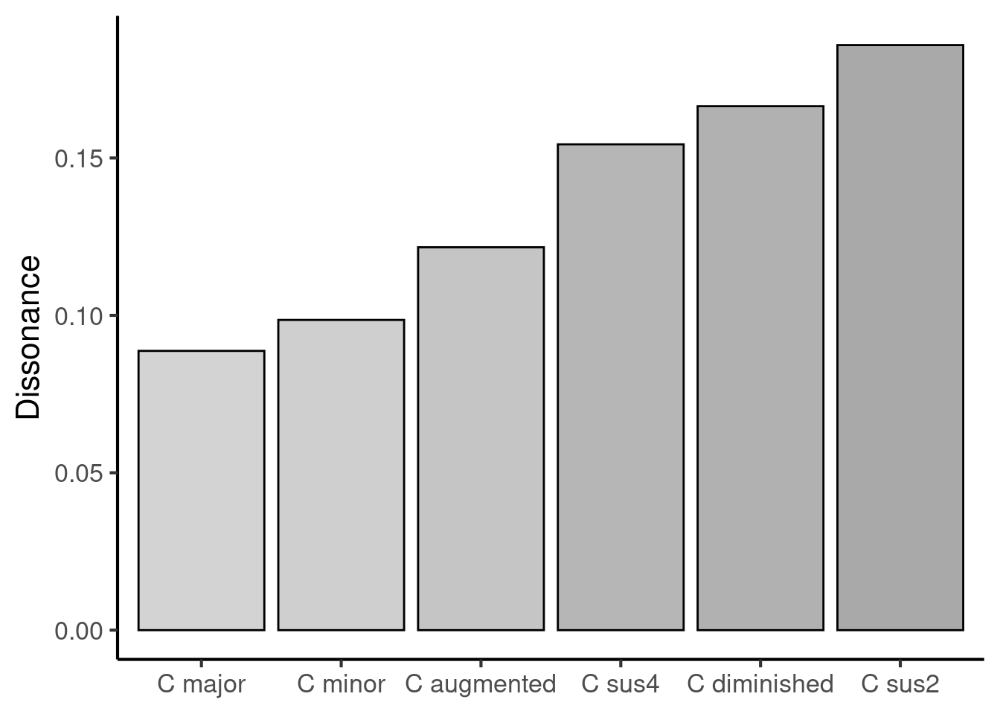
<p class="caption">(\#fig:unnamed-chunk-25)Hutchinson & Knopoff model outputs for various prototypical triads from Western music. Each chord is played in closed form and rooted on middle C.</p>
</div>

We see that, of all these common triad types built on the same root, the major triad (C major) has the lowest dissonance, followed by the minor triad (C minor). In contrast, we see high levels of dissonance from chords such as C diminished and C sus2. This ability of Hutchinson and Knopoff's model to reproduce well-known dissonance categorisations from Western music theory has been used as positive evidence for the model and its underlying theory of dissonance perception.

#### Limitations

This model is conceptually fairly simple, yet performs rather well at recovering dissonance judgments from Western listeners [@Harrison2020-gx]. Nonetheless, there are several important limitations that are worth noting.

It is generally assumed that the dissonance induced by a pair of partials comes from resulting beating effects, which induce a negatively experienced percept of roughness (though see @Harrison2020-gx for a discussion of this assumption). The magnitude of this roughness percept is modelled using the curve plotted in Figure \@ref(fig:dissonance-curve). However, there are several senses in which this model may not be a fully accurate model of roughness perception, for example:

-   The model ignores phase differences between the partials, yet phase difference is known to contribute to roughness [@mathes1947]. (This may not matter as long as the model is only applied to natural sounds, where two sound sources rarely manifest reliable phase differences).

-   The model assumes that roughness is proportional to the product of the amplitudes in each pair of partials. This reflects the intuition that greater amplitudes will elicit greater beating. However, the precise mathematical relationship between partial amplitude and beating amplitude is more complex than this [@Vassilakis2001].

-   The model assumes that the dissonance factor is determined by the critical bandwidth distance between the partials. However, more recent studies of auditory roughness have shown that the point of maximum roughness (i.e. the peak of the curve) is not found at a fixed critical bandwidth distance, and likewise the point where roughness disappears is not found at a fixed critical bandwidth distance either.

Several models have subsequently developed that address some of these concerns, for example Vassilakis's model [@Vassilakis2001] and Daniel & Weber's model [@Daniel1997; @Wang2013]. Curiously, however, these updates seem if anything to make the models *worse* at capturing musical dissonance [@Harrison2020-gx]. More work needs to be done to dig into these discrepancies and understand how consonance may or may not be explained through roughness modelling.

#### A note on mathematical notation

If you read papers about computational models, you will often see mathematical expressions like the following:

$$
d_{ij}= \frac{A_iA_jg_{ij}}{\sum_k{A_k^2}}
$$

This particular expression is taken from Hutchinson & Knopoff's model, and concerns the dissonance contribution of a pair of partials. The variables in the expression are defined in the text as follows:

-   $d_{ij}$ is the dissonance contribution from the interactions between partial $i$ and partial $j$

-   $A_i$ is the amplitude of partial $i$

-   $A_j$ is the amplitude of partial $j$

-   $g_{ij}$ is the dissonance component that depends on the critical bandwidth distance between partials

-   $\sum_k{A_k^2}$ is a normalising factor.

There are a few notation conventions to note here. The first is *index notation*, where we write small letters or numbers in subscripts, for example:

$$
A_i
$$

The subscript expression ($i$ in the above) is called the index. It is used as a counter to differentiate between multiple versions of an object. For example, in our above model, $A_1$ denotes the amplitude of the first partial, $A_2$ denotes the amplitude of the second partial, and so on.

When we write mathematical expressions using indices, we often write them in *generic* forms. This means that, instead of writing $A_1$ or $A_2$, we write $A_i$, which refers to the $i$th partial. When we write an equation containing indices like $i$ and $j$, the implication is generally that the equation holds true for all reasonable values of $i$ and $j$, where 'reasonable' typically means 'is a positive integer'.

A second thing to note is *summation notation*. In the above, we had one example of summation notation:

$$
\sum_k{A_k^2}
$$

The big sigma ($\Sigma$) denotes 'sum'. The letter beneath it tells us what we are summing over; in this case we are summing over all possible values of $k$. By default, we assume that $k$ starts at 1, and we count upwards to higher numbers of $k$. So, we could write out this sum as follows:

$$
\sum_k{A_k^2} = A_1^2 + A_2^2 + A_3^2 + \ldots
$$

In this version we did not specify explicitly what the starting point for $k$ was, or what its ending point was; this was left up to common sense. If we want to be explicit, we can use notation like the following:

$$
\sum_{k=1}^{5}{A_k^2} = A_1^2 + A_2^2 + A_3^2 + A_4^2 + A_5^2
$$

By writing $k=1$ at the bottom of the sum we are instructing the reader to begin the sum with $k=1$; by writing $5$ at the top of the sum we are instructing the reader to finish the sum with $k=5$.

#### R implementation

As before, here is a full implementation of Hutchison & Knopoff's model written in the R programming language. You can try out this code in the linked [Google Colab notebook](https://colab.research.google.com/drive/1677LRzW8g_8NfxncQULVgWr2V3Coj0iD?usp=sharing), and experiment with inputting different chords, changing the numbers of harmonics, changing the pitch height, etcetera.


```r
library(tidyverse)

# We input our chord pitches here, expressed directly as frequencies.
# To identify the required frequencies for your chord you may wish 
# to refer to the following table: 
# https://musicinformationretrieval.com/midi_conversion_table.html.

pitches <- 
  c(
    "C4    " = 261.6, 
    "Eb4   " = 311.1, 
    "Gb4   " = 370.0
  )

# This function expands each tone into its implied harmonics.
expand_harmonics <- function(fundamental_frequencies, n_harmonics = 11) {
  if (is.null(names(fundamental_frequencies))) {
    names(fundamental_frequencies) <- seq_along(fundamental_frequencies)
  }
  n_tones <- length(fundamental_frequencies)
  map2_dfr(
    fundamental_frequencies, 
    names(fundamental_frequencies), 
    function(f0, tone_id) {
      tibble(
        tone_id = tone_id,
        harmonic_number = seq_len(n_harmonics),
        frequency = f0 * harmonic_number,
        amplitude = 1 / harmonic_number
      )
    }
  )
}

spectrum <-
  pitches %>% 
  expand_harmonics() %>%
  arrange(frequency)

spectrum %>% 
  ggplot(aes(colour = factor(tone_id))) + 
  geom_linerange(aes(x = frequency, ymin = 0, ymax = amplitude)) + 
  scale_x_continuous("Frequency (Hz)") +
  scale_y_continuous("Amplitude") +
  scale_colour_viridis_d("Tones:", end = 0.975) +
  theme(
    legend.direction = "horizontal",
    legend.position = c(0.7, 0.75)
  )

n_partials <- nrow(spectrum)

combinations <- combn(n_partials, 2, simplify = FALSE)

get_cbw <- function(f1, f2) {
  mean_f <- (f1 + f2) / 2
  1.72 * (mean_f ^ 0.65)
}

dissonance_curve <- function(bandwidth_distance) {
  (4 * bandwidth_distance * exp(1 - 4 * bandwidth_distance)) ^ 2
}

get_dissonance_factor = function(f1, f2) {
  abs_freq_diff <- abs(f1 - f2)
  critical_bandwidth <- get_cbw(f1, f2)
  bandwidth_distance <- abs_freq_diff / critical_bandwidth
  dissonance_factor <- dissonance_curve(bandwidth_distance)
  dissonance_factor
}

dissonance_by_partial_pairs <- 
  tibble(
    i1 = map_int(combinations, 1),
    i2 = map_int(combinations, 2),
    f1 = spectrum$frequency[i1],
    f2 = spectrum$frequency[i2],
    a1 = spectrum$amplitude[i1],
    a2 = spectrum$amplitude[i2],
    f_mean = (f1 + f2) / 2,
    cbw = get_cbw(f1, f2),
    cbw_dist = abs(f2 - f1) / cbw,
    dissonance_factor = get_dissonance_factor(f1, f2),
    a1_a2 = a1 * a2,
    sum_sq_amp = sum(spectrum$amplitude ^ 2),
    dissonance = dissonance_factor * a1_a2 / sum_sq_amp
  )
dissonance_by_partial_pairs

sum(dissonance_by_partial_pairs$dissonance)
```

## Modelling approaches

There are many different approaches to computer modelling in the music psychology literature. Every approach has its own advantages and disadvantages. We will now consider a couple of relevant issues in turn.

### Symbolic versus audio inputs

Computer models typically take some kind of input and return some kind of output. In the context of music modelling, the input is typically some kind of musical extract, and the output typically represents some kind of subjective response to that extract.

Input musical extracts may be represented in two main ways: in audio format, or in symbolic format.

-   **Audio formats** represent the music as a waveform, and can be stored in common file formats such as `wav` and `mp3`. They carry a lot of raw information about the music and its performance.

-   **Symbolic formats** represent the music using simplified notation intended to capture the essential structural details of the music. For example, a C major triad might be represented as a collection of MIDI note numbers: $[60, 64, 67]$.

There is a sense in which symbolic formats represent latter stages of perceptual processing than audio formats. The audio file represents the sound as it exists in the air; the symbolic file represents concepts such as pitches and chords, which are only derived after a complex series of physical and psychological processes that are carried out both in the ear and in the brain.

In theory, audio models can be considerably more powerful than symbolic models. Audio files are typically straightforward to get hold of, both in the context of Western and non-Western musics. In contrast, symbolic music transcriptions are often laborious to put together. Western Classical music works quite well for symbolic analysis, because most pieces already have published musical scores, and these scores can be converted into machine-readable representations with only a moderate amount of effort. However, many other musical styles do not use musical scores by default, and hence creating a symbolic transcription requires transcribing from audio, which is a highly time-consuming and difficult task. Moreover, there is a sense in which audio better approximates the 'true' information that the human receives when they listen to music; in contrast, when we encode a musical piece in symbolic notation, it's easy to end up encoding additional information (e.g. key signatures) or assumptions (e.g. metric hierarchy) that are not directly available to the listener.

In practice, however, audio models have traditionally experienced some difficulties versus symbolic models. Because it is still difficult to simulate the early stages of music perception computationally (e.g. pitch tracking, chord recognition), it is difficult to use audio models to study later or more advanced stages of music perception (e.g. sensitivity to harmonic syntax), because the models get 'stuck' at these early stages. In contrast, it seems possible to make quicker progress here with symbolic models, which can take these early processing stages for granted and begin immediately with modelling higher-level cognition.

### Neuroscience, cognition, biology, acoustics

We know that psychological processes are ultimately mediated by the neurons in the brain. There are billions of these neurons, and they connect to each other to form networks of extraordinarily complexity. One issue of contention in the psychological literature concerns the following question: to what extent should our computational models focus on modelling individual neurons (the **neuroscientific** approach) versus modelling abstract psychological constructs (the **cognitive** approach)?

There is a sense in which the 'true' answer to how the mind works is ultimately neuroscientific: everything that happens is ultimately happening at a neural level. The main difficulty is that the brain is so hard to read at this level. Knowledge seems to be represented and processed in a very distributed manner, and decoding these dynamics has proved to be very complex, even in the case of very simple organisms. This difficulty of neural decoding is massively compounded once we try to study humans, which mostly rules out many invasive neuroscientific methods for ethical reasons. It's further compounded once we try to study complex high-level processes such as aesthetic appreciation; the more subtle and high-level a phenomenon, the harder it tends to be to find direct neural correlates in the brain.

The cognitive approach sidesteps this issue by modelling psychological processes at a higher level of abstraction. Instead of modelling the behaviour of individual neurons, we model the abstract units of information that these neurons are meant to represent, and we model the computational processes that are applied to these units of information. The Krumhansl-Kessler algorithm is an example of a cognitive model; it directly processes collections of pitch classes, and does not worry about how those pitch classes are represented neurally. A useful benefit of the cognitive approach is that its algorithms can often be performed manually by the researcher; this makes them much easier to interpret and to reason about. However, this comes with the sacrifice of knowing that one can only ever gain an approximation to the underlying neuroscientific truth.

In music psychology we also often see models that have biological or acoustic elements. The Hutchinson-Knopoff model is one such example; it derives its predictions by considering the way that chords produce certain kinds of frequency spectra, and the way that the resulting frequency components interfere with one another depending on their respective critical bandwidths, which reflect the underlying biology of the inner ear.

Ultimately a comprehensive account of music psychology will have to incorporate each of these aspects. Computer modelling provides a promising way to unite these aspects together in a precise yet interpretable fashion.
